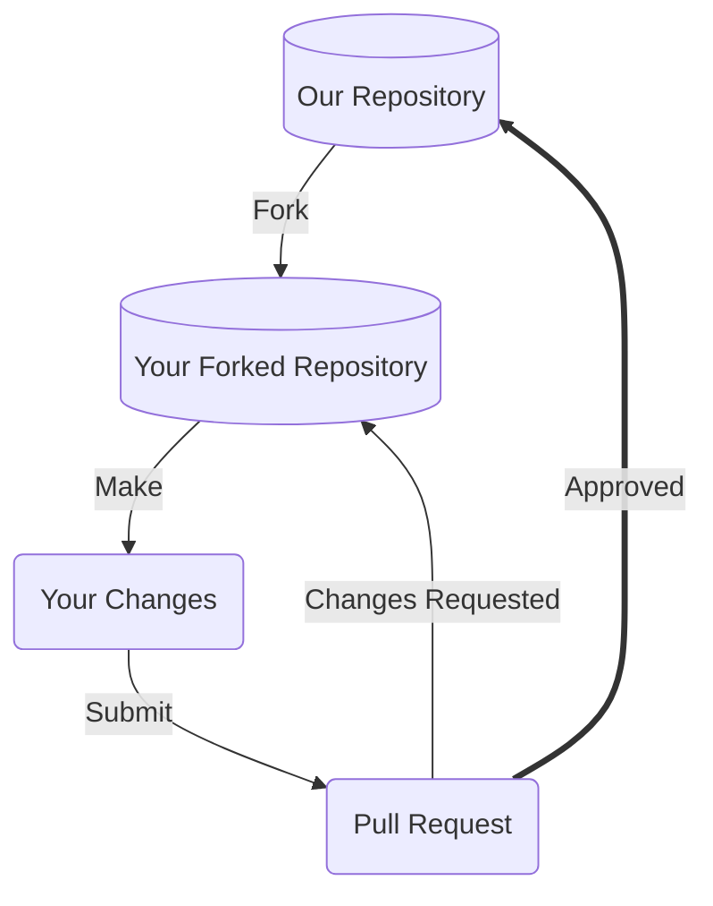
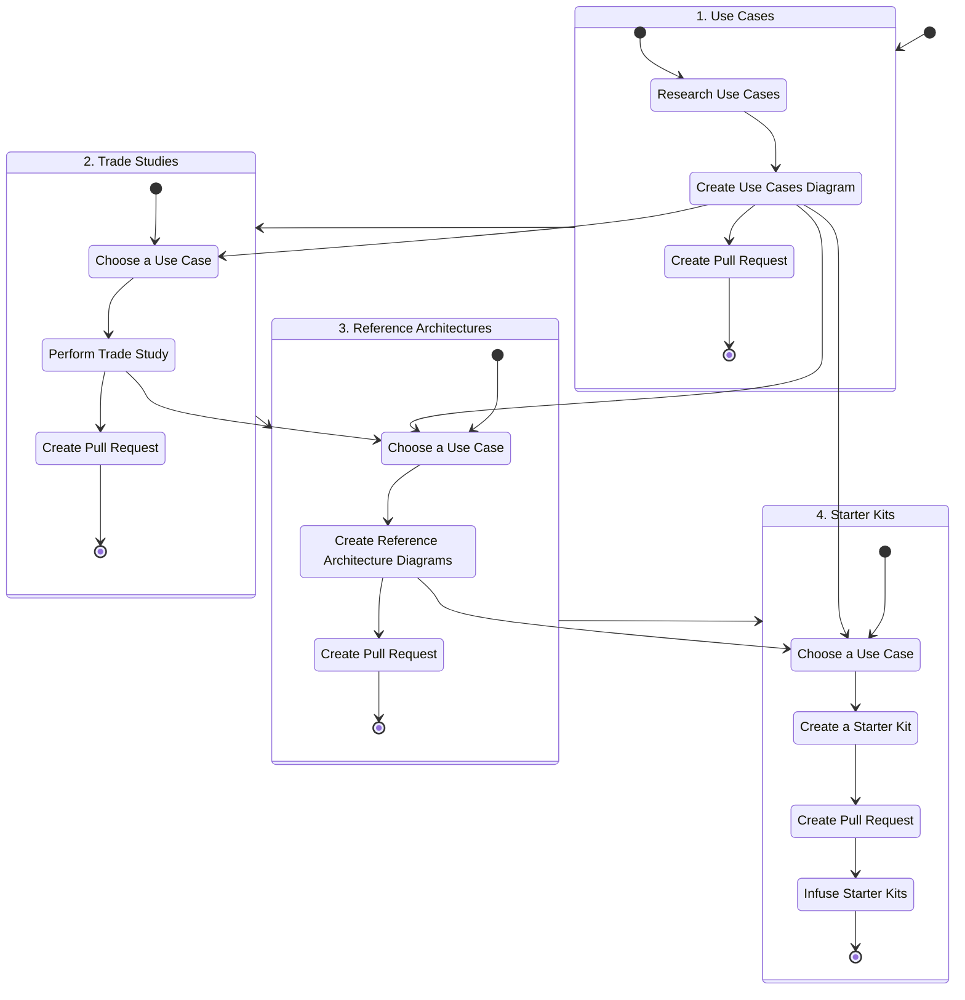

# Contributing to SLIM

Thanks for taking the time to consider contributing! We very much appreciate your time and effort. This document outlines the many ways you can contribute to our project, and provides detailed guidance on best practices. We look forward to your help!

## Prerequisites

Before you begin contributing to our project, it'll be a good idea to ensure you've satisfied the below pre-requisites. 

### Developer Certificate of Origin (DCO)

To accept your contributions for any kind of patch, you'll want to:
1. Understand what a Developer Certificate of Origin is. See [this](https://wiki.linuxfoundation.org/dco) guide.
2. Read and agree to the [terms](https://developercertificate.org) of the Developer Certificate of Origin.
3. Remember to add your Sign-Off for each patch contribution you submit to our project via either:
   1. By using the `-s` flag if using Git. See [these](https://git-scm.com/docs/git-commit#Documentation/git-commit.txt--s) instructions.
   2. By including the following text in your patch contributions (i.e. pull requests)
   ```
   Signed-off-by: Full Name <email>
   ``` 

Reviewers reviewing your patch will look for the sign-off before deciding to accept your contribution.

### License

Our project has our licensing terms, including rules governing redistribution, documented in our [LICENSE](LICENSE) file. Please take a look at that file and ensure you understand the terms. This will impact how we, or others, use your contributions.

### Code of Conduct

Our Code of Conduct helps facilitate a positive interaction environment for everyone involved with the team, and provides guidance on what to do if you experience problematic behavior. Read more in our [CODE_OF_CONDUCT.md](CODE_OF_CONDUCT.md), and make sure you agree to its terms. 

### Developer Environment

For patch contributions, see our Developer Documentation (TBD) for more details on how to set up your local environment, to best contribute to our project. 

At a minimum however to submit patches (if using Git), you'll want to ensure you have:
1. An account on the Version Control System our project uses (i.e. GitHub).
2. The Version Control System client (i.e. Git) installed on your local machine.
3. The ability to edit, build, and test our project on your local machine. Again, see our `README.md` or detailed developer guide for more details 

### Communication Channels

Before contributing changes to our project, it's a great idea to be familiar with our communication channels and to socialize your potential contributions to get feedback early. This will help give you context for your contributions, no matter their form.

Our communication channels are:
- [Issue tracking system](https://github.com/NASA-AMMOS/slim/issues) - a regularly monitored area to report issues with our software or propose changes
- [Discussion board](https://github.com/NASA-AMMOS/slim/discussions) - an permanently archived place to hold conversations related to our project, and to propose as well as show+tell topics to the contributor team. This resource can be searched for old discussions.

## Our Development Process

Our project integrates contributions from many people, and so we'd like to outline a process you can use to visualize how your contributions may be integrated if you provide something. 



### Fork our Repository

Forking our repository, as opposed to directly committing to a branch is the preferred way to propose changes. 

See [this GitHub guide](https://docs.github.com/en/get-started/quickstart/fork-a-repo) on forking for information specific to GitHub.com

#### Find or File an Issue

Make sure people are aware you're working on a patch! Check out our [issue tracking system](https://github.com/NASA-AMMOS/slim/issues) and find an open issue you'd like to work against, or alternatively file a new issue and mention you're working on a patch.

#### Choose the Right Branch to Fork

Our project typically has the following branches available, make sure to fork either the default branch or a branch someone else already tagged with a particular issue ticket you're working with.
- `main` - default branch, and contains mature SLIM deliverables and should be the typical branch you fork
- `develop` - active development area for SLIM deliverables, and typically ahead of `main` 
- `retype` - live rendering of SLIM website, auto-generated by changes committed to `main` branch via [a GitHub Action](https://github.com/NASA-AMMOS/slim/actions/workflows/retype.yml)

### Make your Modifications

Within your local development environment, this is the stage at which you'll propose your changes, and commit those changes back to version control. See the [README.md](README.md) or development guide for more specifics on what you'll need as prerequisites to setup your local development environment.

#### Commit Messages

Commit messages to version control should reference a ticket in their title / summary line:

```
Issue #248 - Show an example commit message title
```

This makes sure that tickets are updated on GitHub with references to commits that are related to them.

Commit should always be atomic. Keep solutions isolated whenever possible. Filler commits such as "clean up white space" or "fix typo" should be merged together before making a pull request, and significant sub-feature branches should be [rebased](https://www.youtube.com/results?search_query=git+rebase) to preserve commit history. Please ensure your commit history is clean and meaningful!

Additionally, remember to "Sign-Off" on your commits to align with our [Developer Certificate of Origin (DCO) policy](#developer-certificate-of-origin-dco). 

### Submit a Pull Request

Pull requests are the core way our project will receive your patch contributions. Navigate to your branch on your own fork within the version control system, and submit a pull request or submit the patch text to our project. 

Please make sure to provide a meaningful text description to your pull requests, whenever submitted. Our pull-request template will be auto-generated for you when you create your pull-request. See the template [here](.github/PULL_REQUEST_TEMPLATE.md). 

**Working on your first Pull Request?** See guide: [How to Contribute to an Open Source Project on GitHub](https://kcd.im/pull-request)

### Reviewing your Pull Request

Reviewing pull-requests, or any kinds of proposed patch changes, is an art. That being said, we follow the following best practices:
- **Intent** - is the purpose of your pull-request clearly stated?
- **Solution** - is your pull-request doing what you want it to?
- **Correctness** - is your pull-request doing what you want it to *correctly*?
- **Small Patches** - is your patch of a level of complexity and brevity that it can actually be reviewed by a human being? Or is does it involve too much content for one pull request?
- **Coding best practices** - are you following best practices in the coding / contribution language being used?
- **Readability** - is your patch readable, and ultimately maintainable, by others?
- **Reproducibility** - is your patch reproducible by others?
- **Tests** - do you have or have conducted meaningful tests?

## Ways to Contribute

### ⚠️ Issue Tickets

> *Do you like to talk about new features, changes, requests?*

Issue tickets are a very simple way to get involved in our project. It also helps new contributors get an understanding of the project more comprehensively. This is a great place to get started with the project if you're not sure where to start. 

See our list of issues at: https://github.com/NASA-AMMOS/slim/issues

#### Cleaning up Duplicate Issues

Often we receive duplicate issues that can confuse project members on *which* issue ticket to hold conversations upon.

Here's how you can help:
1. Scan the list of *open* issue tickets for duplicate titles, or internal wording 
2. If you find duplicates, copy / paste the below message on the conversation thread of the issue ticket *that has less participants* involved

```
This is a duplicate issue. Please migrate conversations over to [issue-XYZ](hyperlink to issue)
```

#### Good First Issues

Issue tickets can vary in complexity, and issues labeled with `good first issue` labels are often a great way to get started with the project as a newcomer. 

Take a look at our [issue tracking system](https://github.com/NASA-AMMOS/slim/issues), and filter by `good first issue` for issues that are low-complexity, and that will help you get familiar with our issue tracking and patch submission process.

#### Suggesting New Issue Labels

Labels within our [issue tracking system](https://github.com/NASA-AMMOS/slim/issues) are a great way to quickly sort through tickets. The project may not yet have labels to cover the full variety of issue tickets. Take a look through our list of issues, and if you notice a set of issue tickets that seem similar but are not categorized with an existing label, go ahead submit a request within one of the issues you've looked at with the following text:

```
I've noticed several other issues that are of the same category as this issue. Shall we make a new label for these types of issues?
```

#### Submitting Bug Issues

Resolving bugs is a priority for our project. We welcome bug reports. However, please make sure to do the following prior to submitting a bug report:
- **Check for duplicates** - there may be a bug report already describing your issue, so check the [issue tracking system](https://github.com/NASA-AMMOS/slim/issues) first.

Here's some guidance on submitting a bug issue:
1. Navigate to our [issue tracking system](https://github.com/NASA-AMMOS/slim/issues) and file a new issue
2. Select a bug template (if available) for your issue
   1. Fill out the template fields to the best of your ability, including output snippets or screenshots where applicable
3. Follow the general guidelines below for extra information about your bug
   1. Include a code snippet if you have it showcasing the bug
   2. Provide reproducible steps of how to recreate the bug
   3. If the bug triggers an exception or error message, include the *full message* or *stacktrace*
   4. Provide information about your operating system and the version of our project you're using

#### Submitting New Best Practice Guide Requests

We welcome new best practice guides / process improvement guides to help grow best practice guides. However, please make sure to do the following prior to submitting a request:
- **Check for duplicates** - there may be an issue ticket already describing your request, so check the [issue tracking system](https://github.com/NASA-AMMOS/slim/issues) first
- **Consider adding to existing guides** - is your best practice / process improvement guide really needed? Or is there an existing guide which could be improved instead to incoporate your request?
- **Cross-cutting** - is your proposed process improvement need cross-cutting? Or is it very specific to your project? We strive for offerring cross-cutting, and more general guides in this project so please make sure your guide request is a general need that could be applicable to many SLIM community-member projects.

Here's some guidance on submitting a new best practice guide request:
1. Navigate to our [issue tracking system](https://github.com/NASA-AMMOS/slim/issues) and file a new issue
2. Select the new best practice guide request template button
   1. Fill out the template fields to the best of your ability

#### Submitting Best Practice Guide Change / Improvement Requests

We welcome changes and improvements to our existing best practice guides. However, please make sure to do the following prior to submitting a request:
- **Check for duplicates** - there may be an issue ticket already describing your change / improvement request, so check the [issue tracking system](https://github.com/NASA-AMMOS/slim/issues) first
- **Cross-cutting** - is your proposed change / improvement to a guide need cross-cutting? Or is it very specific to your project? We strive for offerring cross-cutting, and more general guides in this project so please make sure your change request is a general solution that could be applicable to many SLIM community-member projects.

Here's some guidance on submitting a best practice guide change request:
1. Navigate to our [issue tracking system](https://github.com/NASA-AMMOS/slim/issues) and file a new issue
2. Select the new best practice guide change / improvement request template button
   1. Fill out the template fields to the best of your ability

#### Submitting Process Improvement Need Requests

Process improvement need requests are the atomic needs that represent SLIM community challenges. Needs are often aggregated together to develop comprehensive guides. You can help us identify and fill out needs that can help SLIM assess which process improvement needs are most important. However, please make sure to do the following prior to submitting a request:
- **Check for duplicates** - there may be an issue ticket already describing your change / improvement request, so check the [issue tracking system](https://github.com/NASA-AMMOS/slim/issues) first

Here's some guidance on submitting a process improvement need request:
1. Navigate to our [issue tracking system](https://github.com/NASA-AMMOS/slim/issues) and file a new issue
2. Select the new process improvement need request template button
   1. Fill out the template fields to the best of your ability

#### Submitting Website Feature Requests

Our SLIM website is constantly evolving, and you can help us by submitting reqeuests for new features. However, please make sure to do the following prior to submitting a request:
- **Check for duplicates** - there may be an issue ticket already describing your change / improvement request, so check the [issue tracking system](https://github.com/NASA-AMMOS/slim/issues) first

Here's some guidance on submitting a website feature request:
1. Navigate to our [issue tracking system](https://github.com/NASA-AMMOS/slim/issues) and file a new issue
2. Select the website feature request template button
   1. Fill out the template fields to the best of your ability

#### Submitting Security Vulnerability Issues

Security vulnerabilities should **not** be filed to the regular issue tracking system.

Report your security vulnerabilities to (see contact links): https://github.com/riverma

Please be sure to:
* Indicate the severity of the vulnerability
* Provide any workarounds, if you know them
* Provide return-contact information to follow-up with you if needed

#### Reviewing Pull Requests

Reviewing others' contributions is a great way to learn about best practices in both contributions as well as software. 

Take a look at our [pull requests tracking system](https://github.com/NASA-AMMOS/slim/pulls), and try the following options for providing a review:
1. Read the code / patch associated with the pull-request, and take note of any coding, bug, or documentation issues if found
2. Try to recreate the pull-request patch on your local machine, and report if it has issues with your system in particular
3. Scan over suggested feedback from other contributors, and provide feedback if necessary

### 📖 Documentation

Documentation is the core way our users and contributors learn about the project. We place a high value on the quality, thoroughness, and readability of our documentation. Writing or editing documentation is an excellent way to contribute to our project without performing active coding. 

⚠️ It's **highly** advised that you take a look at our [issue-tracking system](https://github.com/NASA-AMMOS/slim/issues) before considering any documentation contributions. Here's some guidelines:
1. Check if any duplicate issues exist that cover your documentation contribution idea / task, and add comments to those tickets with your thoughts.
2. If no duplicates exist, create a new issue ticket and get a conversation started before making documentation changes.

Some guidelines for documentation best practices (summarized from Google's [excellent documentation guide](https://google.github.io/styleguide/docguide/best_practices.html)):
- **Minimum viable docs** - don't do less documentation than your readers need, but also don't do more
- **Changed best practice use cases = changed docs** - if your best practice use cases have changed, remember to update your documentation
- **Delete old docs** - continually clean your documentation tree, and remove outdated docs regularly

#### Documentation Organization

The overall structure of our project documentation is as follows:
- Source-controlled documentation
  - [README.md](README.md) - top-level information about how to run, build, and contribute to the project
  - [CODE_OF_CONDUCT.md](CODE_OF_CONDUCT.md) - best practices and guidance on how to work well with other people in the project, and suggestions on dealing with interpersonal issues
  - [CONTRIBUTING.md](CONTRIBUTING.md) - guidance on contributing to the project
  - *BEST PRACTICE GUIDE NAME* - folder containing a given best practice guide
    - *use-cases* - folder containing important uses and scenarios relevant for a particular best practice need
      - `README.md` - a descriptor file describing and linking to use case resources
      - `markmap.md` - a Markdown file containing a list of hierarchial, bullet-point list of use cases, describing relationships between tool / solutions and the use cases that prompt their needs. The formatting of this file follows the convention of [Markmap.js](https://markmap.js.org)
      - `markmap.html` - the visual rendering of a given `markmap.md` file using [Markmap.js](https://markmap.js.org)
    - *trade-studies* - folder containing trade studies of tools / solutions for a particular use case
      - `README.md` - a descriptor file describing and linking to trade study resources
      - `trade-study-\*.md` - a Markdown table formatted file containing a trade study / evaluation of a given set of tools mapping to a particular use case within the use-cases `markmap.md` file
    - *reference-architectures* - folder containing reference architectures for a particular use case
      - `README.md` - a descriptor file describing and linking to reference architecture resources
    - *starter-kits* - folder containing starter kits and automation solutions for a particular use case
      - `README.md` - a descriptor file describing and linking to starter kit resources
      - *STARTER KIT NAME* - folder containing a given starter kit's template, code, or resource files
        - *STARTER KIT RESOURCE* - a code file, template, or any other kind of starter kit resource providing an automation soluton to meet a given use case need within the use-cases `markmap.md` file
  - `**/*.yml` - [RETYPE](https://retype.com) configuration files for webpage rendering
- Discussion Boards
  - [Discussion Board](https://github.com/NASA-AMMOS/slim/discussions) - discussions related to SLIM

For directions on contributing to our source-controlled documentation:
1. Ensure you have development [prerequisites](#prerequisites) cleared.
2. Have your [development environment](#developer-environment) set up properly.
3. Go through our [development process](#our-development-process), including proposing changes to our project.

#### Writing Style

To ensure documentation is readable and consistent by newcomers and experts alike, here are some suggestions on writing style for English:
- Use gender neutral pronouns (they/their/them) instead of he/she/his/her 
- Avoid qualifiers that minimize the difficulty of a task at hand, e.g. avoid words like “easily”, “simply”, “just”, “merely”, “straightforward”, etc. Readers' expertise may not match your own, and qualifying complexity may deter some readers if the task does not match their level of experience. That being said, if a particular task is difficult or complex, do mention that. 

#### Common Wording 

Below are some commonly used words you'll want to leverage in your documentation contributions:
- **GitHub** - one word, and capitalization of the 'G' and the 'H'
- **SLIM** - one word, all capitalized

#### Contributing A Best Practice Guide

Researching, sharing, and disseminating best practices is the bread-and-butter of the SLIM effort. We welcome folks who wish to (1) help provide best practice solutions for active / open needs (link TBD) as well as those who'd like to contribute best practice solutions for new needs that you may already have great solutions for. Additionally, we welcome (2) iterative improvements for existing best practice solutions already shared on the SLIM repository.

Let's explore each of these sub categories for contributing best practices:

##### Adding a New Best Practice Guide

The following is a checklist before you start work on developing new, best practice guide:
- [X] Ensure there's a ticket in our [issue tracking system](https://github.com/NASA-AMMOS/slim/issues) for your new best practice guide idea, feel free to create a ticket if none exist
- [X] Check the Forum for any conversations regarding the best practice need(s) to ensure you have any needed context. Feel free to reach out and ask the community for feedback if you have ideas you'd like to discuss
- [X] Fork the SLIM repository into your own GitHub account so that you can work independently and eventually propose a pull request back to the SLIM project
- [X] Run the GitHub Actions Workflow for generating a Best Practices directory tree for you to work within (TBD)

Once you have a tangible issue you're going to work against, you can begin the process to contribute your best practice guide. The process is not strictly about code development or documentation, rather, it is a multi-step process to ensure your best practice solution is going to meet a tangible community need. We want to help make sure your best practice solution is not only incorporated into SLIM, but actively used! 

⚠️ NOTE: we recommend engaging with the SLIM community throughout the process, but if you've already created some best practice solutions you just want to document, then you can skip some of the community soliciting steps below and get feedback directly as you're developing your documentation. 

The following flowchart provides guidance on the best recommended process for developing and sharing a best practice solution.

###### Recommended Process for Contributing a Best Practice Solution to SLIM



###### Understanding the Recommended Process

To help you understand the recommended process diagrammed above, this section explains each component of the diagram:

**Use Cases**
1. **Research Use Cases** - search the internet, read books, articles, and talk to folks to understand *which* scenarios and use cases may apply to the process improvement need. For example, if the need is something like *"Living documentation best practices for development lifecycle artifacts"* then some use cases could involve things like `Automated PyDoc documentation generation from code`, `User guide generation from static GitHub flavored Markdown`. Basically, consult the community and literature to get specific on the pressing use case scenarios for this need, and identify tools that may help support or satisfy this need.
2. **Create Use Cases Diagram** - here you'll want to *diagram* the research you've collected on scenario / use cases and tools in a format that SLIM community members can easily understand and comment on. The diagramming approach we're recommending with use cases is to create a *mind-map*. See the [Wikipedia article](https://en.wikipedia.org/wiki/Mind_map) on mind mapping for more information about the technique. To generate consistent mind map diagrams, we're suggesting you use a tool called [MarkMap](https://github.com/gera2ld/markmap) both because it creates interactive mind-maps and because it support diagrams being version controlled and easily edited by multiple people. What you'll want to do is to edit the `/use-cases/markmap.md` document in your local directory with use case and tool information you've researched. Add parent nodes for use cases and leaf nodes for tools within the markdown file. The use cases should come first, and be broken down into categories that logically model the tree of use cases you've collected. You can be as limited or as comprehensive as you like with the use cases, the key is to make sure the use cases are readable. A suggestion is to prefix the parent / child node relationships in this file with English-language prepositions (e.g. In, From, To) for the use case information and the keyword "Using" for the tool information. For example, a parent-child relationship within your markdown file to help share best practices for documentation hosting could be:
   ```
   * Documentation Best Practices
       * For Hosting
           * Of Source-Controlled (Static) Content
               * With Markdown support
                   *   Using Jekyll / GitHub Pages
   ```
   Once you've documented your use cases and tools within the respective `markmap.md` file, you'll just need to add and commit your file to GitHub, where an automated GitHub Action (markmap) will auto-generate an equivalent `markmap.html` rendering of your markdown file and commit it to the same directory where you've stored the `markmap.md` file (inside the `use-cases` directory). 
3. **Create Pull Request** - in this step, you'll want to [create a pull-request](#submit-a-pull-request) for the SLIM community to get feedback on:
    - The coverage of use cases in your diagram (e.g. are you missing critical use cases?)
    - An assessment of *which* use case(s) are highest priority to the community. You'll use this to help provide some focus on the scope of reference architectures you should document for your use cases
    - Any other suggestions / fixes
   Also consider reaching out to the community via our [communication channels](#communication-channels) for feedback and engagement for your pull request. Providing an visual example of your modifications is highly encouraged. After your pull request has been evaluated, and you've incorporated change requests / feedback from the community, a maintainer for the project will decide and work towards merging your changes into SLIM for everyone to benefit from.

**Trade Studies**
1. **Choose a Use Case** - in this step, you'll want first pick a "branch" in your markmap rendering, or non-leaf-node item within your use cases markdown file, that has a list of solutions / tools underneath it that offer SLIM community members some decisions to make based on a trade-study you'll create. 
2. **Perform Trade Study** - for the "branch" use case you picked in step 1, you'll now want to do some research on important metric criteria by which to evaluate possible tools / solutions. Consider things like important feature differences, performance, monetary cost, maturity, etc., when choosing criteria to evaluate the solution / tools for your use case upon. In terms of actually documenting your trade-studies, we recommend using markdown tables, this way the documentation you write can be easily viewed, version controlled, and modified by multiple people. Add your diagrams to the `trade-studies/` folder within your best practices parent folder. See the existing examples available in best practice guides for guidance.
3. **Create Pull Request** - in this step, you'll want to [create a pull-request](#submit-a-pull-request) for the SLIM community to get feedback on:
    - The scope of metrics you've chosen to perform your trade study upon
    - The understandability of your metric values, for the given solution / tools you're evaluating
    - Any other suggestions / fixes
   Also consider reaching out to the community via our [communication channels](#communication-channels) for feedback and engagement for your pull request. Providing an visual example of your modifications is highly encouraged. After your pull request has been evaluated, and you've incorporated change requests / feedback from the community, a maintainer for the project will decide and work towards merging your changes into SLIM for everyone to benefit from.

**Reference Architectures**
1. **Choose a Use Case** - in this step, you'll want first pick a "branch" in your markmap rendering, or non-leaf-node item within your use cases markdown file, that has a list of solutions / tools underneath it.
2. **Create Reference Architecture Diagrams** - in this step, take the use case you've chosen and create an architectural reference diagram for it to illustrate how your solutions / tools address the use case. It's a little bit of an art at this point, but you'll want to keep the level of abstraction high enough that specific solution / tools can be swapped in or out but your diagram will still remain valid. The key idea here is to provide a reference architecture that's largely tool-agnostic, and can be used by SLIM community members easily to understand how a best practice solution data or process flow may look like. The recommended diagramming language here is the [Mermaid](https://mermaid-js.github.io/mermaid/#/) markdown diagramming tool that has native Markdown integrations. This way, diagrams can be easily understood, version controlled, and edited by multiple people. We recommend you follow [this tutorial](https://github.blog/2022-02-14-include-diagrams-markdown-files-mermaid/) to get started with this framework, use the flowchart diagram feature, and document your flow chart architecture diagram in `/reference-architectures/ref-archi-XYZ.md`. We also recommend you edit your mind-map markdown files to link to your reference architecture diagrams using hyperlinks. See Markmap [examples](https://markmap.js.org/repl) for hyperlinking.
3. **Pull Request** - in this step, you'll want to [create a pull-request](#submit-a-pull-request) for the SLIM community to get feedback on:
    - The scope of steps within your architecture diagram
    - The level-of-abstraction of your diagram, and whether its appropriate to generalize the tools you have outlined
    - Any other suggestions / fixes
   Also consider reaching out to the community via our [communication channels](#communication-channels) for feedback and engagement for your pull request. Providing an visual example of your modifications is highly encouraged. After your pull request has been evaluated, and you've incorporated change requests / feedback from the community, a maintainer for the project will decide and work towards merging your changes into SLIM for everyone to benefit from.

**Starter Kits**
1. **Choose a Use Case** - in this step, you'll want first pick a "branch" in your markmap rendering, or non-leaf-node item within your use cases markdown file, that has a list of solutions / tools underneath it.
2. **Create a Starter Kit** - here, you will want to spend some dedicated time to create a starter kit. A starter kit can be anything that helps SLIM community members automate some aspect of the use use case you've picked. For example, for our "Documentation Hosting" best practice guide, we offer Markdown templates for various types of documentation categories - thus starter kits don't just need to be code or configuration. Think of starter kits as some form of automation that can be quickly and easily infused into SLIM community member projects, with minor adjustments. Additionally, it's always a good idea to make your starter kit as generic as possible, including using environment variables to allow SLIM community members to customize the starter kit easily. Add your starter kit scripts or configuration to the `starter-kits/` folder within your best practices parent folder and see examples in other best practice guides for guidance.
3. **Pull Request** - in this step, you'll want to [create a pull-request](#submit-a-pull-request) for the SLIM community to get feedback on:
    - The ease-of-use of your starter kit
    - The usefulness of your starter kit
    - Any other suggestions / fixes
   Also consider reaching out to the community via our [communication channels](#communication-channels) for feedback and engagement for your pull request. Providing an visual example of your modifications is highly encouraged. After your pull request has been evaluated, and you've incorporated change requests / feedback from the community, a maintainer for the project will decide and work towards merging your changes into SLIM for everyone to benefit from.
4. **Pull Request** - in this step, you'll want to [create a pull-request](#submit-a-pull-request) for the SLIM community to get feedback on:
    - The ease-of-use of your starter kit
    - The usefulness of your starter kit
    - Any other suggestions / fixes
   Also consider reaching out to the community via our [communication channels](#communication-channels) for feedback and engagement for your pull request. Providing an visual example of your modifications is highly encouraged. After your pull request has been evaluated, and you've incorporated change requests / feedback from the community, a maintainer for the project will decide and work towards merging your changes into SLIM for everyone to benefit from.
5. **Infuse Starter Kits** - this is the final recommended step of the creating a guide. The key point of creating starter kits is to infuse them in SLIM community member projects in a consistent way. Since you've worked so hard to make a starter kit, now is the time to propose the starter kit to as many SLIM community member projects as possible! We recommend two methods of infusion:
   - Taking the initiative and creating pull requests or text-file patches using your starter kits for SLIM community member projects. Many SLIM community member projects are busy and may not have the time to propose your starter kits on their own, so leverage the best practice of open development and propose a starter kit to some aspect of their codebase.
   - Reach out to SLIM community member projects and socialize your new starter kit to gain interest. Leverage our [communication channels](#communication-channels) for this purpose.

##### For Adding Improvements to an Existing Best Practice Guide

The Adding a New Best Practice Guide section explains in detail *how* to add a new best practice guide. Adding improvements to an existing guide follows the same principles of creating a new guide. Please see the Adding a New Best Practice Guide section for detailed guidance on how to add content to an existing guide - including proposing pull requests. 

The following is a checklist before you start contributing to an existing best practice guide:
- [X] Ensure there's a ticket in our [issue tracking system](https://github.com/NASA-AMMOS/slim/issues) for your improvement, feel free to create a ticket if none exist
- [X] Check the Forum for any conversations regarding the best practice need(s) to ensure you have any needed context. Feel free to reach out and ask the community for feedback if you have ideas you'd like to discuss
- [X] Fork the SLIM repository into your own GitHub account so that you can work independently and eventually propose a pull request back to the SLIM project

#### Inline Code Documentation

For language-specific guidance on code documentation, including style guides, see [Google's list of language style guides](https://google.github.io/styleguide/) for a variety of languages. 

Additionally, take a look at Google's recommendations on [inline code documentation](https://google.github.io/styleguide/docguide/best_practices.html#documentation-is-the-story-of-your-code) for best practices. 

#### Media

Media, such as such as images, videos, sound files, etc., are an excellent way to explain documentation to a wider audience more easily. Include media in your contributions as often as possible.

When including media into our version-control system, it is recommended to use formats such as:
- Diagrams: [Mermaid](https://mermaid-js.github.io/mermaid/#/) format
- Images: JPEG format
- Videos: H264 MPEG format
- Sounds: MP3 format

### ❓ Questions

Answering questions is an excellent way to learn more about our project, as well as get better known in our project community. 

Here are just a few ways you can help answer questions for our project:
- Answer open questions in our [discussion forum](https://github.com/NASA-AMMOS/slim/discussions/categories/q-a)
- Answer open questions mentioned in our [issue tracking system](https://github.com/NASA-AMMOS/slim/issues)

When answering questions, keep the following in mind:
- Be polite and friendly. See our [Code of Conduct](CODE_OF_CONDUCT.md) recommendations as you interact with others in the team.
- Repeat the specific question you are answering, followed by your suggestion.
- If suggesting code, repeat the line of code that needs to be altered, followed by your alteration
- Include any post-steps or checks to verify your answer can be reproduced 

### 🎨 Design

Design files can help to guide new features and new areas of expansion for our project. We welcome these kinds of contributions.

Here are just a few ways you can help provide design recommendations for our project:
- Create visual mockups or diagrams to increase usability of our project applications. This can apply to user interfaces, documentation structuring, or even code architecture diagrams.
- Conduct user research to understand user needs better. Save your findings within spreadsheets that the project team / contributors can review.
- Create art, such as logos or icons, to support the user experience for the project

Each of the above can be contributed directly to repository code, and you should use our [development process](#our-development-process) to contribute your additions.

### 🎟️ Meetups

A great way to contribute towards our project goals is to socialize and encourage people to meet and learn more about each other. Consider ideas like:
- Propose workshops or meetups regarding some topic within our project
- Help point project contributors and community members to conferences and publications where they may socialize their unique innovations
- Schedule in-person or virtual happy-hours to help create a more social atmosphere within the project community

For the above ideas, use our [communication channels](#communication-channels) to propose get-togethers.  
