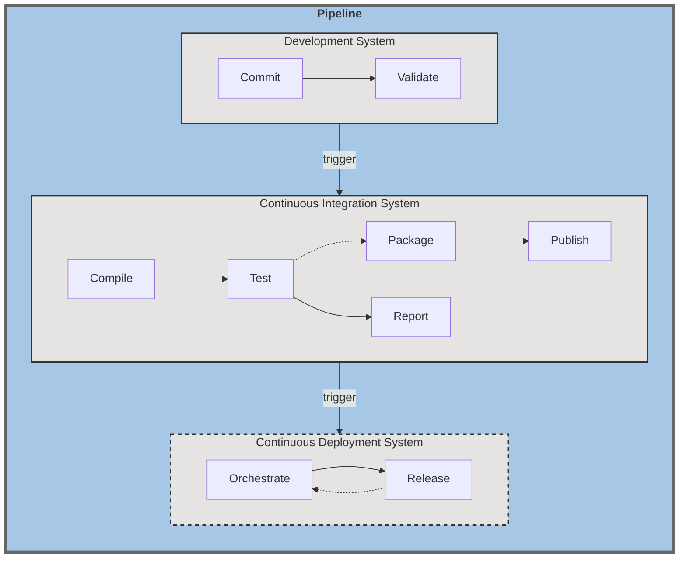
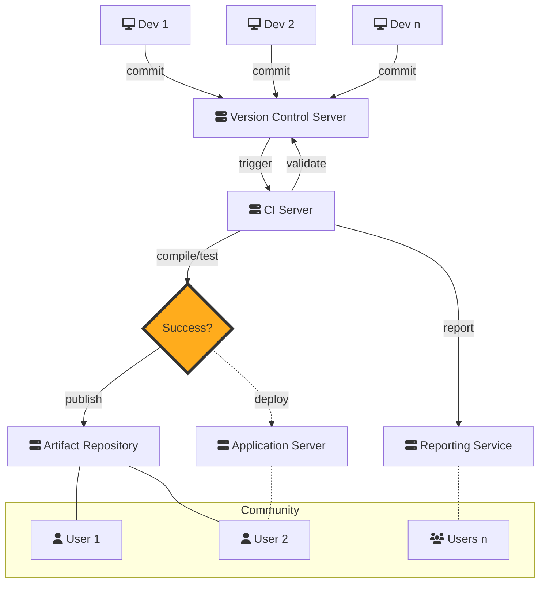

# Reference Architectures

## Overview
Architectures presented here provides a high-level reference guide for the implementation of 
continuous integration best practices. They describe the structure, component interrelationship and 
processes invoked without detailing any specific implementation. Please see categories and links 
below for details.

## Continuous Integration
Continuous integration (CI) is an automated process triggered by development changes to perform an 
end-to-end validation and presentation of software. There are a number of different steps whose goal 
is to ensure code works together, tests successfully and releases readily. CI is implemented as a 
_development pipeline_ that automates steps normally undertaken in a release process.

### An approach to best practices
Routine merging of components into a functional software product and publishing compiled binaries 
is the core of CI. It demands code be committed collaboratively and requires products from different 
development systems to work together. It tests software builds through a predictable process of known 
touchpoints that identify specific areas of interoperability and breakage. Compilation results are 
shared in a centralized system of logging and reporting. These approaches promote many software 
development best practices, but in particular [reduce risk](https://martinfowler.com/articles/continuousIntegration.html#BenefitsOfContinuousIntegration):
- [Single Source of Truth](https://martinfowler.com/articles/continuousIntegration.html#MaintainASingleSourceRepository.): 
All components and configurations must be bundled to prove compiles function, easing deployment of 
compiled binaries.
- [Fail Fast/Fix Fast](https://martinfowler.com/articles/continuousIntegration.html#FixBrokenBuildsImmediately): 
Know the limitations of compiled integrations and receive immediate notifications about failures.
- [Visibility/Open Success](https://martinfowler.com/articles/continuousIntegration.html#EveryoneCanSeeWhatsHappening): 
The state of the product is reported constantly on CI services.
- [Testing Availability](https://martinfowler.com/articles/continuousIntegration.html#AutomateDeployment): 
Automation allows repeatable deployment to test servers, elevating functional testing on par 
with release.

### Pipeline: A series of systems executing builds
A [CI pipeline](https://www.redhat.com/en/topics/devops/what-cicd-pipeline) is a series of automated 
processes, systems and triggers that execute in order to push software from raw code to a compiled 
product that may be deployed.  

The CI pipeline is composed of several systems linked together through a series of automation 
triggers: 
1. _Development System_  
The sum of [code commits](https://en.wikipedia.org/wiki/Commit_(version_control)) and [code 
versioning systems](https://en.wikipedia.org/wiki/Version_control), such as Git, comprised of systems 
that manage raw code. Modern implementations, such as [GitHub](https://github.com/), 
provide limited facilities to validate commits.
2. _Continuous Integration System_  
A collection of services that interact dynamically to perform such tasks as compilation, testing, 
reporting and/or archiving build artifacts. CI services, such as [Jenkins](https://www.jenkins.io/) 
or [Travis CI](https://www.travis-ci.com/), serve as management node for CI operations.
3. _Continuous Deployment System_  
Tooling and services, such as [Ansible](https://www.ansible.com/) or [Puppet](https://puppet.com/), 
that deploy published software into one or more venues for extended testing or delivery. Often, 
software outputs from the CI pipeline are deployed to development systems for extended user testing.

### Build systems are composed of discrete process steps
The compile-release-publish workflow is broken down to a series of discrete process steps that describe 
specific operations, ranging from commit processing to publishing compiled binaries. These discrete 
process steps are reported in logs and reports, helping identify specific points during processing 
and build failures. Process steps are associated with specific systems in the pipeline based on its 
role, so the Development System may focus on tracking code merging and commit history, for instance. 

#### Development System
- **Commit**  
Code management, including developer commits, merging and history, are tracked in this step. A commit 
triggers notifications to subsequent steps and systems to kick off the CI pipeline. 
- **Validate** (optional)  
Self-contained processing may take place to validate commit content in advance of triggering 
notifications to subsequent steps and systems. These may include facilities, similar to 
[Github Actions](https://docs.github.com/en/actions), that can be leveraged to validate files, amongst 
other tasks. 

#### Continuous Integration System
- **Compile** (core)  
Core software packages are compiled and the capacity to compile is validated, resulting in unpackaged 
binaries. Failures at this step indicate a problem in code, code merges or tooling. 
- **Test**   
At the core of CI is testing. The process is inherently checking for successful compilation and 
execution, and optionally validating software with unit, integration and other tests.  
_Successful Execution:_ Builds are inherently validated to ensure compilations complete successfully, 
and other processes germane to the build complete. **Errors or failures result in build failure where 
the compile-release-publish process is halted.**  
_Software Testing:_ (optional, desirable) Test software packages are compiled and the capacity to compile tests is validated, also. The test 
step will execute the compiled tests against core software packages to run [unit and other types of 
functional tests](https://nasa-ammos.github.io/slim/continuous-testing/reference-architectures/) on 
every build. Builds will proceed if no tests are implemented, however, test validation is material 
to the CI philosophy.  
- **Report**  
At the core of CI is reporting, both notifications and functional reporting.  
_Notifications:_ Developers are notified on successful completion of builds or failures. 
Notifications also trigger subsequent automation steps and systems.  
_Functional Reporting:_ (compile status, test results) Reports are a built-in feature in many CI 
systems, but extended reports can be generated also to track such items as test results locally or 
in connected systems. The Jenkins build server, for instance, maintains build logs that tie commit 
history and compile results to every single execution. Similarly, results from tests can be reported 
using extended tooling to servers such as [Gurock TestRail](https://www.gurock.com/testrail/) 
to retain test runs from every build. Build logs typically span all aspects of the 
compile-release-publish workflow, from code checkout to publishing compiled binaries. 
- **Package**  
The result of code compilation must be deliverable as manageable objects, and that is the purpose 
of the packaging phase. One or more compiled binaries may exist, as well as a set of properties or 
other application-required configurations. These are bundled into one or more collections typically 
compressed using one of a number of common formats, such as ZIP, JAR or TAR. In practice many build 
frameworks, such as [Apache Maven](https://maven.apache.org/), package automatically. This step 
allows the CI system to bundle, protect and lock down files for distribution and reproducibility.
- **Publish**  
The results of the compile-release-publish process are packaged binaries. These are shared with 
development and devops communities by publishing the files to one or more artifact repositories, 
such as [JFrog Artifactory](https://jfrog.com/artifactory/). Packaged binaries are versioned, 
checksummed and do not change after release -- core features of reliable and reproducible CI 
software delivery.

#### Continuous Deployment System
- **Orchestrate** (optional)  
The orchestration process downloads files and prepares target servers to launch. It moves compiled 
binaries and properties into place and configures required services on destination systems. Depending 
on complexity of the final product this step is optional.
- **Release** (optional)  
In CI implementations releasing product typically starts and announces applications on a development 
server used for extended functionality testing. An extension of this, Continuous Delivery (CD), 
automates functionality testing and deploys to multiple [release runway](https://www.techtarget.com/searchsoftwarequality/definition/staging-environment) 
destinations, including potentially directly to production. Releasing compiled product is optional 
depending on intended use cases (executable vs. API library) or whether further testing is desired.

### Actors and Automation
A more robust view of CI architecture describes the participants, both users and automated systems. 
The CI process always starts with developers who commit code, and it finishes with reliable, 
unchanging, versioned and packaged software delivered by an automated system.  

