# Reference Architectures

## Overview
Architectures presented here provides a high-level reference guide for the implementation of continuous integration best practices. They describe the structure, component interrelationship and processes invoked without detailing any specific implementation. Please see categories and links below for details.

## Continuous Integration
Continuous integration (CI) is an automated process triggered by development changes to perform an end-to-end validation and presentation of software. There are a number of different steps whose goal is to ensure code works together, tests successfully and releases readily. CI is implemented as a _development pipeline_ that automates steps normally undertaken in a release process.

### Background
Routine merging of components into a functional software product and publishing compiled binaries is the core of CI. It demands code be committed collaboratively and requires products from different development systems to work together. It tests software builds through a predictable process of known touchpoints that identify specific areas of interoperability and breakage. Compilation results are shared in a centralized system of logging and reporting. These approaches promote many software development best practices, but in particular [reduce risk](https://martinfowler.com/articles/continuousIntegration.html#BenefitsOfContinuousIntegration):
- [Single Source of Truth](https://martinfowler.com/articles/continuousIntegration.html#MaintainASingleSourceRepository.)  
All components and configurations must be bundled to prove compiles function, easing deployment of compiled binaries.
- [Fail Fast/Fix Fast](https://martinfowler.com/articles/continuousIntegration.html#FixBrokenBuildsImmediately)  
Know the limitations of compiled integrations and receive immediate notifications about failures.
- [Visibility/Open Success](https://martinfowler.com/articles/continuousIntegration.html#EveryoneCanSeeWhatsHappening)  
The state of the product is reported constantly on CI services.
- [Testing Availability](https://martinfowler.com/articles/continuousIntegration.html#AutomateDeployment)  
Automation allows repeatable deployment to test servers, elevating functional testing on par with release.

### Pipeline: A series of systems executing builds
A [CI pipeline](https://www.redhat.com/en/topics/devops/what-cicd-pipeline) is a series of automated processes, systems and triggers that execute in order to push software from raw code to a compiled product that may be deployed.  

The CI pipeline is composed of several systems linked together through a series of automation triggers: 
1. _Development System_  
The sum of [code commits](https://en.wikipedia.org/wiki/Commit_(version_control)) and 
[code versioning systems](https://en.wikipedia.org/wiki/Version_control), such as Git, comprised of systems that manage raw code. Hosted implementations, such as [GitHub](https://github.com/), provide limited facilities to validate commits.
2. _Continuous Integration System_  
A collection of services that interact dynamically to perform such tasks as compilation, testing, reporting and/or archiving build artifacts. CI services, such as [Jenkins](https://www.jenkins.io/) 
or [Travis CI](https://www.travis-ci.com/), serve as management node for CI operations.
3. _Continuous Deployment System_  
Tooling and services, such as [Ansible](https://www.ansible.com/) or [Puppet](https://puppet.com/), that deploy published software into one or more venues for extended testing or delivery. Often, software outputs from the CI pipeline are deployed to development systems for extended user testing.

### A CI Pipeline is composed of discrete process steps
The compile-release-publish workflow is broken down to a series of discrete process steps that describe specific operations, ranging from commit processing to publishing compiled binaries. These discrete process steps are reported in logs and reports, helping identify specific points during processing and build failures. Process steps are associated with specific systems in the pipeline based on its role, so the Development System may focus on tracking code merging and commit history, for instance. 

#### Development System
- **Commit**  
Code management, including developer commits, merging and history, are tracked in this step. A commit triggers notifications to subsequent steps and systems to kick off the CI pipeline. 
- **Validate** (optional)  
Self-contained processing may take place to validate commit content in advance of triggering notifications to subsequent steps and systems. These may include facilities, similar to [Github Actions](https://docs.github.com/en/actions), that can be leveraged to validate files, amongst other tasks. 

#### Continuous Integration System
- **Compile** (core)  
Core software packages are compiled and the capacity to compile is validated, resulting in unpackaged binaries. Failures at this step indicate a problem in code, code merges or tooling. 
- **Test**   
At the core of CI is testing, a process of inherently checking for successful compilation and execution, and optionally validating software with unit, integration and other tests.  
**_Successful Execution:_** Builds are inherently validated to ensure compilations complete successfully, and other processes germane to the build complete. _Errors or failures result in build failure where the compile-release-publish process is halted._  
**_Software Testing:_** (optional, desirable) Test software packages are compiled and the capacity to compile tests is validated, also. The test step will execute the compiled tests against core software packages to run [unit and other types of functional tests](https://nasa-ammos.github.io/slim/continuous-testing/reference-architectures/) on every build. Builds will proceed if no tests are implemented, however, test validation is material to the CI philosophy.  
- **Report**  
At the core of CI is reporting, both notifications and functional reporting.  
**_Notifications:_** Developers are notified on successful completion of builds or failures. These notifications support a number of electronic media, such as email, RSS feed and chat messaging in commonly used applications, such as [Slack](https://slack.com/).  
**_Other notifications_** may trigger subsequent automation steps and systems through technologies such as RESTful Web service messaging or simple HTTP requests. Think of notifying a [Kubernetes](https://kubernetes.io/) service to start deployment to a cloud computing platform.  
**_Functional Reporting:_** (compile status, test results) Reports are a built-in feature in many CI systems, but extended reports can be generated also to track such items as test results locally or in connected systems. The Jenkins build server, for instance, maintains build logs that tie commit history and compile results to every single execution. Similarly, results from tests can be reported using extended tooling to servers such as [Gurock TestRail](https://www.gurock.com/testrail/) to retain test runs from every build. Build logs typically span all aspects of the compile-release-publish workflow, from code checkout to publishing compiled binaries. 
- **Package**  
The result of code compilation must be deliverable as manageable objects, and that is the purpose of the packaging phase. One or more compiled binaries may exist, as well as a set of properties or other application-required configurations. These are bundled into one or more collections typically compressed using one of a number of common formats, such as ZIP, JAR or TAR. In practice many build frameworks, such as [Apache Maven](https://maven.apache.org/), package automatically. This step allows the CI system to bundle, protect and lock down files for distribution and reproducibility.
- **Publish**  
The results of the compile-release-publish process are packaged binaries. These are shared with development and devops communities by publishing the files to one or more artifact repositories, such as [JFrog Artifactory](https://jfrog.com/artifactory/). Packaged binaries are versioned, checksummed and do not change after release -- core features of reliable and reproducible CI software delivery.

#### Continuous Deployment System
- **Orchestrate** (optional)  
The orchestration process downloads files and prepares target servers to launch. It moves compiled binaries and properties into place and configures required services on destination systems. Depending on complexity of the final product this step is optional.
- **Release** (optional)  
In CI implementations releasing product typically starts and announces applications on a development server used for extended functionality testing. An extension of this, Continuous Delivery (CD), automates functionality testing and deploys to multiple [release runway](https://www.techtarget.com/searchsoftwarequality/definition/staging-environment) destinations, including potentially directly to production. Releasing compiled product is optional depending on intended use cases (executable vs. API library) or whether further testing is desired.

### Actors and Automation
A more robust view of CI architecture describes the participants, both users and automated systems. The CI process always starts with developers who commit code, and it finishes with reliable, unchanging, versioned and packaged software delivered by an automated system.  

```mermaid
flowchart TB
    D1([fa:fa-desktop Dev 1]) -->|push| R["fa:fa-server Version Control Server¹"]
    D2([fa:fa-desktop Dev 2]) -->|push| R
    Dn([fa:fa-desktop Dev n]) -->|push| R
    R -->|trigger| C["fa:fa-server CI Server²"]
    C-->|validate| R
    C-->|report| RS["fa:fa-server Reporting Service⁵"]
    Q{Compile<br/>& Test}
    S((Success))
    F[Notify]
    style Q fill:#FFAC1C,stroke:#333,stroke-width:4px
    C-->Q
    Q-->S
    Q-->|exception<br/>or change|F
    S-->|publish| AR["fa:fa-server Artifact Repository³"]
    S-.->|"deploy (opt.)"| AS["fa:fa-server Application Server⁴"]
    subgraph Community
        U1([fa:fa-user User 1])
        U2([fa:fa-user User 2])
        Un([fa:fa-users Users n])
    end
    style Community fill:#ECFFDC,stroke:#333,stroke-width:2px
    AR<-->U1 & U2
    AS<-.->U2
    RS<-.->Un
    F-.->U2
    style U1 fill:#F6F5F3,stroke:#333,stroke-width:1px
    style U2 fill:#F6F5F3,stroke:#333,stroke-width:1px
    style Un fill:#F6F5F3,stroke:#333,stroke-width:1px
```

###### **_NOTE: Physical servers are numbered in the above diagram._**
#### Participant Touchpoints
The actors in the CI process are code maintainers and end users. The automation takes place in servers or services between these actors. A more detailed understanding of the process itemizes the roles and responsibilities of each participant. This graph interleaves services with users and processes to explain process flow. 

👩‍💻 [**Action:** Push] **Developers**, or code maintainers, ("Dev 1...n") start the build process by committing and pushing code to a remote version control server (VCS), such as Git. This may be anything from a minor property change to new code, but in all cases the expectation is that code from one maintainers' workstation should execute identically and reliably on others. 

1🖥 [**Start** -- **Action:** Trigger, Content Validation] The **VCS server** reports when new code is delivered (commit) and performs content validation on that code. Content validation can range from verifying format of data in the commit to checking for specific content in files. On code acceptance and validation, a network request triggers to notify successive machines to continue processing. 

2🖥 [**Service** -- **Action:** Validate, Publish, Deploy (opt.), Report] The **Continuous Integration Server** (CI Server) provides a platform to execute various steps in the CI process. It's the core that handles both decision making and mechanics of compilation, testing and packaging. A unified interface provides a centralized location to view progress and success of application builds. The CI Server makes decisions on whether to proceed when code compiles and examines test results to verify test passes. It typically retains detailed logs of processes and test results that are made available through a user interface for on-demand viewing. Notifications are provided through both the user interface and other media, such as email. Additionally, the CI Server provides the platform that executes post-build steps, including publishing packaged artifacts or deploying those artifacts to servers for user consumption. This is all accomplished using built-in tooling or compatible scripting. 

3🖥 [**Endpoint**] The **Artifact Repository** is a dedicated software library for storing various build products ("artifacts") that is available on demand to developers, users and implementers. On successful builds the CI server publishes packaged artifacts to the repository to make them available broadly. 

4🖥 [**Endpoint**] The **Application Server** provides an execution environment with the final software package deployed in a runtime environment for extended use testing. Depending on the type of software project -- whether it's an API library, server application or executable -- deployment optionally provides a platform to demonstrate the product. Automated testing can be further leveraged to verify that an application performs as designed. Some CI processes extend the concept of automated deployment through a series of server destinations along a release runway. "Continuous Deployment (CD)" extends the CI process to automatically deploy packaged software in a production environment. 

5🖥 [**Service** -- **Notification and Reporting Services**] **Notify** and **Reporting Services** assume different forms to provide real-time information on build status. These are typically handled within the CI Server in the case of build failure emails. Build logs are published to the CI Server user interface for on-demand inspection. However, reporting in a CI process may also take the form of automated ticket creation in issue tracking software, such as [Atlassian Jira](https://www.atlassian.com/software/jira/guides/getting-started/overview) or test case reporting in test management software, such as _Gurock TestRail_. Notification is highly customizable in the CI server and in most cases leverages built-in server features. 

👥  [**End** -- **Action**: Usage] The target audience is, of course, the **User Community** ("User 1...n"), which is comprised of a number of participants from developers to application users. Primarily, the CI process delivers packaged binaries available for download, usage or integration from the Artifact Repository. These may be executed directly or used as dependencies in other code. A running version of the application may also be provided with an automated deployment to an Application Server. However, generally, users benefit prodigiously from logs, notifications and other information that provide invaluable insight and transparency to otherwise detailed and intricate build systems producing modern software. 

**Ultimately, the CI process benefits all users** with a predictable, controlled and automated mechanism to produce reliable software that is transparent and self-validating. This lends itself to tested, reproducible software deliveries with the crisp reliability and speed of automated systems. 
