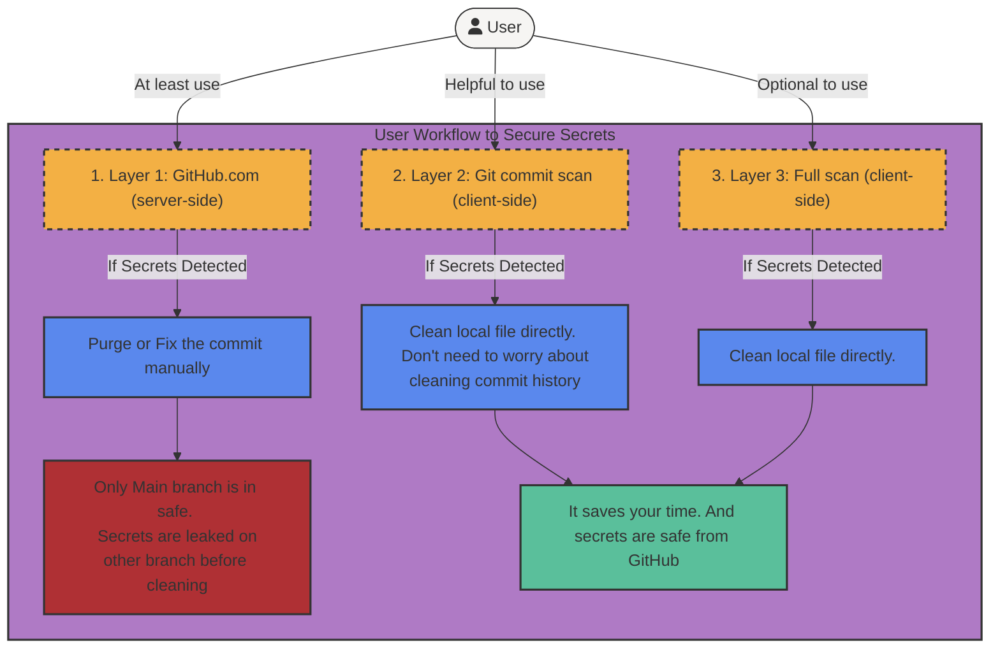

# Automated Checking for General Sensitive Information within Git

This page contains starter kit information for the open source tool [detect-secrets](https://github.com/Yelp/detect-secrets) and [pre-commit](https://github.com/pre-commit-ci) to help you get started with the detection of sensitive information across three layers of Git and GitHub repositories. This solution also provides [customized plugins](plug-ins/README.md) to support more types of secrets. Please see categories and links below for details.

## Content
* [What is detect-secrets?](#what-is-detect-secrets)
* [What is pre-commit?](#what-is-pre-commit)
* [Introduction to three layers of protection](#introduction-to-three-layers-of-protection)
* [Layer 1: client-side full scan of existing code base](#layer-1-client-side-full-scan-of-existing-code-base)
* [Layer 2: client-side scan of updated code upon Git commit](#layer-2-client-side-scan-of-updated-code-upon-git-commit)
* [Layer 3: server-side push to GitHub.com from client](#layer-3-server-side-push-to-githubcom-from-client)
* [Recommended workflow](#recommended-workflow)

## What is detect-secrets?
[detect-secrets](https://github.com/Yelp/detect-secrets) is an open source tool to detect secrets in files, which is recommended by [Microsoft](https://microsoft.github.io/code-with-engineering-playbook/continuous-integration/dev-sec-ops/secret-management/recipes/detect-secrets/) and the government (**TODO: John mentioned this. I have not found the link yet**). It is designed to be used as a pre-commit hook and/or as a CI step to prevent secrets from being committed to a repository. It is also designed to be used as a standalone tool to scan a codebase for secrets.

## What is pre-commit?
[pre-commit](https://pre-commit.com/) is a framework for managing and maintaining multi-language pre-commit hooks. It is a command line tool that is installed on the developer’s local machine. It can also be used as a service, [pre-commit.ci](https://pre-commit.ci/), which is a free service for open source projects.

## Introduction to three layers of protection
This page proposes three layers of secret scanning to help preventing secrets from being leaked on GitHub

Three layers of protection are:
1. Client-side full scan of existing code base
2. Client-side scan of updated code upon Git commit
3. Server-side push to GitHub.com from client

Each layer has its own advantages and disadvantages. The full use of these three layers of protection is recommended to minimize human negligence.

Here is the overview of user workflow diagram:


## Layer 1: client-side full scan of existing code base
This layer allows you to scan current local code base for secrets. It also provides a way to easily read and label the scan result ([Auditing a Baseline](https://github.com/Yelp/detect-secrets#auditing-a-baseline)). In this page, it also provides customized version of [detect-secrets](https://github.com/perryzjc/detect-secrets) to support more types of secrets.

**Starter Kit**:
1. Install default [detect-secrets](https://github.com/Yelp/detect-secrets)
```bash
pip install detect-secrets
```
or Install enhanced [detect-secrets](https://github.com/perryzjc/detect-secrets)
```bash
pip install git+https://github.com/perryzjc/detect-secrets@v1.4.4
```
> **Additional Secret Types Supported**
> * [AWS sensitive information]() (click for more information)
> * IP address
> * Absolute path
> * Email address

2. Scan all local files from current directory and output the result to a file
```bash
detect-secrets scan ./ --all-files > .secrets.baseline
```

3. Check result method 1: read the result directly from the file `.secrets.baseline`
```bash
cat .secrets.baseline
```
> **Note**: If any secrets are detected, the result will be located at the `"results":` of the file. 

For example: 
```json
"results": {
    "Jenkins/e2e-opera-pcm-develop.sh": [
    {
    "type": "AWS Sensitive Information",
    "filename": "Jenkins/e2e-opera-pcm-develop.sh",
    "hashed_secret": "a2c61f79dd90429e5284ab45de3318c16756a2f0",
    "is_verified": false,
    "line_number": 39
},
```

Only line number is visible through this method. To see the actual secret, you need to use method 2.

3. Check result method 2: [auditing the result](https://github.com/perryzjc/detect-secrets#auditing-a-baseline)
```bash
detect-secrets audit .secrets.baseline
```
> **Note**: It can provide you an interactive interface to view the actual secret and label it as false positive or true positive.

For example:


## Layer 2: client-side scan of updated code upon Git commit
This layer allows you to easily set up a pre-commit hook to prevent commit from creating if any secrets exist. This layer uses the recommended way through [pre-commit](https://pre-commit.com/).

**Starter Kit**:
1. Install [pre-commit](https://pre-commit.com/)
```bash
pip install pre-commit
```
2. Set up `.pre-commit-config.yaml` on the root directory of your project

For default detect-secrets:
```yaml
repos:
  - repo: https://github.com/Yelp/detect-secrets
    rev: v1.4.0
    hooks:
      - id: detect-secrets
        args: ['--baseline', '.secrets.baseline']
```

For enhanced detect-secrets:
```yaml
repos:
- repo: https://github.com/perryzjc/detect-secrets
  rev: v1.4.4
  hooks:
  - id: detect-secrets
    args: ['--baseline', '.secrets.baseline']
```

3. Install pre-commit hook based on `.pre-commit-config.yaml`
```bash
pre-commit install
```
This command will create a `.git/hooks/pre-commit` file based on the configuration in `.pre-commit-config.yaml`. It will be triggered before each commit.

4. Set up `.secrets.baseline` file on the root directory of your project
```bash
detect-secrets scan ./ --all-files > .secrets.baseline
```
> **Note**: pre-commit hook block commit by comparing new secrets with the results in `.secrets.baseline` file. If you want to add new secret results, you need to update `.secrets.baseline` file by re-running the scan command and generate a new baseline file.
> 
> You can create an empty baseline file by running this command at a directory without secrets.

5. Now, if any new secrets are detected, the commit will be blocked. And you will be able to see the error message in the terminal.
For example:


6. You can handle this output by either:
* Remove the new secrets from the code base
* Generate a new baseline file by running the scan command and update the baseline file.
```bash
detect-secrets scan ./ --all-files > .secrets.baseline
```

## Layer 3: server-side scan of updated code upon Git push
This layer serves as the final layer. As long as anyone set up this layer, GitHub will be able to draw the report of secrets in the code base. When the status check is failed, by setting up branch protection,it can also protect the repository from being pushed or merged to the main branch.

> This layer has some major issues:
> 1. It can not prevent commit from pushing to GitHub even though it can protect the main branch from being pushed or merged. Secrets can still exist on other branches.
> 2. Reports generated are visible to the public if using default setup provided by [pre-commit.ci](https://pre-commit.ci/) or GitHub Action
>    * public is able to see the results about 1. filename, 2. line number, 3. secret type, 4. hashed secret
>    * Additional setup is able to solve the visibility issue, but it requires additional efforts such as an private repository to receive the reports from the public repository.

**Starter Kit**:
1. Use the same `.pre-commit-config.yaml` file as layer 2 (on the root directory of your project)
2. Use the same `.secrets.baseline` file as layer 2 (on the root directory of your project)
3. Register your repository on [pre-commit.ci](https://results.pre-commit.ci/)


4. Once after the registration, every time when you push commits to the repository, pre-commit.ci will run detect-secrets (based on the yaml file) and generate a report. You can see the report on your project GitHub repository or [pre-commit.ci](https://results.pre-commit.ci/) website.


5. If you set up the main branch as protected, you can also set up the status check to prevent push or merge to the main branch if any secrets are detected.


## Recommended workflow
1. At least use layer 3 to protect the main branch from being pushed or merged if any secrets are detected.
2. If any secrets are detected during layer 3, you can:
   - Clean the commit history of the branch
     - To find out the files that needs clean, you can use layer 1's auditing feature
3. Recommend to set up layer 2 for every developer
   - It can minimize the chance of pushing secrets to the cloud
   - Local files are easier to clean than GitHub commit history
4. layer 1 is involved during each stage
   - It helps you generate baseline file for layer 2 and 3
   - Read the secret easily by using auditing feature
