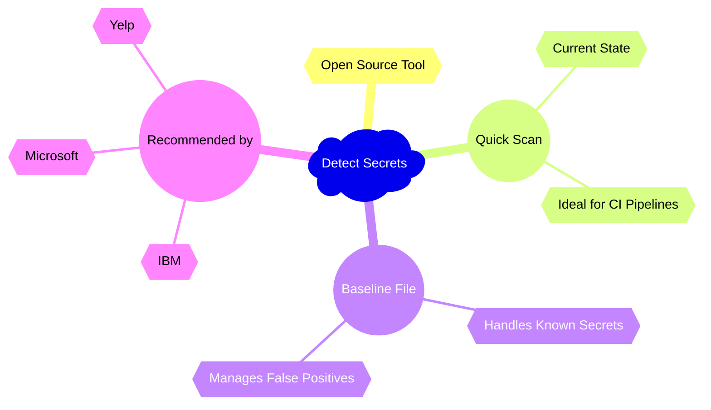
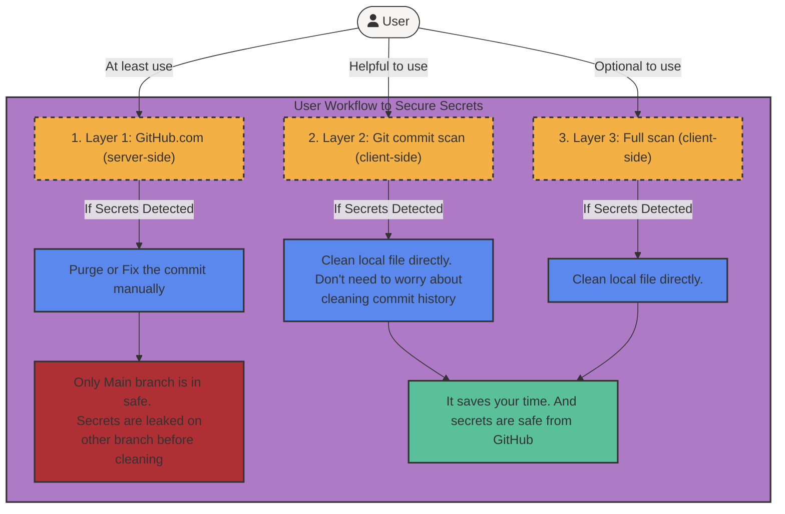
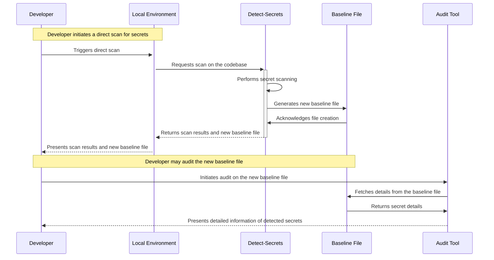
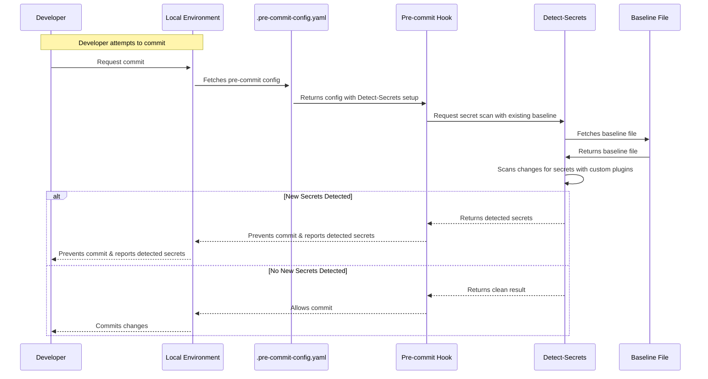
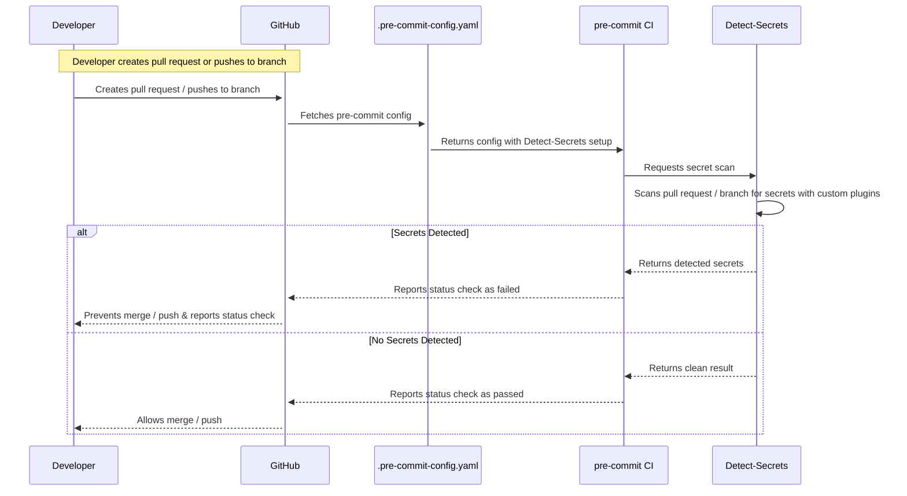
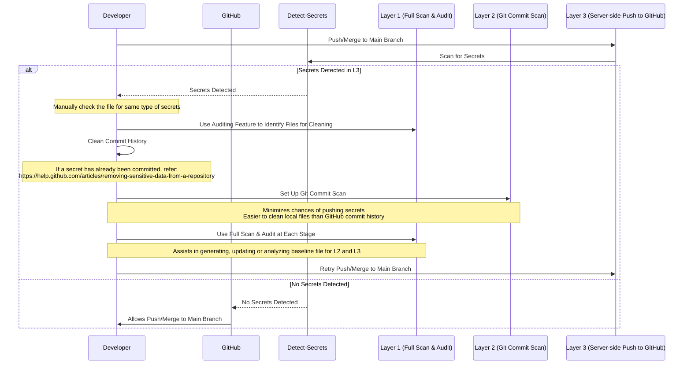

# Starter Kits

This page contains starter kit information, which represent templates, code and configuration to help you get started quickly with continuous testing best practices described in this overall guide. Please see categories and links below for details. 

## Static Application Security Testing

This section contains links to sample actions, templates and configurations that analyze and validate code for security flaws and sensitive information. Identifying security vulnerabilities and sensitive data is an [OSS cybersecurity](https://www.cisa.gov/uscert/ncas/alerts/aa22-137a) [best practice](https://appel.nasa.gov/2022/06/30/spotlight-on-lessons-learned-open-source-and-commercial-web-software-vulnerabilities/).  

### Detect Secrets 
[detect-secrets](https://github.com/Yelp/detect-secrets), an open-source tool employed and recommended by leading technology companies such as [Microsoft](https://microsoft.github.io/code-with-engineering-playbook/continuous-integration/dev-sec-ops/secret-management/recipes/detect-secrets/), [IBM](https://github.com/IBM/detect-secrets), and [Yelp](https://github.com/Yelp/detect-secrets), is instrumental in identifying sensitive information within project files. Its prowess lies in its extensible Python plugin API, which allows custom rules and heuristics to tackle a broad spectrum of secrets. Designed to scan the project's current state rather than the entire git history, 
it operates swiftly, making it ideal for continuous integration pipelines. Leveraging the concept of a "baseline file" (`.secrets.baseline`), it enables easy handling of known secrets and false positives, facilitating its gradual integration into existing projects. 



Our application of `detect-secrets` embraces a tri-layered approach, bolstered by customized plugins, to provide robust protection against potential secret leaks at the earliest stage.
This page proposes three layers of secret scanning to help preventing secrets from being leaked on GitHub

Three layers of protection are:
1. Client-side full scan of existing code base
2. Client-side scan of updated code upon Git commit
3. Server-side push to GitHub.com from client

Each layer has its own advantages and disadvantages. The full use of these three layers of protection is recommended to minimize human negligence.

#### Layer 1: Full Scan and Audit (Client-side)
The first layer initiates a direct scan on the developer's local environment. This is achieved through the `detect-secrets` tool, which scans the entire codebase and outputs a new baseline file containing any detected secrets. The developer can then audit this file to view detailed information about any detected secrets. Detailed documentation for Layer 1

Starter Kit:
1. Install [detect-secrets](https://github.com/Yelp/detect-secrets)
```bash
pip install detect-secrets
```
##### 2. Install our additional configurations
cd to your project root directory
```bash
cd <your-project-root-directory>
```

Download our customized setup
```bash
git clone --depth 1 https://github.com/NASA-AMMOS/slim-config-detect-secrets.git temp_repo && \
# Copy needed files and folders from the temporary folder to the current project directory
cp -r temp_repo/.detect-secrets . && \
cp -r temp_repo/.pre-commit-config.yaml . && \
# Remove the temporary folder
rm -rf temp_repo
```

After running this command, you will see a new folder `.detect-secrets` and a new file `.pre-commit-config.yaml` in your project root directory.

In `.detect-secrets` folder, there are `.secrets.baseline` file and `plugins` folder. 

For example,
```text
├── .detect-secrets
│   ├── .secrets.baseline
│   └── plugins
│       ├── ...
│       ├── ...
│       ├── ...
├── .pre-commit-config.yaml
```
> Note: We are in the progress of contributing these general plugins back to the `detect-secrets` community.
> Once they are accepted, configuration will be simplified.
3. Scan all local files from current directory and output the result as a baseline file
```bash
mkdir -p .detect-secrets \
&& detect-secrets scan ./ \
  --all-files \
  --baseline .detect-secrets/.secrets.baseline \
  --exclude-files '^\.git(/.*)?$' \
  --exclude-files '^\.detect-secrets(/.*)?$' \
  -p .detect-secrets/plugins/absolute_filepath.py \
  -p .detect-secrets/plugins/aws_sensitive_info.py \
  -p .detect-secrets/plugins/email_address.py \
  -p .detect-secrets/plugins/ip_address.py
```
This command will scan all files from current directory and output the result as a baseline file `.detect-secrets/.secrets.baseline`.
4. Check result in the baseline file
```bash
cat .detect-secrets/.secrets.baseline
```
If any secrets are detected, the result will be located at the "results": of the file.

For example,
```json
"results": {
    "Jenkins/e2e-opera-pcm-develop.sh": [
    {
    "type": "AWS Sensitive Information",
    "filename": "Jenkins/e2e-opera-pcm-develop.sh",
    "hashed_secret": "a2c61f79dd90429e5284ab45de3318c16756a2f0",
    "is_verified": false,
    "line_number": 39
},
```
5. Analyze results by `audit` tool
```bash
detect-secrets audit .detect-secrets/.secrets.baseline
```
> detect-secrets audit tool can provide you an interactive interface to view the actual secret based on the line number
> and label it as false positive or true positive.

For example,


#### Layer 2: Git Commit Scan (Client-side)
The second layer is a pre-commit hook implemented in the local environment. This hook utilizes a pre-configured `.pre-commit-config.yaml` file, which contains a baseline file for secret comparison. If any new secrets are detected during the commit process, the hook prevents the commit from being created. This acts as a safety net, ensuring no new secrets are accidentally committed. Detailed documentation for Layer 2

Starter Kit:
1. Install [pre-commit](https://pre-commit.com/#install)
```bash
pip install pre-commit
```
2. [Install our additional configurations (same as layer 1)](#2-install-our-additional-configurations)
3. Install pre-commit hook
```bash
pre-commit install
```
> This command will install a pre-commit hook in your local git repository based on the configurations in `.pre-commit-config.yaml` file.
4. Commit your changes

    Now, you can commit your changes as usual. If any new secrets are detected, the commit will be prevented and the secrets will be reported.

    For example,

    


> **Note**: pre-commit hook block commit by comparing new secrets with the results in `.secrets.baseline` file. If you want to add new secret results, you need to update `.secrets.baseline` file by re-running the scan command and generate a new baseline file.
>
> You can create an empty baseline file by running this command at a directory without secrets.

#### Layer 3: Server-side Push to GitHub.com
The final layer of our solution is a server-side pre-commit scan powered by `pre-commit.ci`. This scan is triggered whenever a developer pushes to a branch or creates a pull request. It uses the same `.pre-commit-config.yaml` file as Layer 2, ensuring consistency between local and server-side checks. If the scan detects any new secrets, it returns a status check. If the target branch is protected, GitHub uses this status check to decide whether the merge or push can proceed. Detailed documentation for Layer 3

This multi-layered approach to secret scanning provides a robust and comprehensive secret detection system, reducing the risk of exposing sensitive information in your codebase. For a more in-depth explanation of each layer, please refer to the respective detailed documentation links.


Starter Kit:
1. [Install our additional configurations (same as layer 1 and layer 2)](#2-install-our-additional-configurations)

2. Register your repository on [pre-commit.ci](https://results.pre-commit.ci/)
   
   After this, every time you push to a branch or create a pull request, pre-commit.ci will run a scan and report the results as a status check.

   
   
   

3. [Protect your branch](https://docs.github.com/en/repositories/configuring-branches-and-merges-in-your-repository/managing-protected-branches/managing-a-branch-protection-rule)

    After this, if status check fails, GitHub will prevent the merge or push to the protected branch.

#### Attention for using Detect Secrets
> 1.It does not [show all the same type of secrets in a same file to minimize noise](https://github.com/Yelp/detect-secrets/blob/master/docs/design.md#:~:text=Furthermore%2C%20this%20will%20not%20flag%20on%20every%20single%20usage%20of%20a%20given%20secret%20in%20a%20given%20file%2C%20to%20minimize%20noise.)
> 
> This means sometimes it will only show one secret in a file even if there are multiple **same type of secrets** in the same file.
> Audit tool will not show all the secrets due to this reason.
>
> **->** Thus, when you see a secret is detected, best practice is to **manually** check that file.

> 2.Even though detect-secrets has strong secret-detect ability compared to other tools, it is still possible that detect-secrets will not show you a file that contains secrets due to a new type of secret not capable by current plugins.
>
> **->** Thus, the best practice is always to be careful as a developer and **manually** check the files that you think might contain secrets.
>> `detect-secrets` is a backup approach to minimize the chance of pushing secrets to the cloud.

#### Recommended Workflow
1. At least use layer 3 (Server-side push to GitHub.com) to protect the main branch from being pushed or merged if any secrets are detected.
2. If any secrets are detected during layer 3, you can:
    - Clean the commit history of the branch
        - To find out the files that needs clean, you can use layer 1's auditing feature as assistance
        - If a secret has already been committed, visit
          https://help.github.com/articles/removing-sensitive-data-from-a-repository
3. Recommend to set up layer 2 (Git commit scan, client-side) for every developer
    - It can minimize the chance of pushing secrets to the cloud
    - Local files are easier to clean than GitHub commit history
4. Layer 1 (Full scan and audit, client-side) can be involved during each stage
    - It helps you generate, update or analyze baseline file for layer 2 and 3



#### More Configurations
Check out
1. [detect-secrets](https://github.com/Yelp/detect-secrets)
2. [pre-commit](https://pre-commit.com/)
3. [pre-commit.ci](https://pre-commit.ci/)

## Software Composition Analysis

This section contains links to sample actions, templates and configurations that analyze and validate composition of Open Source Software (OSS) components in software systems. Identifying software and licensing vulnerabilites and ensuring routine software updates is an [OSS cybersecurity](https://www.cisa.gov/uscert/ncas/alerts/aa22-137a) [best practice](https://appel.nasa.gov/2022/06/30/spotlight-on-lessons-learned-open-source-and-commercial-web-software-vulnerabilities/).  

### Dependabot
A GitHub ecosystem tool for dependency version and security vulnerability analysis.

#### Automated Dependency Updates

This Dependabot task provides an automated check for OSS component updates and automatically creates [pull requests](https://docs.github.com/en/code-security/dependabot/working-with-dependabot/managing-pull-requests-for-dependency-updates) to commit new versions. 

Starter Kit:
- [SLIM Starterkit Python -- Dependabot Script](https://github.com/NASA-AMMOS/slim-starterkit-python/blob/main/.github/dependabot.yml) to install in your GitHub repo

To leverage Dependabot, make sure to do the following:
1. Discuss with your development team the cybersecurity best practice to regularly update OSS to latest versions and seek consensus on a workflow to accept proposed updates.
2. Add Dependabot automation to your repository, either via the **admin console** or **manually** (choose **one**):
> **Shortcut**  
  Copy the pre-set configuration to an identical path in your repository, e.g. `.github/dependabot.yml`.
   * **Admin console:** (requires admin rights)
      1. Proceed to [enable Dependabot alerts through GitHub Settings UI](https://docs.github.com/en/code-security/dependabot/dependabot-alerts/configuring-dependabot-alerts#enabling-or-disabling-dependabot-alerts-for-a-repository).
   * **Manually:** (_approach available to all committers_)
      1. Create an issue and an issue branch to implement a code change. Checkout the issue branch.
      2. Copy the Dependabot configuration file from one of the SLIM Starterkit repos -- for example, [`dependabot.yml` in the Python Starterkit](https://github.com/NASA-AMMOS/slim-starterkit-python/blob/main/.github/dependabot.yml) -- into the root of your repository at `.github/dependabot.yml`.
3. Modify [Dependabot configurations](https://docs.github.com/en/code-security/dependabot/dependabot-version-updates/configuration-options-for-the-dependabot.yml-file#configuration-options-for-the-dependabotyml-file) for your project: 
> **Requirement**  
  Set properties to match your repository setup, including core packaging system.
   * Set the `package-ecosystem` property to [match your packaging system](https://docs.github.com/en/code-security/dependabot/dependabot-version-updates/configuration-options-for-the-dependabot.yml-file#package-ecosystem) in `dependabot.yml`.
   * Set the `target-branch` to the [name of your default branch](https://github.com/NASA-AMMOS/slim-starterkit-python/branches) in `dependabot.yml`.
   * Optionally, value-added features may be set, including such settings as [scheduling](https://docs.github.com/en/code-security/dependabot/dependabot-version-updates/configuration-options-for-the-dependabot.yml-file#scheduleday), a [strategy for versioning](https://docs.github.com/en/code-security/dependabot/dependabot-version-updates/configuration-options-for-the-dependabot.yml-file#versioning-strategy) and [pull request reviewers](https://docs.github.com/en/code-security/dependabot/dependabot-version-updates/configuration-options-for-the-dependabot.yml-file#reviewers).
4. Dependabot is now installed and detections can be tracked through the dependency graph at [`Insights` **->** `Dependency graph` **->** `Dependabot`](https://github.com/NASA-AMMOS/slim-starterkit-python/network/updates). [Pull Requests](https://github.com/NASA-AMMOS/slim-starterkit-python/pulls) also will include automatically created Dependabot merges.

#### Automated Security Updates

This Dependabot task automates security scanning for [known vulnerabilities](https://github.com/advisories) in OSS components and automatically creates [pull requests](https://docs.github.com/en/code-security/dependabot/working-with-dependabot/managing-pull-requests-for-dependency-updates) to update flagged components.  

[Dependabot Security Updates](https://docs.github.com/en/code-security/dependabot/dependabot-security-updates) requires [Dependabot Automated Dependency Updates](./README.md#automated-dependency-updates) (see above). Although technically part of the same automation stack, it's [enabled through the GitHub Settings UI](https://docs.github.com/en/code-security/dependabot/dependabot-security-updates/configuring-dependabot-security-updates#enabling-or-disabling-dependabot-security-updates-for-an-individual-repository). Optionally, dependency updates can be disabled so that only security updates create pull requests.

> **Requirement**  
  Install and set up the Starter Kit for Dependabot Automated Dependency Updates.

To leverage this template, make sure to do the following:
1. Discuss with your development team the cybersecurity best practice to regularly scan OSS components for security flaws and seek consensus on a workflow to accept proposed updates.
2. Enable Security Updates:
   1. At [`Settings` **->** `Code security and analysis` **->** `Dependabot`](https://github.com/NASA-AMMOS/slim-starterkit-java/settings/security_analysis), select the `Enable` button to turn on `Dependabot security updates`.
> **Requirement**  
  Admin rights are necessary to modify `Code security and analysis` settings.
3. Modify [Dependabot configurations](https://docs.github.com/en/code-security/dependabot/dependabot-version-updates/configuration-options-for-the-dependabot.yml-file#configuration-options-for-the-dependabotyml-file) for your project: (optional)
   1. If only security-related pull requests are desired, [set the `open-pull-requests-limit` property to `0` for `updates` block(s)](https://docs.github.com/en/code-security/dependabot/dependabot-version-updates/configuration-options-for-the-dependabot.yml-file#open-pull-requests-limit).
