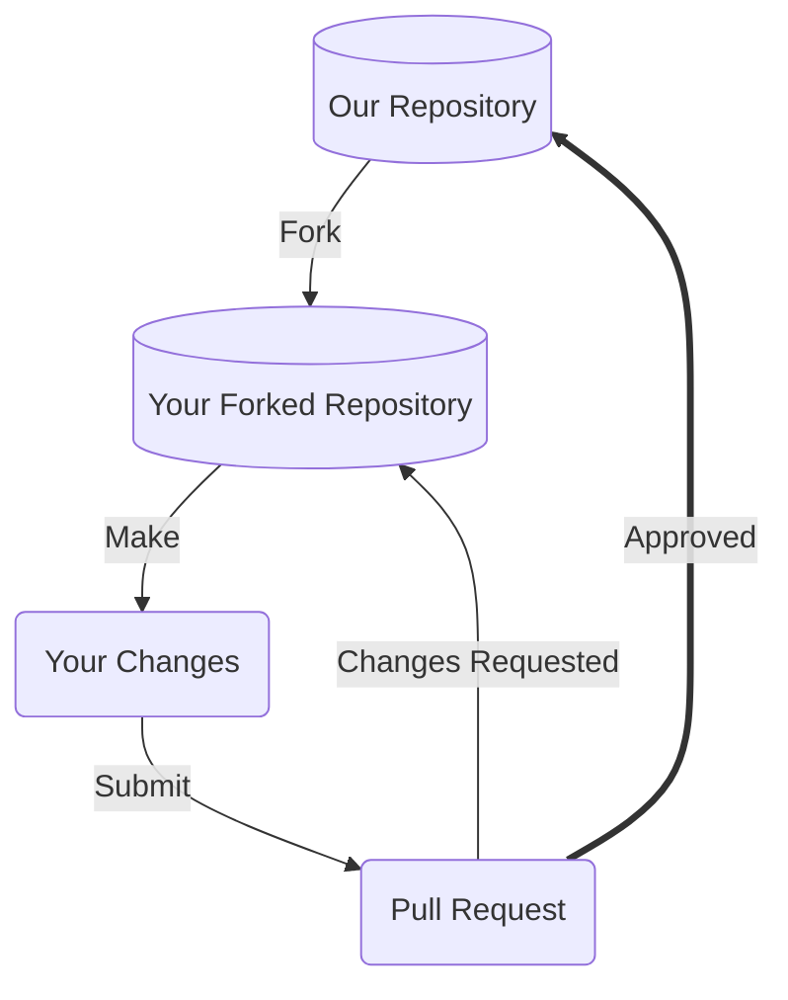

# Our Development Process

Our project integrates contributions from many people, and so we'd like to outline a process you can use to visualize how your contributions may be integrated if you provide something. 



## Fork our Repository

Forking our repository, as opposed to directly committing to a branch is the preferred way to propose changes. 

See [this GitHub guide](https://docs.github.com/en/get-started/quickstart/fork-a-repo) on forking for information specific to GitHub.com

### Find or File an Issue

Make sure people are aware you're working on a patch! Check out our [issue tracking system](https://github.com/NASA-AMMOS/slim/issues) and find an open issue you'd like to work against, or alternatively file a new issue and mention you're working on a patch.

### Choose the Right Branch to Fork

Our project typically has the following branches available, make sure to fork either the default branch or a branch someone else already tagged with a particular issue ticket you're working with.
- `main` - default branch, and contains mature SLIM deliverables and should be the typical branch you fork
- `gh-pages` - live rendering of SLIM website, auto-generated by changes committed to `main` branch via [a GitHub Action](https://github.com/NASA-AMMOS/slim/blob/main/.github/workflows/docusaurus.yml)

## Make your Modifications

Within your local development environment, this is the stage at which you'll propose your changes, and commit those changes back to version control. See the [README.md](https://github.com/nasa-ammos/slim/README.md) or development guide for more specifics on what you'll need as prerequisites to setup your local development environment.

### Commit Messages

Commit messages to version control should reference a ticket in their title / summary line:

```
Issue #248 - Show an example commit message title
```

This makes sure that tickets are updated on GitHub with references to commits that are related to them.

Commit should always be atomic. Keep solutions isolated whenever possible. Filler commits such as "clean up white space" or "fix typo" should be merged together before making a pull request, and significant sub-feature branches should be [rebased](https://www.youtube.com/results?search_query=git+rebase) to preserve commit history. Please ensure your commit history is clean and meaningful!

Additionally, remember to "Sign-Off" on your commits to align with our [Developer Certificate of Origin (DCO) policy](#developer-certificate-of-origin-dco). 

## Submit a Pull Request

Pull requests are the core way our project will receive your patch contributions. Navigate to your branch on your own fork within the version control system, and submit a pull request or submit the patch text to our project. 

Please make sure to provide a meaningful text description to your pull requests, whenever submitted. Our pull-request template will be auto-generated for you when you create your pull-request. See the template [here](https://nasa-ammos.github.io/slim/.github/PULL_REQUEST_TEMPLATE.md). 

**Working on your first Pull Request?** See guide: [How to Contribute to an Open Source Project on GitHub](https://kcd.im/pull-request)

## Reviewing your Pull Request

Reviewing pull-requests, or any kinds of proposed patch changes, is an art. That being said, we follow the following best practices:
- **Intent** - is the purpose of your pull-request clearly stated?
- **Solution** - is your pull-request doing what you want it to?
- **Correctness** - is your pull-request doing what you want it to *correctly*?
- **Small Patches** - is your patch of a level of complexity and brevity that it can actually be reviewed by a human being? Or is does it involve too much content for one pull request?
- **Coding best practices** - are you following best practices in the coding / contribution language being used?
- **Readability** - is your patch readable, and ultimately maintainable, by others?
- **Reproducibility** - is your patch reproducible by others?
- **Tests** - do you have or have conducted meaningful tests?
