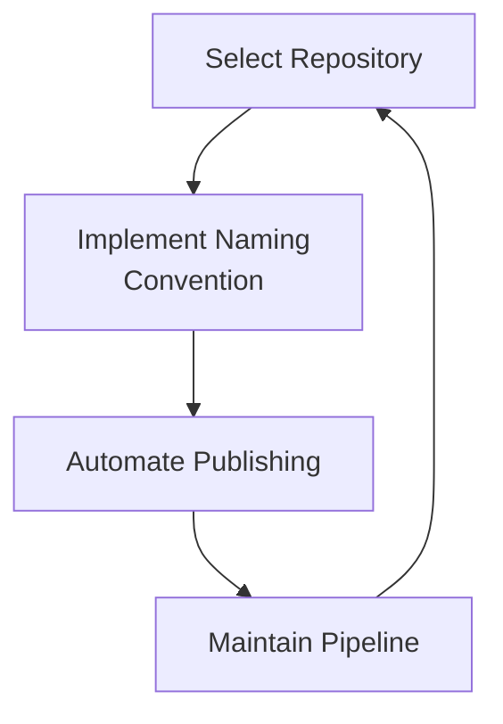
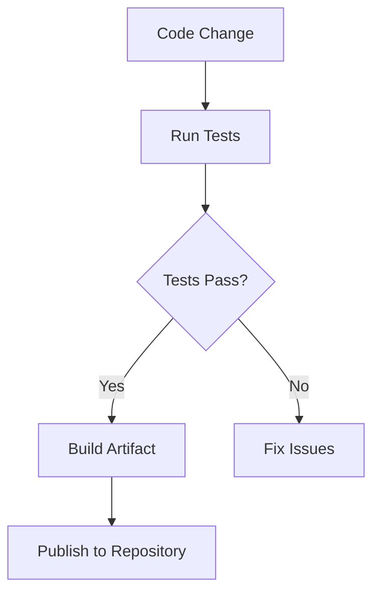

# Continuous Delivery

<pre align="center">A comprehensive guide to developing a continuous delivery plan, implementation, and automation approach for your project.</pre>

<!--

-->

## Introduction

### Background 

Continuous Delivery (CD) is the practice of automatically building, testing, and preparing code changes for release to production. It extends Continuous Integration by ensuring that all code changes after passing automated tests are immediately ready for deployment. This guide provides a streamlined approach to implementing CD through standardized repository choices, naming conventions, and automation processes.

### Approach

Our recommendation is to follow a 4-step plan for continuous delivery: (1) select appropriate repositories, (2) implement standardized naming, (3) automate publishing, and (4) maintain delivery pipeline.



### Use Cases

- Automatically publishing built artifacts to package managers
- Standardizing package naming across repositories
- Implementing versioned releases with semantic versioning
- Managing test data distribution
- Automating container image publishing
- Facilitating infrastructure as code deployment

## Quick Start

The most important step in setting up continuous delivery is choosing the right repositories and implementing proper naming conventions.

**Key Concepts to Get Started:**

**[⬇️ Choose a Package Repository](#package-repositories)** based on your artifact type:
- PyPI for Python packages
- Maven Central for Java
- NPM Registry for NodeJS
- ECR (Amazon Elastic Container Registry)/DockerHub for Containers

**📝 Implement [Standardized Naming Conventions](#naming-conventions):**
- `nasa-[project-org]-[module-name]` for Python
- `gov.nasa.[project-org].[module-name]` for Java
- `@nasa-[project-org]/[module-name]` for NodeJS

**🚀 Set up [Automated Publishing](#automated-publishing)** using GitHub Actions

## Step-by-Step Guide

### 1. Select Package Repositories

Choose appropriate repositories based on your artifact type:

#### 1.1 Code Packages

##### Python Packages
- **Repository**: PyPI
- **Size Limit**: 60MB
- **Cost**: Free
- **Best For**: Python libraries and tools
- **Setup Steps**:
  1. Create account on PyPI
  2. Set up project with `setup.py` or `pyproject.toml`
  3. Configure automated publishing

##### Java Packages
- **Repository**: Maven Central
- **Size Limit**: No specific limit
- **Cost**: Free
- **Best For**: Java libraries and frameworks
- **Setup Steps**:
  1. Create Sonatype account
  2. Configure Maven settings
  3. Set up GPG signing

##### NodeJS Packages
- **Repository**: NPM Registry
- **Size Limit**: No specific limit
- **Cost**: Free
- **Best For**: JavaScript/TypeScript packages
- **Setup Steps**:
  1. Create NPM account
  2. Configure package.json
  3. Set up automated publishing

#### 1.2 Container Images

##### Public Containers
- **Repository**: GitHub Packages/GitLab Registry
- **Best For**: Open source projects
- **Limitations**: Higher latency for runtime

##### Private Containers
- **Repository**: Amazon ECR
- **Best For**: Production deployments
- **Features**: Low-latency pulls, private repos

#### 1.3 Test Data

##### Small Datasets (<2GB)
- **Repository**: GitHub/GitLab Releases
- **Naming**: `[project-org]-[project-module]-test-dataset`
- **Best For**: Unit test data, small samples

##### Medium Datasets (2GB-100GB)
- **Repository**: Amazon S3
- **Features**: Pre-signed URLs, bandwidth control
- **Best For**: Integration test data

##### Large Datasets (>100GB)
- **Repository**: EOSDIS DAAC (Earth data) or PDS (Planetary data)
- **Best For**: Mission data, large-scale testing

### 2. Implement Naming Conventions

#### 2.1 Package Naming
Follow standard naming conventions for each repository type:

```mermaid
graph TD
    A[Package Type] --> B{Language?}
    B -->|Python| C[nasa-project-module]
    B -->|Java| D[gov.nasa.project.module]
    B -->|NodeJS| E[@nasa-project/module]
```

#### 2.2 Version Naming
Use semantic versioning (MAJOR.MINOR.PATCH):
- MAJOR: Breaking changes
- MINOR: New features, backward compatible
- PATCH: Bug fixes

### 3. Automate Publishing

#### 3.1 GitHub Actions Workflow

```yaml
name: Publish Package

on:
  release:
    types: [published]

jobs:
  publish:
    runs-on: ubuntu-latest
    steps:
      - uses: actions/checkout@v3
      - name: Set up environment
        uses: actions/setup-python@v3
        with:
          python-version: '3.x'
      - name: Build and publish
        env:
          TWINE_USERNAME: ${{ secrets.PYPI_USERNAME }}
          TWINE_PASSWORD: ${{ secrets.PYPI_PASSWORD }}
        run: |
          python -m pip install build twine
          python -m build
          python -m twine upload dist/*
```

#### 3.2 Automated Testing Integration



### 4. Maintain Delivery Pipeline

Regular maintenance tasks:
1. Update repository credentials
2. Monitor publishing success rates
3. Verify artifact integrity
4. Review and update workflows
5. Clean up old artifacts

## Frequently Asked Questions (FAQ)

**Q: How do I handle dependencies between packages?**

A: Use semantic versioning and dependency ranges to manage package relationships.

**Q: What about handling sensitive data in artifacts?**

A: Use private repositories and encrypted secrets in CI/CD pipelines.

**Q: How often should artifacts be published?**

A: Publish on every tagged release for stable versions, and optionally for development versions.

**Q: How to manage large binary artifacts?**

A: Use specialized repositories like Amazon S3 for large artifacts and reference them in package metadata.

## Credits

**Authorship**:
- [Kyongsik Yun](https://github.com/yunks128)

**Acknowledgements**:
- Thanks to the SLIM team for providing guidance

## Feedback and Contributions

We welcome feedback and contributions to help improve and grow this page. Please see our [contribution guidelines](https://nasa-ammos.github.io/slim/docs/contribute/contributing/).
