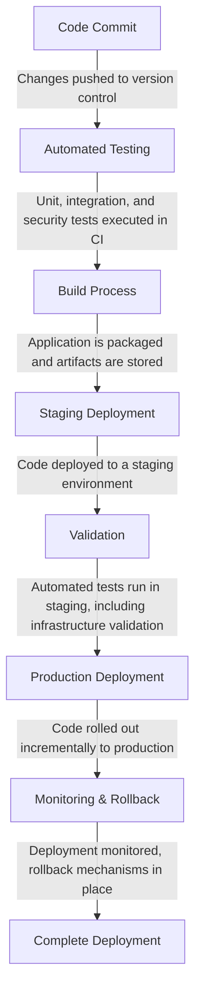

# Continuous Deployment Guide

## 1. Introduction
Continuous Deployment (CD) is a software development practice where code changes are automatically tested, built, and deployed to production with minimal manual intervention. This guide provides best practices, tools, and automation strategies to ensure efficient, reliable, and secure deployments in SLIM projects.

## 2. Key Objectives
- Ensure fast, reliable, and automated deployments.
- Minimize human intervention and errors.
- Maintain high availability and zero-downtime deployment.
- Enable multi-environment validation and rollback mechanisms.
- Optimize CI/CD workflows for efficiency and scalability.

## 3. Deployment Workflow Overview

## 4. Best Practices
### 4.1 Automate Deployment and Testing Early
- Integrate deployment into the Integration & Test (I&T) pipeline.
- Automate end-to-end testing, including functional, performance, and security tests.
- Validate Infrastructure as Code (IaC) across multiple environments.

### 4.2 Secure Environment Variables Management
- Use tools like AWS Systems Manager (SSM), HashiCorp Vault, or Kubernetes Secrets.
- Store sensitive credentials separately from code repositories.
- Avoid hardcoded values for easy transitions across deployments.

### 4.3 Optimize Deployment Duration
- Reduce deployment times from days to hours or minutes.
- Implement caching strategies for dependency installation and artifact storage.
- Use parallel execution in CI/CD pipelines to optimize build times.

### 4.4 Minimize Human Intervention
- Reduce manual steps to streamline processes and prevent errors.
- Implement full automation for testing and deployment pipelines.
- Enforce infrastructure as code (IaC) to standardize and track changes.

### 4.5 Ensure Zero-Downtime Deployment
- Use rolling updates and blue/green deployment strategies.
- Implement feature flags for gradual rollouts and controlled experiments.
- Ensure database migrations are backward-compatible and executed in phases.

### 4.6 Robust Monitoring and Observability
- Integrate logging, monitoring, and alerting with tools like Prometheus, Grafana, and ELK Stack.
- Continuously track deployment health metrics.
- Implement automated rollback strategies based on predefined failure thresholds.

## 5. Deployment Tools and Strategies
### 5.1 CI/CD Pipelines
- Use GitHub Actions, GitLab CI/CD, or Jenkins for automated deployments.
- Implement policy enforcement with tools like Open Policy Agent (OPA).
- Automate security scanning using tools like Snyk, Trivy, and OWASP ZAP.

### 5.2 Starter Kits & Templates
- Provide pre-configured Terraform modules for cloud deployments.
- Include Ansible playbooks for post-deployment configuration.
- Use Helm charts for Kubernetes-based deployments.

### 5.3 Environment Isolation
- Use separate Terraform state files for different environments.
- Consider LocalStack for local AWS emulation.
- Leverage namespaces in Kubernetes to isolate workloads.

## 6. Automating Multi-Environment Testing
- Implement CI/CD pipelines to test deployments in multiple environments.
- Use Infrastructure as Code (IaC) validation tools like Checkov and tfsec.
- Automate end-to-end testing in staging before deploying to production.
- Implement canary deployments for gradual rollouts and monitoring.

## 7. Rollback and Recovery Strategies
- Implement automated rollback mechanisms using feature toggles and deployment history.
- Use database versioning and schema migration tools like Liquibase or Flyway.
- Maintain versioned deployment artifacts for quick rollbacks.
- Conduct regular disaster recovery drills to ensure business continuity.

## 8. Compliance and Security Best Practices
- Enforce role-based access control (RBAC) for deployment environments.
- Regularly audit deployment logs and maintain compliance with security frameworks.
- Implement vulnerability scanning and dependency tracking.
- Ensure encryption in transit and at rest for sensitive data.
