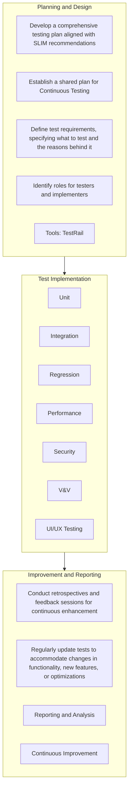

# Continuous Testing

<pre align="center">This page provides an overview of continuous testing, offers a ready-to-use continuous testing plan template, and addresses valuable feedback from our community members.</pre>

## Introduction

**Background**: Continuous Testing (CT) is essential in addressing the challenges of modern software development, providing an automated and systematic approach to testing throughout the software lifecycle. In the ever-evolving landscape of software, CT goes beyond mere bug detection. It stands as a proactive solution that not only validates performance and enhances security but also ensures the seamless functionality of your software. By offering rapid feedback on code quality and functionality, CT becomes a crucial ally in meeting project goals, ultimately leading to more reliable and efficient software releases. Implementing CT promises not only the immediate benefits of bug identification but also the long-term advantages of improved performance, heightened security, and overall robust software functionality. 

**Philosophy**: At the core of our continuous testing philosophy is the strategic utilization of open-source tools. We prioritize the adoption of a singular, comprehensive tool that seamlessly addresses various aspects across the continuous testing phases, optimizing our testing processes for efficiency and effectiveness.

**Use Cases**:
- Ensuring consistent and thorough validation of new code changes
- Identifying and addressing potential performance bottlenecks
- Validating security measures
- Ensuring seamless integration of new features
- Providing timely feedback for developers to streamline the debugging process
- Automating repetitive and time-consuming testing tasks
- Facilitating quicker releases
- Fostering a culture of continuous improvement in software development
  
---

## Prerequisites
- CT Tools (These tools encompass both open-source and widely adopted commercial solutions)
   - **Unit Testing:**
 	- Jest (Javascript), Pytest (Python)
   - **Integration Testing:**
 	- Jest (Javascript), Pytest (Python)
   - **Regression Testing:**
 	- Selenium, Playwright
   - **Performance Testing:**
 	- Apache JMeter
   - **Security Testing:**
 	- Dependabot, SonarQube
   - **Verification and Validation (V&V):**
 	- SonarQube, ESLint (Javascript), PyLint (Python)
   - **UI/UX Testing**
 	- Selenium, Playwright
- Understanding of the software development lifecycle
- Knowledge of the application architecture and dependencies
- An established set of test cases for initial implementation

---

## Continuous Testing Phases

---
## Quick Start

To facilitate the implementation of Continuous Testing, we present a comprehensive template below. This template outlines key steps and considerations across various testing phases, along with recommended tools for each category. Whether you're a seasoned developer or new to continuous testing, this template serves as a valuable guide to streamline your testing processes and enhance software delivery. The tools recommended are chosen for their effectiveness, and they span both open-source and widely adopted commercial options, providing flexibility based on your specific needs and preferences.

[Continuous Testing Plan Template](continuous-testing-plan-template.md)

[Continuous Testing Plan Example](continuous-testing-plan-example.md)

---

## Step-by-Step Guide

1. **Step 1: Define Your Continuous Testing Goals**
   - Clearly outline the objectives and goals you aim to achieve with continuous testing. Identify key performance indicators and success criteria.

2. **Step 2: Select Continuous Testing (CT) Tools**
   - Choose a CT tool that aligns with your development environment. 

3. **Step 3: Set Up Automated Unit Testing**
   - Implement automated unit testing using suitable frameworks for your programming language (e.g., JUnit for Java, Pytest for Python).

4. **Step 4: Implement Integration Testing**
   - Set up automated integration tests to verify the interactions between different components. Use frameworks like Jest (JavaScript) or Pytest (Python).

5. **Step 5: Establish Regression Testing**
   - Implement regression tests to ensure new code changes do not introduce issues in existing functionalities. Tools like Selenium and Playwright are popular for UI regression testing.

6. **Step 6: Integrate Performance Testing**
   - Use tools like Apache JMeter to perform load and performance testing. Ensure your system can handle various conditions and workloads.

7. **Step 7: Implement Security Testing**
   - Integrate security testing tools such as Dependabot for dependency scanning and SonarQube for code security analysis.

8. **Step 8: Verification and Validation (V&V)**
   - Set up tools like ESLint (JavaScript), PyLint (Python), or other linters for static code analysis. Ensure code quality and adherence to coding standards.

9. **Step 9: UI/UX Testing**
    - Implement automated UI/UX testing using tools like Selenium or Playwright to validate the user interface and overall user experience.

10. **Step 10: Reporting and Analysis**
    - Utilize tools like SonarQube for comprehensive code quality and analysis reporting. Leverage reporting to identify areas for improvement.

11. **Step 11: Collaboration with Jira**
    - Integrate with project management tools like Jira to enhance collaboration, track issues, and manage tasks efficiently.

12. **Step 12: Monitor and Adjust**
    - Continuously monitor the performance of your continuous testing process. Make adjustments based on feedback, changing project requirements, and evolving best practices.

   
---

## Frequently Asked Questions (FAQ)

- **User Interface Testing:** The role of usability testing and user interface testing is an important consideration. We're actively exploring how to integrate this into our continuous testing model.

- **Tool Selection:** We understand that implementing all the recommended tools might be challenging due to resource constraints. We're creating a common subset of tools for all projects and prioritizing their importance.

- **Project Maturity:** We recognize that some projects may not be mature enough for certain tools. We recommend waiting until your project reaches an appropriate stage for tools like integration testing.

- **Priority Phases:** We've noted that security, verification and validation, and integration testing are essential phases. We'll prioritize these in our guidelines.

- **Licensing:** Licensing is a crucial factor even in open source tools. We're exploring how to address this concern better.

- **Iterative Implementation:** Iteration is key to successful continuous testing. We understand that it may take time to get it right, and we encourage iterative test implementation.

---

## Credits 

**Authorship**:
- [Kyongsik Yun](https://github.com/yunks128)

**Acknowledgements**:
* We express our gratitude to Rishi Verma and John Engelke for their invaluable reviews and insightful comments, which significantly contributed to the enhancement of this work.
* [Testing Frameworks](testing-frameworks.md)

  
---

## Feedback and Contributions

We welcome feedback and contributions to help improve and grow this page. Please see our [contribution guidelines](https://nasa-ammos.github.io/slim/docs/contribute/contributing/).
