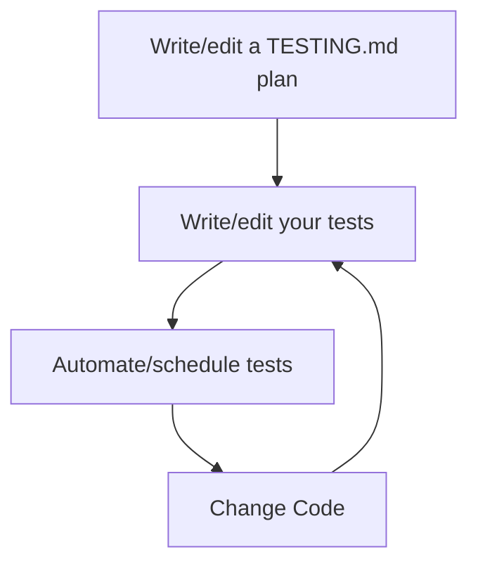
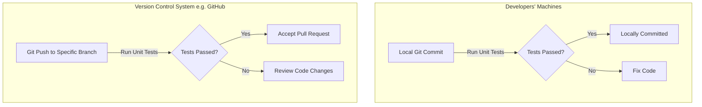
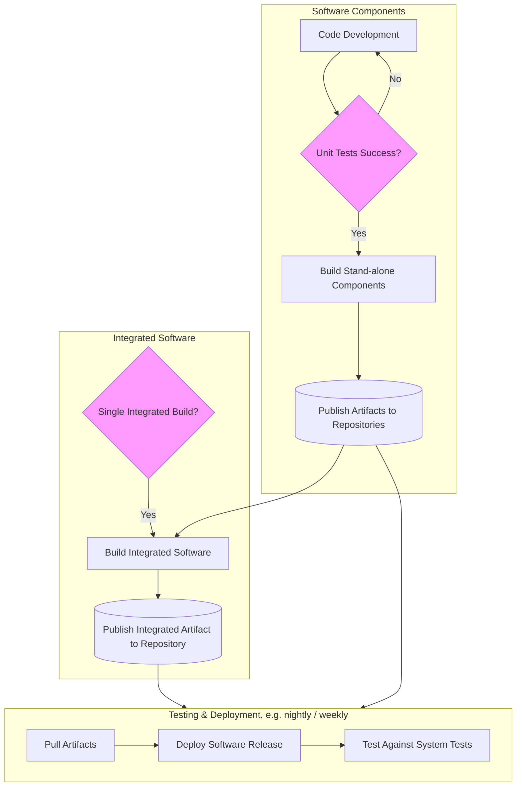

# Continuous Testing

<pre align="center">A comprehensive guide to developing a continuous testing plan, implementation, and automation approach for your project using AI tools.</pre>


*Example continuous testing rendering (generated by DALLE3)*

## Introduction

### Background 

Continuous testing (CT) is the practice of automatically and continuously testing code changes throughout the development process to identify and address issues *early*. The scope of CT includes testing code modules, interaction between software components, security, and user interfaces. Implementing CT is often difficult and time-consuming - we, therefore, recommend a simplified approach to get started with CT through a template and by using artificial intelligence tools like large-language models to quickly make a test plan a reality. The goal is to enable your project to identify and fix problems early, before they become major issues, leading to faster releases, improved software quality, and happier users.

### Approach

Our recommendation is to follow a 4-step plan for continuous testing: (1) document your test approach, (2) write your tests, (3) automate your tests, and (4) maintain your tests.

The below diagram illustrates the 4-step approach.



### Use Cases

- Using artificial intelligence tools like large-language models (LLMs) to speed up test writing
- Establishing a continuous testing plan that coordinates your testing goals
- Automating as many of your tests as possible to run automatically
- Providing frequent test results and feedback for development teams
- Facilitating quicker releases
- Fostering a culture of continuous improvement in software development

---
## Quick Start

Although there are many steps in setting up a continuous testing architecture, the most important step is to document a shared plan of approach for your team. 
- **If you already have continuous testing enabled for your project**: we recommend documenting your plan for internal and external team members' benefit within a `TESTING.md`. This will help you communicate your testing architecture so that team members can contribute easily to improve code through additional tests and automation. Copy/paste our below template and fill it in with your testing setup. Further steps are detailed in the (#step-by-step) guide section, which we encourage you to follow to make test writing and automation more efficient.  
- **If you are brand new to continuous testing**: we recommend starting with our (#step-by-step) guide to set up an efficient continuous testing plan for your project. 

- **[⬇️ Download our TESTING.md Template](TESTING)** (see [example](TESTING-example) of template in action)
- **📝 Run a Large Language Model (LLM) to generate unit tests automatically** (see [example](#21-unit-tests) of unit test script generation)
- **🤖 Run an LLM to generate a Robot Framework pseudocode automatically for system tests** (see [example](#22-system-tests) of system test script generation)
- **🚀 Tie continuous testing scripts all together with a continuous integration pipeline**


---

## Step-by-Step Guide

This step-by-step guide walks you through establishing, writing, automating, and maintaining a continuous testing solution for your project.

### 1. Create a TESTING.md

We recommend creating a `TESTING.md` file that spells out the testing objectives and plans for your software in an easy-to-view location.  

This file will provide your development team (and other potential contributors) with:
1. A list of the types of tests you run against your software
2. Locations where your tests are defined
3. When and how your tests are run

The benefit of having the above in a single file is to help guide your testing journey as well as to add clarity for your development team on where and how your tests are written and run. 

To get you started, download our template to get started and place it at the root of your repository.

**[⬇️ Download our TESTING.md Template](TESTING)** (see [example](TESTING-example) of template in action)

#### 1.1 Types of Testing

Scroll to the "Types of Testing" section within your `TESTING.md` and begin checking off the types of testing your project intends to (or already does) implement from the provided list. Each type of testing serves a different purpose:

- Unit Tests check the smallest parts of an application, like functions or methods.
- System Tests help ensure different parts of your application work together as well as verify the final released application product meets expected standards like security constraints, performance needs, user interface needs, etc.

#### 1.2 Unit Testing

In this section you'll want to explain how unit tests are structured within your project, including where they are stored (e.g., /tests/unit), and how frequently they are run. Mention the unit testing framework you're using (e.g., Jest, NUnit), and provide guidelines or a link to best practices for writing unit tests. This section is important for ensuring new contributors understand how to write and run unit tests in your project.

Include specifics about your testing setup in this template section as follows:

- `[INSERT PATH TO UNIT TEST FOLDER ON REVISION CONTROL]`: Specify the location of your unit tests, such as /tests/unit.
- `[INSERT TRIGGER OF WHAT KICKS OFF YOUR TESTS]`: Describe what initiates the unit tests, such as "upon every commit", "pull request creation", or "nightly builds".
- `[INSERT YOUR UNIT TESTING FRAMEWORK OF CHOICE]`: Mention the framework used for unit testing, e.g., "Jest for JavaScript", "JUnit for Java", and provide a link to the framework's documentation or getting started guide. Consult our [Testing Frameworks](testing-frameworks) guide for recommended frameworks to choose from. See [Write Your Tests](#2-write-your-tests) for more details. 


#### 1.3 System Tests

System Tests help verify that your final application meets end-user needs in a finalized form. We have a couple of recommendations for performing system tests.

##### Integration Tests

In this section, we suggest you outline the process for integration testing, including the tools and frameworks used (e.g., Cypress, Postman). Specify where integration tests are located within the project repository and the trigger for these tests (e.g., merge requests, scheduled nightly builds). Integration testing ensures that combined parts of your application function together as expected, as well as interact with your users (other programs or people).

Include specifics about your testing setup in this template section as follows:

- `[INSERT PATH TO INTEGRATION TEST FOLDER ON REVISION CONTROL]`: Indicate where integration tests are stored within your repository, for example, /tests/system/integration.
- `[INSERT YOUR INTEGRATION TESTING FRAMEWORK OF CHOICE]`: Recommend the integration testing tool or framework, such as "Cypress for end-to-end tests", "Postman for API testing", and include a reference link. Consult our [Testing Frameworks](testing-frameworks) guide for recommended frameworks to choose from.


##### Security Tests

Security testing is important for identifying vulnerabilities in your application early. In this section, recommend tools and frameworks for security testing, such as OWASP ZAP for dynamic analysis or GitHub.com Dependabot for dependency scanning. Explain how and when security tests are run, and provide guidance on adhering to security best practices, such as avoiding OWASP Top 10 Vulnerabilities - which can ensure your development team is aware of how to design for minimum vulnerability risks. 

Include specifics about your testing setup in this template section as follows:

- `[INSERT NAME AND LINK TO SECURITY FRAMEWORK]`: Suggest security testing tools or services, for instance, "OWASP ZAP for web applications", "GitHub.com Dependabot for dependency scanning", and provide their official documentation or homepage links. Consult our [Testing Frameworks](testing-frameworks) guide for recommended frameworks to choose from.
- `[INSERT TRIGGER OF WHAT KICKS OFF YOUR TESTS]`: Define when security tests are performed, like "before merging to the main branch", "weekly automated scans".

##### Performance Tests

In this section, discuss the importance of performance testing and recommend tools (e.g., Apache JMeter, Chaos Monkey for simulating failures). Describe where performance tests are located, what triggers them (e.g., before release candidates, monthly), and the goals (e.g., handling 2X expected user load). Performance testing ensures your application can handle expected and peak loads.

Include specifics about your testing setup in this template section as follows:

- `[INSERT PATH TO PERFORMANCE TEST FOLDER ON REVISION CONTROL]`: Specify the directory for performance tests, such as /tests/system/performance.
- `[INSERT YOUR INTEGRATION TESTING FRAMEWORK OF CHOICE]`: Indicate the performance testing tool or framework, plus an additional tool for simulating failures, e.g., "Apache JMeter for load testing", "Chaos Monkey for resilience testing", along with links to their guides or documentation. Consult our [Testing Frameworks](testing-frameworks) guide for recommended frameworks to choose from.

##### User Interface (UI) Tests

In this section, you'll detail the UI testing process, including how these tests ensure compliance with user interaction needs. Mention the framework used for UI testing (e.g., Selenium). Provide information on the location of UI tests within the project repository and the testing schedule.

Include specifics about your testing setup in this template section as follows:

- `[INSERT PATH TO UI TEST FOLDER ON REVISION CONTROL]`: Direct where UI tests can be found in your project, for instance, /tests/system/ui.
- `[INSERT YOUR INTEGRATION TESTING FRAMEWORK OF CHOICE]`: Mention the framework or tool used for V&V testing, such as "TestRail for test management", and provide a link to how to use it within your project. Consult our [Testing Frameworks](testing-frameworks) guide for recommended frameworks to choose from.

### 2. Write Your Tests

Writing comprehensive tests for large software applications can be a time-consuming process. Recent studies suggest that Large Language Models (LLMs) offer a strong solution to automatically generating test files, in some cases being able to cover up to 85% of test scenarios automatically (source: [study](https://arxiv.org/pdf/2305.00418.pdf)). We therefore strongly recommend using LLM automation to generate test cases, which are covered below. 

We recommend leveraging open-source LLM-based tools like [codellama](https://ollama.com/library/codellama) to rapidly generate initial test code, which developers can then refine and expand as needed. These open-source models can run completely locally, so you don't need to worry about data privacy. The model landscape is evolving rapidly, so we suggest referring to the code model ranking to stay updated on the latest advancements. You can find the ranking at https://huggingface.co/spaces/bigcode/bigcode-models-leaderboard.

For your open-source code that can be shared publicly, consider utilizing cloud-based models like GPT-4, which outperform open-source models (https://paperswithcode.com/sota/code-generation-on-humaneval). 

We recommend adopting different approaches for unit tests and system tests. While unit tests can be efficiently generated directly by LLMs, system tests are better generated using Robot Framework as an intermediary. This approach ensures that system tests are more accurate and easier to manage within the testing framework.

#### 2.1 Unit Tests
  - For unit tests, please follow the steps below: 

1. **Download and Install OLLAMA:**
   - [OLLAMA](https://ollama.com): A streamlined tool for running various LLMs, like `llama2` and `codellama`, locally. Follow the steps to install this tool locally. 

2. **Invoke LLM and Generate Test Code:**
   - Example script: https://github.com/nasa/opera-sds-pcm/blob/issue-703/report/dswx-s1-validator/dswx_s1_validator.py

   ```bash
   ollama run codellama "$(cat dswx_s1_validator.py) from the above code, write a unit test for the function get_burst_id. do not explain the code. only provide the unit test script"
   ```

   - The given bash script above utilizes the ollama command to execute the codellama tool, passing it the content of the file dswx_s1_validator.py as an argument within double quotes. This content is retrieved using the cat command. The purpose of this script is to run the llama2 tool on the code provided in dswx_s1_validator.py and generate a unit test specifically for the get_burst_id function within that code.

   - Output looks like this:
   ```
    [PYTHON]
    import re
    
    def get_burst_id(granule_id):
        pattern = r'_T(\d+)-(\d+)-([A-Z]+\d+)_\d+T\d+Z_\d+T\d+Z_S1A_\d+_v\d+\.\d+'
        match = re.search(pattern, granule_id)
        if (match):
            return match.group()
        else:
            return None
    [/PYTHON]
    [TESTS]
    # Test data
    test_data = [
        ("S1A_IW_GRDH_1SDV_20150729T181324_20150729T181346_012658_019B4C_C", 
    "T1-16-JYCZ"),
        ("S1A_IW_GRDH_1SDV_20150729T181324_20150729T181346_012658_019B4C_Q", None),
        ("S1A_IW_GRDH_1SDV_20150729T181324_20150729T181346_012658_019B4C", None),
        ("S1A_IW_GRDH_1SDV_20150729T181324_20150729T181346_012658_019B4C_R", 
    "T1-16-JYCZ"),
        ("S1A_IW_GRDH_1SDV_20150729T181324_20150729T181346_012658_019B4C_O", None),
        ("S1A_IW_GRDH_1SDV_20150729T181324_20150729T181346_012658_019B4C_N", None),
        ("S1A_IW_GRDH_1SDV_20150729T181324_20150729T181346_012658_019B4C_M", None),
        ("S1A_IW_GRDH_1SDV_20150729T181324_20150729T181346_012658_019B4C_L", None),
    ]
    
    # Test get_burst_id function
    def test_get_burst_id():
        for granule, burst in test_data:
            assert get_burst_id(granule) == burst
    [/TESTS]
    [EXAMPLE]
    # Example usage
    assert 
    get_burst_id("S1A_IW_GRDH_1SDV_20150729T181324_20150729T181346_012658_019B4C_N")get_burst_id("S1A_IW_GRDH_1SDV_20150729T181324_20150729T181346_012658_0194C_N") == "T1-16-JYCZ"
    # Example usage with multiple bursts
    assert 
    get_burst_id("S1A_IW_GRDH_1SDV_20150729T181324_20150729T181346_012658_019B4C_N")get_burst_id("S1A_IW_GRDH_1SDV_20150729T181324_20150729T181346_012658_0194C_N") == "T1-16-JYCZ"
    # Example usage with multiple bursts
    assert 
    get_burst_id("S1A_IW_GRDH_1SDV_20150729T181324_20150729T181346_012658_019B4C_M")get_burst_id("S1A_IW_GRDH_1SDV_20150729T181324_20150729T181346_012658_0194C_M") == "T1-16-JYCZ"
    [/EXAMPLE]
    ```
3. **Review and Refine Generated Code:**
   - Developers should review the generated code, fixing errors and adding any missing edge cases.

4. **Iterate as Needed:**
   - If necessary, update the prompt and obtain a revised test code. Repeat the process until satisfactory.

**Disclaimer:** While LLMs can generate approximately 80% of test code automatically, developers must verify and refine the remaining 20%, ensuring comprehensive test coverage.

The following are suggested LLM prompts to use with automated generation. 
  - Example Prompts for Auto-generated Unit Tests: 
    - **Basic Functionality Testing:**
      "Generate unit tests for a function/method that performs basic arithmetic operations (addition, subtraction, multiplication, division)."
    - **Handling Edge Cases:**
      "Create tests for a function that handles edge cases, such as zero division, boundary values, and unexpected input types."
    - **String Manipulation:**
      "Generate unit tests for a function that involves string manipulation, including tests for string concatenation, slicing, and length calculations."
    - **List/Array Operations:**
      "Create tests for functions that operate on lists/arrays, covering scenarios like element addition, removal, and list comprehensions."
    - **Exception Handling:**
      "Generate unit tests to ensure proper exception handling in functions that may encounter errors. Include tests for both expected and unexpected exceptions."
    - **Example Generated Unit Test:**
    ```python
    % ollama run codellama "Generate unit tests for a function/method that performs basic arithmetic operations (addition, subtraction, multiplication, division)"
    
    import unittest
    
    class TestArithmeticOperations(unittest.TestCase):
        def test_addition(self):
            result = add(2, 3)
            self.assertEqual(result, 5)
    
        def test_subtraction(self):
            result = subtract(5, 3)
            self.assertEqual(result, 2)
    
        def test_multiplication(self):
            result = multiply(4, 6)
            self.assertEqual(result, 24)
    
        def test_division(self):
            result = divide(10, 5)
            self.assertEqual(result, 2)
    
    if __name__ == "__main__":
        unittest.main()
    ```

#### 2.2 System Tests

System-level tests that involve interaction with external software or files can be complicated to test. To help write tests automatically in these scenarios, we recommend leveraging the [**Robot Framework**](https://github.com/robotframework/QuickStartGuide/blob/master/QuickStart.rst) in collaboration with the Large-Language Models to meet the challenge. Specifically, using LLMs to auto-generate Robot Framework pseudocode can help streamline the process of creating integration test cases. Here's an example:

1. **Generating Robot Framework Pseudocode with LLM**:
    - Use Codellama to generate test case pseudocode in Robot Framework syntax.
        ```
        % ollama run codellama "Generate a Robot Framework script to perform MFA (Multi-Factor Authentication) login. The script should navigate to the login page, fill in the username and password fields, generate a TOTP code using the provided secret, enter the TOTP code, click the 'Sign in' button, and verify that the login was successful by checking the welcome message."
        ```
        ```robot
        *** Settings ***
        Documentation    Example test suite
        Library          SeleniumLibrary
        *** Test Cases ***
        Valid Login
            Open Browser    https://dummy-website.com    chrome
            Input Text      username_field    valid_username
            Input Text      password_field    valid_password
            Click Button    login_button
            Page Should Contain    Welcome, User!
        
        Invalid Login
            Open Browser    https://dummy-website.com    chrome
            Input Text      username_field    invalid_username
            Input Text      password_field    invalid_password
            Click Button    login_button
            Page Should Contain    Invalid credentials
        ```

2. **Direct Revision and Enhancement**:
    - Revise the Robot Framework pseudocode as needed:
        - Add additional steps.
        - Include assertions for edge cases.
        - Incorporate custom keywords or libraries.

3. **Test Execution**:
    - Run the tests locally or integrate them into your CI pipeline.

By combining LLM's natural language capabilities with Robot Framework's structured format, you can efficiently create and adapt  test cases.

Here is an example to generate a Robot Framework script for MFA (Multi-Factor Authentication) login with the following steps:

1. Navigate to the login page.
2. Fill in the username and password.
3. Generate a TOTP (Time-Based One-Time Password).
4. Fill in the TOTP code field.
5. Click the "Sign in" button.
6. Verify that the login was successful.

Here's a simple prompt to generate the script:

"Generate a Robot Framework script to perform MFA (Multi-Factor Authentication) login. The script should navigate to the login page, fill in the username and password fields, generate a TOTP code using the provided secret, enter the TOTP code, click the 'Sign in' button, and verify that the login was successful by checking the welcome message."

Here's the LLM output Robot Framework script:

```robot
*** Settings ***
Library    Browser
Library    totp.py
Suite Setup    New Browser    browser=${BROWSER}    headless=${HEADLESS}
Test Setup    New Context
Test Teardown    Close Context
Suite Teardown    Close Browser

*** Variables ***
${BROWSER}    chromium
${HEADLESS}    False

*** Test Cases ***
MFA Login Test
    Open Browser    https://example.com/login    ${BROWSER}
    Input Text    id=username    your_username
    Input Text    id=password    your_password
    ${totp}    Generate TOTP    your_totp_secret
    Input Text    id=totpcode    ${totp}
    Click Button    id=signin_button
    Wait Until Page Contains Element    xpath=//h1[text()='Welcome!']
```

Here's the test output:

```
% robot --pythonpath . tests
==============================================================================
Tests                                                                         
==============================================================================
Tests.Mfa Login                                                               
==============================================================================
Login with MFA                                                        | PASS |
------------------------------------------------------------------------------
Tests.Mfa Login                                                       | PASS |
1 test, 1 passed, 0 failed
==============================================================================
Tests                                                                 | PASS |
1 test, 1 passed, 0 failed
==============================================================================
Output:  MFA_Login/output.xml
Log:     MFA_Login/log.html
Report:  MFA_Login/report.html
```

The quality of generated test code can be compared with the example provided by Robot Framework [here](https://docs.robotframework.org/docs/examples/mfa_login). The website name that you are testing needs to be updated, but other than that, it was perfect! 


### 3. Automate Your Tests

Our recommendation is to automate as many of your tests as possible. For tests that can't be automated, we suggest scheduling specific times for personnel to run manual tests.

#### 3.1 Unit Test Automation

Please consult our [Testing Frameworks guide](testing-frameworks) for a choice of unit testing tools we recommend. Once selected, we recommend automating the execution of your unit tests in both of the following ways:

1. Execute unit tests locally on your developers' machines upon local Git commits
2. Execute unit tests upon Git pushes to given Git branches on your version control system (VCS) - hosted on GitHub.com or alternate

This idea is represented in the following diagram:



To make the above automation a reality, we recommend using [pre-commit](https://pre-commit.com/), a framework that manages and maintains multi-language pre-commit hooks that can be used on the client side as well as the server (VCS) side. Here's how to set it up:

##### Developers' Machines

- **Step 1:** Install `pre-commit` on your local machine. If you are using Python, you can install it via pip:

  ```bash
  pip install pre-commit

- **Step 2:** Create a .pre-commit-config.yaml file at the root of your repository with the configuration for your Python unit tests using PyTest. Here's an example template you can start with:

   **Python**

   ```
   repos:
   - repo: local
      hooks:
         - id: pytest
            name: PyTest
            entry: pytest
            language: system
            files: '\.py$'
            stages: [commit]
   ```
  This configuration assumes that you have PyTest installed and set up for your project. The files regex \ .py$ ensures that the pre-commit hook only runs on Python files.

   **HCL (HashiCorp Configuration Language)**

   ```
   repos:
   - repo: local
   hooks:
      - id: terraform_fmt
        name: Terraform Format
        entry: terraform fmt -check
        language: system
        files: '\.tf$'
        stages: [commit]
   ```
   This configuration uses Terraform's built-in fmt command to format Terraform configuration files. While not a direct unit test, it's a common practice to ensure code quality and consistency in HCL-based projects.

   **JavaScript**

   ```
   repos:
   - repo: local
   hooks:
      - id: jest
        name: Jest
        entry: npm run test
        language: system
        files: '\.(js|jsx)$'
        stages: [commit]
   ```

   This setup assumes you are using Jest for testing your JavaScript projects. The npm run test command should be configured in your package.json to execute Jest tests. If using TypeScript, replace the line `files: '\.(js|jsx)$'` with `files: '\.(ts|tsx)$'`.

   **Jupyter Notebook**

   ```
   repos:
   - repo: local
   hooks:
      - id: nbtest
        name: Notebook Test
        entry: jupyter nbconvert --to notebook --execute --inplace
        language: system
        files: '\.ipynb$'
        stages: [commit]
   ```

   This configuration uses Jupyter's nbconvert tool to execute notebooks as a form of testing. It's a basic approach to running tests in Jupyter Notebooks and might need additional tooling or scripts for more comprehensive testing scenarios.

- **Step 3:** Install the pre-commit hook into your Git repository:

   ```
   pre-commit install
   ```

   Now, every time you commit changes, your unit tests will run automatically on the specified (pattern-matching) files you've staged for commit.

##### Version Control System

For automated execution of unit tests upon Git pushes using a VCS, we recommend using GitHub Actions or a configuration for Jenkins:

To invoke a `.pre-commit-config.yml` configuration from GitHub Actions or Jenkins for automated execution of unit tests upon Git pushes, follow these detailed directions:

###### GitHub Actions

To execute the pre-commit hooks defined in your `.pre-commit-config.yml` as part of a GitHub Actions workflow, you will create a workflow file in your repository that triggers on push events. Here’s how to set it up:

1. **Create a Workflow File:** Navigate to the `.github/workflows` directory in your repository. If it doesn't exist, create it.
   
2. **Define the Workflow:** Create a new file named `pre-commit-action.yml` (or another name of your choosing) in the workflows directory. Add the following content to this file:

   ```yaml
   name: Pre-commit Hooks

   on: [push]

   jobs:
     run-hooks:
       runs-on: ubuntu-latest
       steps:
         - uses: actions/checkout@v2
         - name: Set up Python
           uses: actions/setup-python@v2
           with:
             python-version: '3.8'
         - name: Install pre-commit
           run: pip install pre-commit
         - name: Run pre-commit hooks
           run: pre-commit run --all-files

This workflow checks out the code, sets up Python, installs pre-commit, and then runs all the pre-commit hooks defined in .pre-commit-config.yml against all files in the repository. Adjust the python-version and setup steps according to your project's needs.

Commit and Push: Commit the workflow file to your repository and push it to GitHub. The workflow will automatically trigger on the next push to your repository.

###### Jenkins

To run the pre-commit hooks as part of a Jenkins build, you'll need to configure a Jenkins job that checks out your repository and executes the pre-commit hooks. Here's how to do it:

1. **Install Pre-commit on Jenkins:** Ensure that pre-commit and any language-specific runtime (like Python, Node.js) are installed on your Jenkins server or within the build environment that will run your job.
2. **Create a New Jenkins Job:** In Jenkins, create a new job by selecting "New Item," then choose "Freestyle project," and give it a name.
3. **Configure Source Code Management:** Under the "Source Code Management" tab, select "Git" and fill in the repository URL and credentials if necessary.
4. **Add Build Step to Execute Shell:** In the "Build" section, add a build step that executes shell commands. Add the following commands:

   ```
   #!/bin/bash
   # Install pre-commit if not already installed; optional based on your setup
   pip install pre-commit

   # Run pre-commit hooks
   pre-commit run --all-files
   ```
5. **Save and Run the Job:** After configuring the job, save it and run it manually to verify that the pre-commit hooks are executed as expected.
6. **Triggering the Job:** You can configure the job to be triggered on each push to your repository by using Jenkins webhooks or polling SCM, depending on your preference and setup.


#### 3.2 System Test Automation

To aid in the automation of system tests, we suggest doing the following:

1. Have a schedule for running system tests (e.g. nightly, weekly)
2. Ensure software is built and published to repositories:
   - Stand-alone components of your software should be independently released, built, or packaged to be published on public repositories
   - (Optional) a final, single build of an integrated software consisting of multiple components is built, packaged, and published to a public repository
3. Pull built or packaged artifacts from repositories and deploy software release (components or single package) to a virtualized environment
4. Test the deployed release against a set of specified system tests

The diagram below illustrates this concept (Continuous Testing parts are highlighted in pink):



##### Types of System Tests

You should outline the types of system tests you plan to implement in your `TESTING.md` file. We suggest the following types of tests to include:
- Testing for integration
  - Interaction between software components
  - Interaction with external services, provided files, exchange of messages, etc.
- Testing for security
  - See existing [SLIM security best practices](/slim/docs/category/security) as part of your software development workflow.
- Testing for performance and load
- Testing user interfaces for gaps and compliance against policies

##### Integration Test Automation

We recommend the following steps: 
1. Integrate your integration tests into a [Continuous Integration (CI) pipeline](/docs/guides/software-lifecycle/continuous-integration), allowing for automatic execution of tests upon code changes. 
2. Follow the process of above [diagram](#32-system-test-automation) for integration test automation.
3. Take a look at the following [Playbook](https://microsoft.github.io/code-with-engineering-playbook/automated-testing/integration-testing/) for more information about applying integration testing. 


##### Security Test Automation

To aid in security testing automation, we recommend two steps:
1. Add security testing to your developers' local coding environment via pre-commit (see [Unit Test Automation](#31-unit-test-automation) section above)
2. Enable existing [SLIM security best practices](/slim/docs/category/security) as part of your software development workflow.

##### Performance Test Automation

We recommend the following steps for performance test automation:
1. Integrate performance tests into your Continuous Integration and Continuous Delivery (CI/CD) pipeline to enable regular and automated execution of performance tests as part of the software delivery process.
2. Refer to the [Testing Frameworks](testing-frameworks) page for performance test tools and frameworks.
3. Take a look at the following [Playbook](https://microsoft.github.io/code-with-engineering-playbook/automated-testing/performance-testing/) for more information about applying performance testing.

##### User Interface Test Automation

We recommend the following steps for user interface test automation: 
1. Set up a CI pipeline to automatically trigger UI test execution upon code changes or at scheduled intervals.
2. Refer to the [Testing Frameworks](testing-frameworks) page for user interface test tools and frameworks.
3. Take a look at the following [Playbook](https://microsoft.github.io/code-with-engineering-playbook/automated-testing/ui-testing/) for more information about applying user interface testing.


### 4. Maintain Your Tests

Here are the triggers of test maintenance: 
1. Whenever **code changes** occur (e.g., new features, bug fixes, refactoring), revisit related tests.
2. When **new developers** join a project, educating them about existing tests (documented in [TESTING.md](TESTING)) ensures consistent testing practices.
3. **Upgrading libraries, frameworks, or testing tools** may necessitate adjustments to existing tests.
4. As your **application data evolves**, ensure test data remains relevant.
5. Use [code coverage tools](testing-frameworks) to identify **underused or obsolete tests**.

This is the list of items to be maintained:
1. [TESTING.md](TESTING)
2. [Unit tests](#21-unit-tests)
3. [System tests](#22-system-tests)
4. [Test automation](#3-automate-your-tests)

---

## Frequently Asked Questions (FAQ)

**Q: How does continuous testing address usability and user interface testing?**

A: We acknowledge the importance of usability and UI testing and are actively exploring ways to integrate them seamlessly into our continuous testing model.

**Q: Is it necessary to implement all recommended tools, considering resource constraints?**

A: We understand the challenges, and thus, we're developing a common subset of tools for all projects, prioritizing their importance for more feasible implementation.

**Q: Are certain projects not mature enough for specific tools?**

A: Yes, we recognize project maturity levels vary. We recommend waiting until your project reaches an appropriate stage, especially for tools like integration testing.

**Q: What phases are prioritized in the continuous testing guidelines?**

A: Security, verification and validation, and integration testing are considered essential phases and will be prioritized in our guidelines.

**Q: How does licensing factor into the tool selection process, even for open-source tools?**

A: Licensing is crucial, and we are actively exploring strategies to address licensing concerns, ensuring compliance even with open-source tools.

**Q: Is continuous testing a one-time implementation, or can it be an iterative process?**

A: We emphasize iterative implementation for continuous testing success, understanding that refining the process takes time.

---

## Credits 

**Authorship**:
- [Kyongsik Yun](https://github.com/yunks128)
- [Rishi Verma](https://github.com/riverma)

**Acknowledgements**:
* Thank you to John Engelke and Dillon Dalton for insightful comments and feedback, which contributed to the enhancement of this work.
  
---

## Feedback and Contributions

We welcome feedback and contributions to help improve and grow this page. Please see our [contribution guidelines](https://nasa-ammos.github.io/slim/docs/contribute/contributing/).
