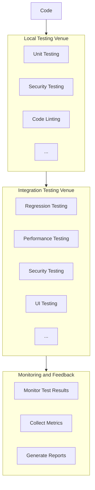

# Continuous Testing

## Introduction

Welcome to the Continuous Testing page. This page provides an overview of continuous testing, offers a ready-to-use continuous testing plan template, and addresses valuable feedback from our community members.

## What is Continuous Testing?

Continuous Testing (CT) is integral to modern software development, automating systematic tests throughout the software lifecycle. It ensures your project's goals are met by providing rapid feedback on code quality and functionality. Beyond bug detection, CT validates performance, enhances security, and ensures seamless functionality.

## Continuous Testing Philosophy
At the core of our continuous testing philosophy is the strategic utilization of open-source tools. We prioritize the adoption of a singular, comprehensive tool that seamlessly addresses various aspects across the continuous testing phases, optimizing our testing processes for efficiency and effectiveness.

## Continuous Testing Phases

**1. Planning and Design:**
   - Develop a comprehensive testing plan aligned with SLIM recommendations.
   - Establish a shared plan for Continuous Testing.
   - Define test requirements, specifying what to test and the reasons behind it.
   - Identify roles for testers and implementers.
   - Tools: TestRail (Test management tool for test case planning and design)

**2. Test Implementation:**
   - **Unit Testing:**
     - Jest (Javascript), Pytest (Python)
   - **Integration Testing:**
     - Jest (Javascript), Pytest (Python)
   - **Regression Testing:**
     - Selenium, Playwright
   - **Performance Testing:**
     - Apache JMeter
   - **Security Testing:**
     - Dependabot, SonarQube
   - **Verification and Validation (V&V):**
     - SonarQube, ESLint (Javascript), PyLint (Python)
   - **UI/UX Testing**
     - Selenium, Playwright


**3. Improvement and Reporting:**
   - Conduct retrospectives and feedback sessions for continuous enhancement.
   - Regularly update tests to accommodate changes in functionality, new features, or optimizations.
   - **Reporting and Analysis:**
     - SonarQube
   - **Continuous Improvement:**
     - Jira


## Continuous Testing Plan Template

### 1. Project Overview
- **Project Name:** [INSERT PROJECT NAME HERE]
- **Project Description:** [INSERT SHORT PROJECT DESCRIPTION HERE]
- **Testing Lead:** [INSERT PROJECT LEAD NAME HERE]

### 2. Test Requirements
- **Objective:** Why are we testing? [INSERT OBJECTIVE HERE]
- **Test Artifacts:** What are we testing? [INSERT ARTIFACTS HERE]

### 3. Testing Workflow Architecture

#### [Insert your workflow diagram here]

### 4. Test Specifications

Before customizing the table entries below, evaluate your project's needs and requirements. Add, remove, or modify rows in the table to best represent the phases, tests, tools, and people associated with your testing approach.

#### [Insert your table here]

### 5. Implementation Checklist

- [ ] Continuous Testing Plan (this document) defined, including all relevant parts
- [ ] Security Testing tools, people, and tests implemented
- [ ] Unit Testing tools, people, and tests implemented
- [ ] All planned test cases defined in the test plan are implemented.
- [ ] Defects are reported and tracked.
- [ ] Test summary report is generated and shared with stakeholders.

### Example
```
### [INSERT PROJECT NAME HERE] Continuous Testing Plan

#### Introduction:
This document aims to provide a general approach to Continuous Testing for [INSERT PROJECT NAME HERE]. It encompasses planning, test phases, tool recommendations, and test specifications.

---

#### **1. Project Overview**
- **Project Name:** [INSERT PROJECT NAME HERE]
- **Project Description:** [INSERT SHORT PROJECT DESCRIPTION HERE]
- **Testing Lead:** [INSERT PROJECT LEAD NAME HERE]

#### **2. Test Requirements**
- **Objective:** Why are we testing? [INSERT OBJECTIVE HERE]
  <!-- Example: "Ensure that the codebase remains free of critical vulnerabilities and maintains high performance." -->

- **Test Artifacts:** What are we testing? [INSERT ARTIFACTS HERE]
  <!-- Example: "Web APIs, Front-end components, Database layer." -->


#### **3. Testing Workflow Architecture**
```


```
#### **4. Test Specifications**
Before customizing the table entries below, evaluate your project's specific needs and requirements. Add, remove, or modify rows in the table to best represent the phases, tests, tools, and people associated with your testing approach.

| Phase | High-level Tests | Recommended Tool | Description | Starter Kit | Key People |
|-------|------------------|-----------------|-------------|-------------|------------|
| Security Testing | Vulnerability Scan | [GitHub Dependabot](https://dependabot.com/) | Monitors dependencies for known vulnerabilities. | [GitHub Docs](https://docs.github.com/en/code-security/supply-chain-security/keeping-your-dependencies-updated-automatically/about-dependabot-version-updates) | [INSERT NAME HERE] |
| | Secure Code Review | [SonarQube](https://www.sonarqube.org/) | Continuous inspection of code quality. | [SonarQube Docs](https://docs.sonarqube.org/latest/) | [INSERT NAME HERE] |
| Unit Testing | Function Validity | [JUnit](https://junit.org/junit5/) | Verifies individual units of Java software. | [JUnit 5 Guide](https://junit.org/junit5/docs/current/user-guide/) | [INSERT NAME HERE] |
| | Null Checks | [xUnit](https://xunit.net/) | Unit testing tool for .NET. | [xUnit.net Docs](https://xunit.github.io/docs/) | [INSERT NAME HERE] |
| Regression Testing | Feature Consistency | [Cucumber](https://cucumber.io/) | Supports behavior-driven development (BDD). | [Cucumber Starter](https://cucumber.io/docs/guides/10-minute-tutorial/) | [INSERT NAME HERE] |
| | User Flow Validation | [Selenium](https://www.selenium.dev/) | Ensures that new code changes do not adversely affect existing functionalities. | [Selenium HQ](https://www.selenium.dev/documentation/en/getting_started_with_webdriver/) | [INSERT NAME HERE] |
| Integration Testing | API Contract Validation | [REST Assured](https://rest-assured.io/) | Java DSL for simplifying testing of REST based services. | [REST Assured Guide](https://github.com/rest-assured/rest-assured/wiki/GettingStarted) | [INSERT NAME HERE] |
| | Data Flow Checks | [Postman](https://www.postman.com/) | Validates the interfaces and interactions between different software modules. | [Postman Learning Center](https://learning.postman.com/) | [INSERT NAME HERE] |
| Performance Testing | Load Testing | [JMeter](https://jmeter.apache.org/) | Measures system performance under various conditions. | [JMeter User Manual](https://jmeter.apache.org/usermanual/index.html) | [INSERT NAME HERE] |
| Requirements Verification & Validation | Requirement Traceability | [TestRail](https://www.gurock.com/testrail) | Ensures that the system meets the defined requirements. | [TestRail Docs](https://www.gurock.com/testrail/docs/) | [INSERT NAME HERE] |
| Deployment Testing | Cloud Deployment | [Terraform](https://www.terraform.io/) | Infrastructure as code for cloud provisioning. | [Terraform Get Started](https://learn.hashicorp.com/terraform/getting-started/install.html) | [INSERT NAME HERE] |
| | Chaos Testing | [Chaos Monkey](https://github.com/Netflix/chaosmonkey) | Simulates random failures to test system resilience. | [Chaos Monkey Wiki](https://github.com/Netflix/chaosmonkey/wiki) | [INSERT NAME HERE] |

#### 5. Implementation Checklist
- [ ] Continuous Testing Plan (this document) defined, including all relevant parts
- [ ] Security Testing tools, people, and tests implemented
- [ ] Unit Testing tools, people, and tests implemented
- [ ] All planned test cases defined in the test plan are implemented.
- [ ] Defects are reported and tracked.
- [ ] Test summary report is generated and shared with stakeholders.
```


## Feedback

We value the feedback from our community members, and we've taken your input into account:

- **User Interface Testing:** The role of usability testing and user interface testing is an important consideration. We're actively exploring how to integrate this into our continuous testing model.

- **Tool Selection:** We understand that implementing all the recommended tools might be challenging due to resource constraints. We're creating a common subset of tools for all projects and prioritizing their importance.

- **Project Maturity:** We recognize that some projects may not be mature enough for certain tools. We recommend waiting until your project reaches an appropriate stage for tools like integration testing.

- **Priority Phases:** We've noted that security, verification and validation, and integration testing are essential phases. We'll prioritize these in our guidelines.

- **Licensing:** Licensing is a crucial factor even in open source tools. We're exploring how to address this concern better.

- **Iterative Implementation:** Iteration is key to successful continuous testing. We understand that it may take time to get it right, and we encourage iterative test implementation.

## Resources
[Use Cases and Frameworks](testing-frameworks)
