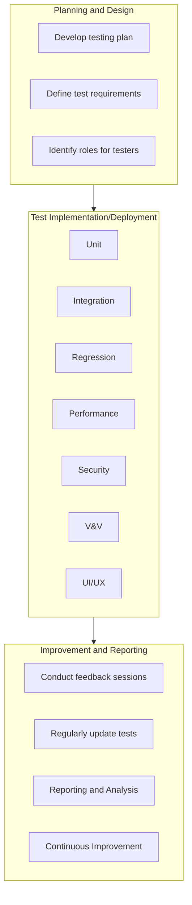

# Continuous Testing

<pre align="center">This page provides an overview of continuous testing, offers a ready-to-use continuous testing plan template, and addresses valuable feedback from our community members.</pre>

## Introduction

**Background**: Continuous testing (CT) is a powerful approach that automatically analyzes your software throughout the development process, not just to find bugs, but to ensure it performs well, is secure, and functions flawlessly. CT provides rapid feedback, letting you identify and fix problems early, before they become major issues. This leads to faster releases, improved software quality, and happier users.

**Philosophy**: To provide a simple, consistent, easy-to-use continuous testing plan template and recommend tools to bootstrap your project with the essentials needed for a high-quality continuous testing setup. 

**Use Cases**:
- Ensuring consistent and thorough validation of new code changes
- Identifying and addressing potential performance bottlenecks
- Validating security measures
- Ensuring seamless integration of new features
- Providing timely feedback for developers to streamline the debugging process
- Automating repetitive and time-consuming testing tasks
- Facilitating quicker releases
- Fostering a culture of continuous improvement in software development
  
---

## Prerequisites
- A list of your software tools, a diagram of their interaction, and a list of all third-party dependencies

---

## Continuous Testing Phases

---
## Quick Start

Ready for swift CT implementation? Copy/paste our template, fill it with your team info, and deploy recommended tools. Streamline testing, enhance delivery efficiency.

[Continuous Testing Plan Template](continuous-testing-plan-template.md)

[Continuous Testing Plan Example](continuous-testing-plan-example.md)

---

## Step-by-Step Guide

1. **Define Goals:** https://github.com/NASA-AMMOS/slim/blob/0a3e8cf878f1c280bebe0384e5750b4c708a3ce6/docs/guides/software-lifecycle/continuous-testing/continuous-testing-plan-template.md?plain=1#L16
   - Clearly outline objectives and key performance indicators for continuous testing.

2. **Automated Unit Testing:** https://github.com/NASA-AMMOS/slim/blob/f1bce51e7e18358b667cdd051c9728084730d42f/docs/guides/software-lifecycle/continuous-testing/continuous-testing-plan-template.md?plain=1#L64
   - Implement automated unit testing using language-specific frameworks (e.g., JUnit for Java, Pytest for Python).

3. **Integration Testing:**
   - Set up automated integration tests using frameworks like Jest (JavaScript) or Pytest (Python).

4. **Regression Testing:**
   - Implement regression tests to ensure new changes don't impact existing functionalities, using tools like Selenium or Playwright.

5. **Performance Testing:**
   - Integrate performance testing tools like Apache JMeter to validate system capacity under various conditions.

6. **Security Testing:**
   - Integrate security testing tools such as Dependabot and SonarQube for code security analysis.

7. **Verification and Validation:**
   - Set up static code analysis tools (e.g., ESLint, PyLint) for code quality and adherence to standards.

8. **UI/UX Testing:**
   - Implement automated UI/UX testing using tools like Selenium or Playwright.

9. **Reporting and Analysis:** https://github.com/NASA-AMMOS/slim/blob/f1bce51e7e18358b667cdd051c9728084730d42f/docs/guides/software-lifecycle/continuous-testing/continuous-testing-plan-template.md?plain=1#L83
    - Utilize tools like SonarQube for comprehensive code quality and analysis reporting.

10. **Monitor and Adjust:** https://github.com/NASA-AMMOS/slim/blob/f1bce51e7e18358b667cdd051c9728084730d42f/docs/guides/software-lifecycle/continuous-testing/continuous-testing-plan-template.md?plain=1#L92
    - Continuously monitor testing performance and make adjustments based on feedback and project requirements.

   
---

## Frequently Asked Questions (FAQ)

**Q: How does continuous testing address usability and user interface testing?**

A: We acknowledge the importance of usability and UI testing and are actively exploring ways to integrate them seamlessly into our continuous testing model.

**Q: Is it necessary to implement all recommended tools, considering resource constraints?**

A: We understand the challenges, and thus, we're developing a common subset of tools for all projects, prioritizing their importance for more feasible implementation.

**Q: Are certain projects not mature enough for specific tools?**

A: Yes, we recognize project maturity levels vary. We recommend waiting until your project reaches an appropriate stage, especially for tools like integration testing.

**Q: What phases are prioritized in the continuous testing guidelines?**

A: Security, verification and validation, and integration testing are considered essential phases and will be prioritized in our guidelines.

**Q: How does licensing factor into the tool selection process, even for open-source tools?**

A: Licensing is crucial, and we are actively exploring strategies to address licensing concerns, ensuring compliance even with open-source tools.

**Q: Is continuous testing a one-time implementation, or can it be an iterative process?**

A: We emphasize iterative implementation for continuous testing success, understanding that refining the process takes time.

---

## Credits 

**Authorship**:
- [Kyongsik Yun](https://github.com/yunks128)

**Acknowledgements**:
* We express our gratitude to Rishi Verma and John Engelke for their invaluable reviews and insightful comments, which significantly contributed to the enhancement of this work.
* [Testing Frameworks](testing-frameworks.md)

  
---

## Feedback and Contributions

We welcome feedback and contributions to help improve and grow this page. Please see our [contribution guidelines](https://nasa-ammos.github.io/slim/docs/contribute/contributing/).
