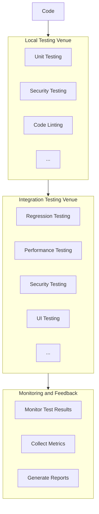

### [Project X] Continuous Testing Plan 

#### Introduction:
This document outlines the Continuous Testing plan for Project X, a Python-based web application for project management. The plan includes testing strategy, phases, tool recommendations, and specifications.

---

#### **1. Project Overview**
- **Project Name:** Project X
- **Project Description:** A web-based application for project management.
- **Testing Lead:** Jane Doe

#### **2. Test Requirements**
- **Objective:** Ensure codebase integrity, performance, and security for reliable software releases.
- **Test Artifacts:** Front-end components, APIs, Database layer.
- ** Key Performance Indicators (KPIs):** Identify KPIs and success criteria.
  1. Measure the percentage of code covered by automated tests.
  2. Monitor the average time for a full test suite to execute.
  3. Track the percentage of defects detected in testing compared to total defects.

#### **3. Testing Workflow Architecture**

#### **4. Test Specifications**

| Phase | High-level Tests | Recommended Tool | Description | Starter Kit | Key People |
|-------|------------------|-----------------|-------------|-------------|------------|
| Security Testing | Vulnerability Scan | [GitHub Dependabot](https://dependabot.com/) | Monitors dependencies for known vulnerabilities. | [GitHub Docs](https://docs.github.com/en/code-security/supply-chain-security/keeping-your-dependencies-updated-automatically/about-dependabot-version-updates) | Jane Doe |
| | Secure Code Review | [SonarQube](https://www.sonarqube.org/) | Continuous inspection of code quality. | [SonarQube Docs](https://docs.sonarqube.org/latest/) | Jane Doe |
| Unit Testing | Function Validity | [pytest](https://docs.pytest.org/en/latest/) | Verifies individual units of Python software. | [pytest Docs](https://docs.pytest.org/en/latest/) | Jane Doe |
| Regression Testing | User Flow Validation | [Selenium](https://www.selenium.dev/) | Ensures that new code changes do not adversely affect existing functionalities. | [Selenium Doc](https://www.selenium.dev/documentation/en/getting_started_with_webdriver/) | Jane Doe |
| Integration Testing | System Validation | [pytest](https://docs.pytest.org/en/latest/) | Pytest supports integration testing. | [pytest Docs](https://docs.pytest.org/en/latest/) | Jane Doe |
| Performance Testing | Load Testing | [Apache JMeter](https://jmeter.apache.org/) | Measures system performance under various conditions. | [JMeter User Manual](https://jmeter.apache.org/usermanual/index.html) | Jane Doe |
| Requirements Verification & Validation | Requirement Traceability | [Pylint](https://pypi.org/project/pylint/) | Checks Python code against coding standards and helps catch errors. | [Pylint Docs](https://pylint.readthedocs.io/en/latest/) | Jane Doe |

#### **5. Reporting and Analysis**

Define how testing results will be reported and analyzed.

- **Reporting Tools:** Utilize SonarQube for comprehensive code quality and analysis reporting.
- **Frequency of Reporting:** Generate reports after each testing cycle and major code changes.
- **Key Metrics Tracked:** Monitor automated test coverage, defect density, and execution time.
- **Analysis Process:** Conduct regular meetings to review reports, identify improvement areas, and plan actions.

#### **6. Collaboration and Issue Tracking**

Integrate with project management tools for efficient collaboration and issue tracking.

- **Project Management Tool:** Jira
- **Integration Approach:** Establish bidirectional integration with Jira for seamless collaboration.
- **Issue Tracking Process:** Create issues in Jira directly from testing tools, track progress, and link issues to test cases.

## Revision History

| Version | Description                     | Date       |
|---------|---------------------------------|------------|
| 1.0     | Initial Draft                   | 2024-04-01 |
| 1.1     | Added reporting and collaboration details | 2024-04-05 |
