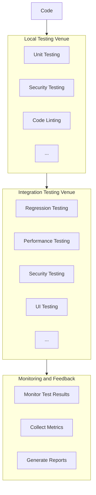

### [Project X] Continuous Testing Plan 

#### Introduction:
This document outlines the Continuous Testing plan for Project X, a Python-based web application for project management. The plan includes testing strategy, phases, tool recommendations, and specifications.

---

#### **1. Project Overview**
- **Project Name:** Project X
- **Project Description:** A web-based application for project management.
- **Testing Lead:** Jane Doe

#### **2. Test Requirements**
- **Objective:** Ensure codebase integrity, performance, and security for reliable software releases.
- **Test Artifacts:** Front-end components, APIs, Database layer.
- ** Key Performance Indicators (KPIs):** Identify KPIs and success criteria.
  1. Measure the percentage of code covered by automated tests.
  2. Monitor the average time for a full test suite to execute.
  3. Track the percentage of defects detected in testing compared to total defects.

#### **3. Testing Workflow Architecture**

#### 4. **Testing Tools Selection:**

- **Automated Unit Testing:**
  - Framework: Pytest for Python
  - Measure Success: 90% of codebase covered by automated unit tests.
  - Frequency: Run on each code commit.

- **Integration Testing:**
  - Framework: Pytest for Python
  - Measure Success: All critical interactions between components validated.
  - Frequency: Run after major code merges.

- **Regression Testing:**
  - Tools: Selenium for UI regression testing
  - Measure Success: No new issues introduced by code changes.
  - Frequency: Run after each code commit.

- **Performance Testing:**
  - Tool: Apache JMeter
  - Measure Success: The system handles expected workloads with response times within acceptable limits.
  - Frequency: Run performance tests every month.

- **Security Testing:**
  - Tools: Dependabot for dependency scanning, SonarQube for code security analysis
  - Measure Success: No critical security vulnerabilities are present in the code.
  - Frequency: Run security scans on each code commit.

#### **5. Reporting and Analysis**

Define how testing results will be reported and analyzed.

- **Reporting Tools:** Utilize SonarQube for comprehensive code quality and analysis reporting.
- **Frequency of Reporting:** Generate reports after each testing cycle and major code changes.
- **Key Metrics Tracked:** Monitor automated test coverage, defect density, and execution time.
- **Analysis Process:** Conduct regular meetings to review reports, identify improvement areas, and plan actions.

#### **6. Collaboration and Issue Tracking**

Integrate with project management tools for efficient collaboration and issue tracking.

- **Project Management Tool:** Jira
- **Integration Approach:** Establish bidirectional integration with Jira for seamless collaboration.
- **Issue Tracking Process:** Create issues in Jira directly from testing tools, track progress, and link issues to test cases.

## Revision History

| Version | Description                     | Date       |
|---------|---------------------------------|------------|
| 1.0     | Initial Draft                   | 2024-04-01 |
| 1.1     | Added reporting and collaboration details | 2024-04-05 |
