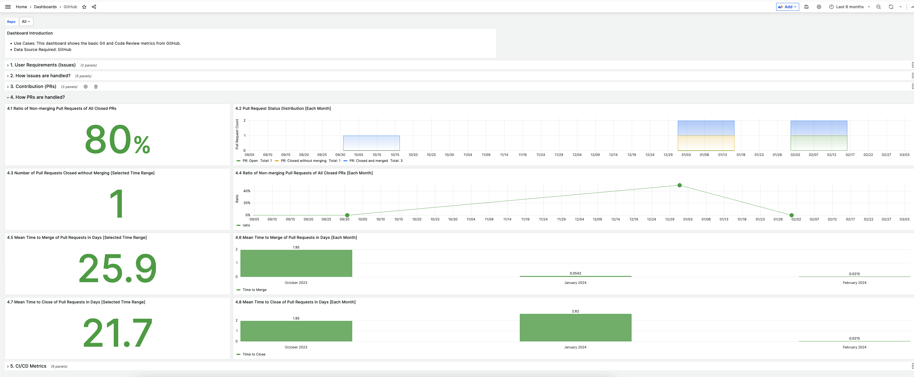

# Metrics

<pre align="center">A Guide for Configuring and Deploying Software Lifecycle Metrics Tracking.</pre>


*Example Metrics Dashboard using Apache DevLake*

## Introduction

Metrics collection is important for project management and software quality assurance. This guide provides two tool recommendations for collecting and visualizing metrics, depending on the complexity of your project:
- For complex, multi-repository metrics gathering: We recommend [Apache DevLake](https://devlake.apache.org/) for detailed metrics tracking and analysis.
- For simpler, single-repository projects: We recommend using GitHub Actions-based tools for easy integration and basic metrics collection. Specifically, the [DeveloperMetrics GitHub Action](https://github.com/DeveloperMetrics), which enables you to quickly gather and display DORA metrics with minimal configuration.

**Use Cases**:

- Collecting and analyzing [DORA metrics](https://devlake.apache.org/docs/DORA/) along with many others for your project.
- Creating a visual dashboard to view metrics from multiple sources (e.g., GitHub, JIRA) in one place.
- Streamlining the setup and configuration of metrics collection through a single-command setup step or plug-and-play GitHub Action.
- Simplifying metrics collection for smaller projects to encourage broader adoption.


## Tool Options

### 1. **Apache DevLake** for Complex Multi-Repository Projects

DevLake is a powerful and flexible tool for gathering and visualizing software lifecycle metrics across multiple repositories. It requires Docker and some configuration but is ideal for teams managing several repositories or those needing in-depth metrics analysis.

**Prerequisites**: 
- Familiarity with [Docker](https://docs.docker.com/engine/install/) as well as a running instance of it
- A familiarity with validated software metrics is not required for this tool but it is recommended

**Why We Chose Apache DevLake**:

- Our decision to select Apache DevLake was informed by thorough trade study documentation, available [here](https://github.com/NASA-AMMOS/slim/issues/117#issuecomment-1802302091).
- Offers detailed metrics analysis for complex projects.
- Supports various data sources (GitHub, Jira, etc.) and can create powerful visual dashboards.
- Well-suited for projects requiring a deeper understanding of organizational and project performance.


### 2. **DeveloperMetrics GitHub Action** for Simple Single-Repository Projects

For smaller, simpler projects, where full DevLake setup might be too cumbersome, we recommend the [DeveloperMetrics GitHub Action](https://github.com/DeveloperMetrics). This tool allows you to quickly collect basic DORA metrics (e.g., deployment frequency, lead time for changes) and display results as badges in your project README.

**Why We Recommend DeveloperMetrics**:

- Lightweight, quick to integrate into any GitHub repository via GitHub Actions.
- No server setup or Docker required—ideal for developers who want an easy solution.
- Automatically collects basic DORA metrics, with results visible as badges on your repository.
- SLIM can automatically submit PRs to infuse this action into repositories, making it easier to adopt.


---

## Quick Start: Apache DevLake

To quickly deploy DevLake on one of your servers or locally for testing, we've developed a convenient 1-step command. Please ensure Docker is running on your system before executing this command.

The purpose of this script is to automate the installation process DevLake recommends [here](https://devlake.apache.org/docs/GettingStarted/DockerComposeSetup). The script does the following:

- Checks for necessary software: ensures you have Docker and docker-compose installed to run DevLake.
- Downloads required files: automatically retrieves setup files if they're not already present on your system.
- Prepares setup files: adjusts file permissions and sets up the necessary environment variables for DevLake.
- Secures the setup: generates a unique encryption key for data security.
- Starts DevLake: uses Docker to initialize the DevLake application in the background and guides you to visit a web address to start using DevLake for data analysis and viewing dashboards.

**Run This Command in Your Terminal and Then Move on to the Next Step of the [Configuration Guide](#step-by-step-configuration-guide):**

```bash
cd /path/to/your/chosen/deployment/directory
/bin/bash -c "$(curl -fsSL https://raw.githubusercontent.com/NASA-AMMOS/slim/main/docs/guides/software-lifecycle/metrics/metrics-starter-kit/install_devlake.sh)"
```

**To Stop Services:**

1. Navigate to the directory containing your `docker-compose.yml` file (where you ran the above command).
2. Run the following command to gracefully stop all containers defined in the `docker-compose.yml` file:

    ```bash
    docker-compose down
    ```

**To Restart Services:**

1. Navigate to the directory containing your `docker-compose.yml` file.
2. Run the following command to start containers for services defined in the `docker-compose.yml` file:

    ```bash
    docker-compose up -d
    ```

   The `-d` flag runs containers in detached mode, allowing them to run in the background.

---
## Quick Start: DeveloperMetrics GitHub Action

To add simple metrics collection for a single repository:

1. Add the following GitHub Action to your repository's `.github/workflows/metrics.yml` file:

    ```yaml
    name: Collect DORA Metrics
    on:
      push:
        branches:
          - main
    jobs:
      collect-metrics:
        runs-on: ubuntu-latest
        steps:
          - uses: actions/checkout@v2
          - name: Run DORA Metrics Collection
            uses: DeveloperMetrics/collect@v1
            with:
              GITHUB_TOKEN: ${{ secrets.GITHUB_TOKEN }}
    ```

2. After a push to your repository, metrics such as deployment frequency and lead time for changes will be collected and displayed as badges on your project README.

For more information, check out the [DeveloperMetrics repository](https://github.com/DeveloperMetrics).

---

## Step-by-Step Configuration Guide for DevLake 
_For **DeveloperMetrics**, no additional configuration is needed beyond adding the GitHub Action to your repository._

1. Run the **[Quick Start](#quick-start)** steps above.
2. Once you have a working DevLake instance, we recommend going through DevLake's [official start guide](https://devlake.apache.org/docs/Overview/Introduction/#2-configuring-data-source) step-by-step, beginning with the data sources section.
3. If you're interested in sharing your dashboards with your community but are unable to host a server, you can export your dashboards by following the instructions provided [here](https://grafana.com/docs/grafana/latest/dashboards/create-reports/).

There are two additional topics we'd like to emphasize. Our recommendations for data sources and metrics to collect.

### Recommended Data Sources

We recommend, at a minimum, connecting the following data sources (see the DevLake docs on [configuring data sources](https://devlake.apache.org/docs/Overview/Introduction#2-configuring-data-source) for further assistance):

- [GitHub](https://devlake.apache.org/docs/v0.20/Configuration/GitHub)

### Recommended Metrics to Collect

See [this list](https://devlake.apache.org/docs/Metrics) of metrics on the DevLake documentation guide for why certain metrics are important and how to collect them. As a minium, we recommend the following metrics should be collected for your projects:

- [Change Failure Rate](https://devlake.apache.org/docs/Metrics/CFR): *"The percentage of changes that were made to a code that then resulted in incidents, rollbacks, or any type of production failure."*
- [Lead Time for Changes](https://devlake.apache.org/docs/Metrics/LeadTimeForChanges): *"The median amount of time for a code change to be deployed into production."*

---

## Frequently Asked Questions (FAQ)

- **Q:** How do I customize the DevLake Quick Start script for more functionality?
- **A:** If you have already provided DevLake with a data source, you can further configure your dashboard by following [this guide](https://devlake.apache.org/docs/Configuration/Dashboards/GrafanaUserGuide). Use simple queries to gather the information you need.

- **Q:** How do export the Grafana dashboard to a PDF?
- **A:** You can use [this](https://github.com/IzakMarais/reporter) tool.

---

## Credits

**Authorship**:

- Dillon Dalton [ddalton-jpl](https://github.com/ddalton-jpl)
- Rishi Verma [riverma](https://github.com/riverma)
- Kyongsik Yun [yunks128](https://github.com/yunks128)

---

## Feedback and Contributions

We value your feedback and welcome contributions to improve this guide. Please see our [contribution guidelines](https://link-to-contribution-guidelines).

---

**Acknowledgements**:

- The [NISAR](https://nisar.jpl.nasa.gov/) and [SWOT](https://swot.jpl.nasa.gov/) missions for their experience deploying and using DevLake.
