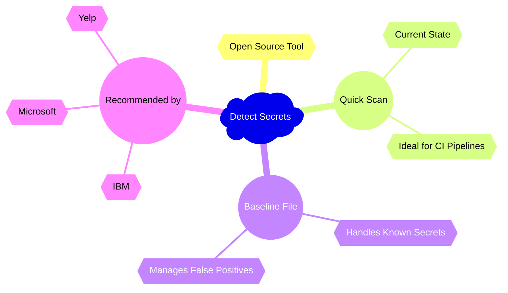
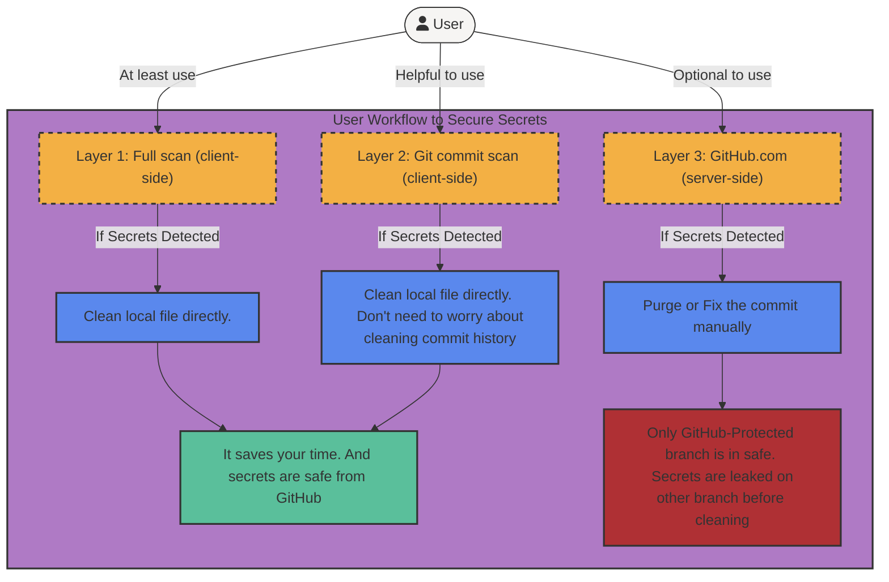
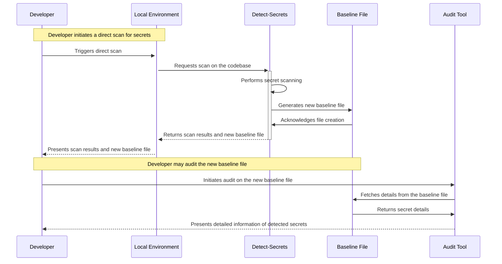
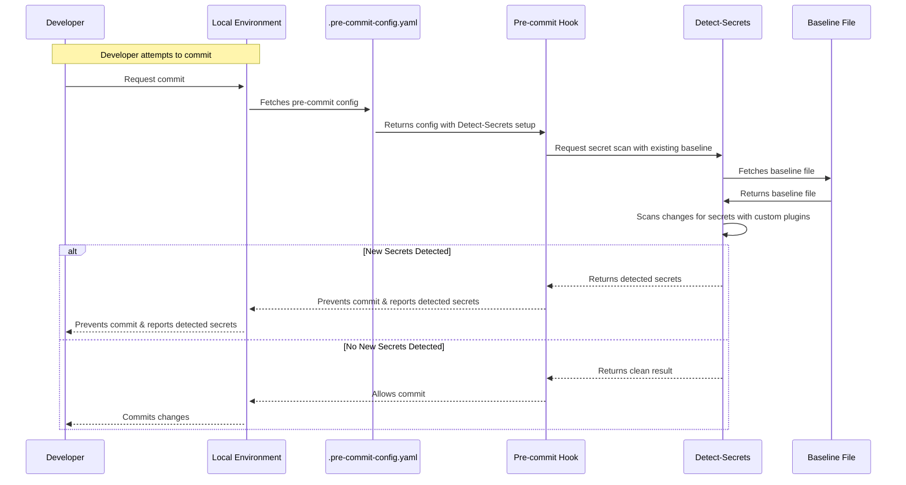
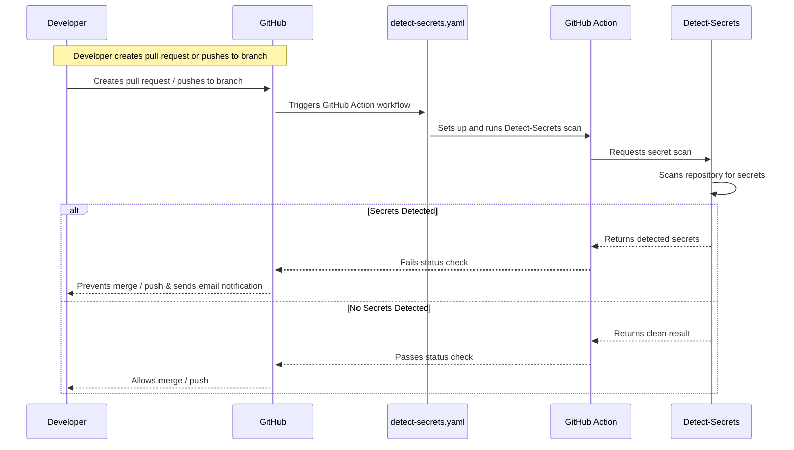
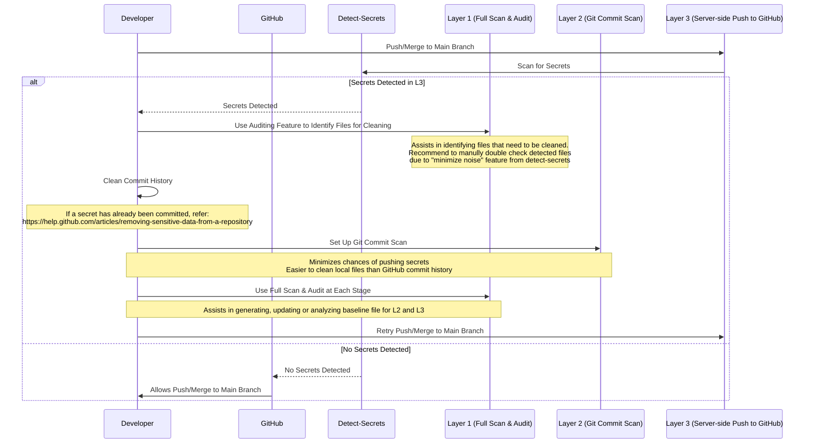

# Secrets Detection

We recommend [detect-secrets](https://github.com/Yelp/detect-secrets) to identify secure information included in source controlled files. Its prowess lies in its extensible Python plugin API, which allows custom rules and heuristics to tackle a broad spectrum of secrets. Designed to scan the project's current state rather than the entire git history, 
it operates swiftly, making it ideal for continuous integration pipelines. Leveraging the concept of a "baseline file" (`.secrets.baseline`), it enables easy handling of known secrets and false positives, facilitating its gradual integration into existing projects. 

<!--- Currently not supported with RETYPE v3.0.0 rendering of Mermaid graphs, using inline image instead.

--->


Our application of `detect-secrets` embraces a tri-layered approach, bolstered by customized plugins ([full list of plugins available here](https://github.com/NASA-AMMOS/slim-detect-secrets/tree/exp#viewing-all-enabled-plugins)), to provide robust protection against potential secret leaks at the earliest stage.
This page proposes three layers of secret scanning to help prevent secrets from being leaked on GitHub

Three layers of protection are:
1. Client-side full scan of existing code base
2. Client-side scan of updated code upon Git commit
3. Server-side push to GitHub.com from client

Each layer has its own advantages and disadvantages. The full use of these three layers of protection is recommended to minimize human negligence.

> **Note**: Below three layers, are running on experimental version [slim-detect-secrets](https://github.com/NASA-AMMOS/slim-detect-secrets/tree/exp) which supports additional secret detection [plugins](https://github.com/NASA-AMMOS/slim-detect-secrets/tree/exp#viewing-all-enabled-plugins).
> 
> They are:
> > * AWS sensitive information
> > * Public IP Address
> > * Absolute Path
> > * Email Address
> >
> > Link to their [implementation](https://github.com/NASA-AMMOS/slim-detect-secrets/tree/exp/detect_secrets/plugins) and [test suites](https://github.com/NASA-AMMOS/slim-detect-secrets/tree/exp/tests/plugins)
> 
> It is being tested by both [NASA-AMMOS/slim](https://github.com/NASA-AMMOS/slim) team and [Yelp/detect-secrets](https://github.com/Yelp/detect-secrets) team.
> Eventually, it will be merged into Yelp/detect-secrets.
> 
> At that time, this document will be updated to use the official version of detect-secrets.

## Layer 1: Full Scan and Audit (Client-side)

The first layer initiates a direct scan on the developer's local environment. This is achieved through the `detect-secrets` tool, which scans the entire codebase and outputs a new baseline file containing detected secrets. The developer can then audit this file to view detailed information about detected secrets.


Starter Kit:
1. Install experimental version of [slim-detect-secrets](https://github.com/NASA-AMMOS/slim-detect-secrets/tree/exp)
```bash
pip install git+https://github.com/NASA-AMMOS/slim-detect-secrets.git@exp
```

2. Scan all local files from current directory and output the result as a baseline file
```bash
detect-secrets scan ./ --all-files --exclude-files '.secrets.*' --exclude-files '.git*' > .secrets.baseline
```
Here it scans all the local files from current directory, but excludes `.git` directory and `.secrets` baseline files from scanning to reduce false positive. Make modifications when necessary.

3. Check result in the baseline file
```bash
cat .secrets.baseline
```
> This command is supported in Unix-like system. For Windows, you can use other command, such as `type .secrets.baseline`
If any secrets are detected, the result will be located at the "results:" of the file.

For example,
```json
"results": {
    "Sample/sample-develop.sh": [
    {
    "type": "AWS Sensitive Information",
    "filename": "Sample/sample-develop.sh",
    "hashed_secret": "d3f72b97cd8756fe12345678bdf96aef1ac23b7d",
    "is_verified": false,
    "line_number": 39
},
```
Only line number is visible through this approach. You can check them manually in the file, or use the following audit tool to conveniently view the actual secret.

4. Analyze results by `audit` tool
```bash
detect-secrets audit .secrets.baseline
```
> detect-secrets audit tool can provide you an interactive interface to view the actual secret based on the line number
> and label it as false positive or true positive.

For example,

</img>

It also provides other ways to present the result. For more information, please refer to [Auditing Secrets in Baseline](https://github.com/Yelp/detect-secrets#auditing-secrets-in-baseline)

***Note*** if you have marked any detected secrets as true positives, its best to first remove all references to those secrets in your code and then rerun a full scan to generate a fresh audit report that you can compare against to ensure you only have false-positives (white-listed secrets) in your `.secrets.baseline` - this is especially important for Layer 2.
## Layer 2: Git Commit Scan (Client-side)
The second layer is a pre-commit hook implemented in the local environment. This hook utilizes a `.pre-commit-config.yaml` file to config the pre-commit hook. The hook is triggered when the developer attempts to commit changes. The hook will scan the changes and **compare** them to the baseline file generated in the first layer. If any **new secrets** are detected, the hook will prevent the commit and report the detected secrets to the developer.

Starter Kit:
1. Install [pre-commit](https://pre-commit.com/#install)
```bash
pip install pre-commit
```
This tool is used to install pre-commit hook in your local git repository.

2. Create `.pre-commit-config.yaml` file in root directory of your project with the following contents
```yaml
repos:
  - repo: https://github.com/NASA-AMMOS/slim-detect-secrets
    # using commit id for now, will change to tag when official version is released
    rev: 91e097ad4559ae6ab785c883dc5ed989202c7fbe
    hooks:
      - id: detect-secrets
        args:
          - '--baseline'
          - '.secrets.baseline'
          - '--exclude-files'
          - '.git*'
          - '--exclude-files'
          - '.secrets.*' 

```
This file is used to config the pre-commit hook. In this example, we use the experimental version of `slim-detect-secrets` tool. The `--baseline` argument is used to specify the baseline file generated in the first layer. The `--exclude-files` argument is used to exclude the `.git` directory and `.secrets` baseline files from scanning to reduce false positives. Make modifications when necessary.

3. Install pre-commit hook
```bash
pre-commit install
```
This command reads the `.pre-commit-config.yaml` file and installs the pre-commit hook in your local git repository.
After this, you can see a `.git/hooks/pre-commit` file is created in your local git repository.

4. Add the baseline file `.secrets.baseline` in your local Git repository under the following conditions only:
   1. You wish to share white-listed secrets with other team members
   2. You've removed any references in your code to sensitive secrets detected that are not white-listed, i.e. find and modify code referenced in you `.secrets.baseline` with flag `is_secret: true`
   3. You've re-run a fresh `detect-secrets scan` followed by a `detect-secrets audit` and your `.secrets.baseline` ONLY now contains white-listed entries, i.e. `is_secret: false`
   
**Warning**: Adding your `.secrets.baseline` file to your local Git and pushing changes to a remote without following the above directions could create a security risk by sharing the sensitive parts of your security scan with the outside world!

5. Commit your changes

Now, you can commit your changes as usual. If any **new secrets** are detected, the commit will be prevented and the secrets will be reported.

For example,

</img>

> **Note**: The pre-commit hook blocks a commit by comparing new secrets with the results in the `.secrets.baseline` file. If new secrets are introduced, the hook will report them, but it does not automatically update the `.secrets.baseline` file. To update the baseline file with newly introduced secrets, you need to re-run the scan command in Layer 1 (step 2) and generate a new baseline file.

> **Note**: during commit checks, detect secrets may not display all secrets present within a single file during a single scan. This can be to [minimize noise](https://github.com/Yelp/detect-secrets/blob/master/docs/design.md#potentialsecret), among other reasons. Thus if you have multiple violations of different types of secrets per file, multiple independent commits may be necessary to help identify all violations.
> 
> You can create an empty result baseline file by running this command at a directory without secrets.

## Layer 3: Server-side Push to GitHub.com
The final layer of our solution is a server-side pre-commit scan powered by [GitHub Action](https://github.com/features/actions). This scan is triggered whenever a developer pushes to a branch or creates a pull request. If the scan detects any new secrets, it can generate a not detailed report compared to layer 2 (for security concern), email to the developer, and report a status check to GitHub. The status check will prevent the developer from merging the pull request or pushing to the **protected** branch. This layer protects the protected branch from being polluted by secrets, but secrets can still be pushed to other branches.


Starter Kit:
1. Create a workflow file `detect-secrets.yaml` in `.github/workflows` directory from your repository root.
```yaml
name: Secret Detection Workflow
on:
  push:
    branches:
      - main
  pull_request:
    branches:
      - main

jobs:
  secret-detection:
    runs-on: ubuntu-latest
    steps:
      - name: Checkout code
        uses: actions/checkout@v2

      - name: Install necessary packages
        run: |
          # This is the experimental version of slim-detect-secrets.
          # It will be updated to the official Yelp/detect-secrets version once the customized plugins are merged.
          # For more information about slim/detect-secrets, check the following:
          # 1. https://github.com/NASA-AMMOS/slim-detect-secrets/tree/exp
          # 2. https://github.com/NASA-AMMOS/slim/blob/d20ee6134a0dc0e0dab11d2d2570e358ef7e4550/continuous-testing/starter-kits/README.md#detect-secrets
          pip install git+https://github.com/NASA-AMMOS/slim-detect-secrets.git@exp
          # This library is used for JSON operations.
          pip install jq
          
      - name: Create an initial .secrets.baseline if .secrets.baseline does not exist
        run: |
          if [ ! -f .secrets.baseline ]; then
            # This generated baseline file will only be temporarily available on the GitHub side and will not appear in the user's local files.
            # Scanning an empty folder to generate an initial .secrets.baseline without secrets in the results.
            echo "⚠️ No existing .secrets.baseline file detected. Creating a new blank baseline file."
            mkdir empty-dir
            detect-secrets scan empty-dir > .secrets.baseline
            echo "✅ Blank .secrets.baseline file created successfully."
            rm -r empty-dir
          else
            echo "✅ Existing .secrets.baseline file detected. No new baseline file will be created."
          fi

      - name: Scan repository for secrets
        run: |
          # scripts to scan repository for new secrets
          
          # backup the list of known secrets
          cp .secrets.baseline .secrets.new

          # find the secrets in the repository
          detect-secrets scan --baseline .secrets.new --exclude-files '.secrets.*' --exclude-files '.git*'
               
          # if there is any difference between the known and newly detected secrets, break the build
          # Function to compare secrets without listing them
          compare_secrets() { diff <(jq -r '.results | keys[] as $key | "\($key),\(.[$key] | .[] | .hashed_secret)"' "$1" | sort) <(jq -r '.results | keys[] as $key | "\($key),\(.[$key] | .[] | .hashed_secret)"' "$2" | sort) >/dev/null; }
        
          # Check if there's any difference between the known and newly detected secrets
          if ! compare_secrets .secrets.baseline .secrets.new; then
            echo "⚠️ Attention Required! ⚠️" >&2
            echo "New secrets have been detected in your recent commit. Due to security concerns, we cannot display detailed information here and we cannot proceed until this issue is resolved." >&2
            echo "" >&2
            echo "Please follow the steps below on your local machine to reveal and handle the secrets:" >&2
            echo "" >&2
            echo "1️⃣ Run the 'detect-secrets' tool on your local machine. This tool will identify and clean up the secrets. You can find detailed instructions at this link: https://nasa-ammos.github.io/slim/continuous-testing/starter-kits/#detect-secrets" >&2
            echo "" >&2
            echo "2️⃣ After cleaning up the secrets, commit your changes and re-push your update to the repository." >&2
            echo "" >&2
            echo "Your efforts to maintain the security of our codebase are greatly appreciated!" >&2
            exit 1
          fi

```
**Explanation**

The Detect Secrets Action follows these steps to ensure the security of your code:

- **Checkout Code**: Utilizes GitHub's checkout action to access the repository. This is the code that will be scanned for secrets.
- **Install Necessary Packages**: Deploys the required Python packages, including the experimental version of `slim-detect-secrets` and `jq`. These packages enable the primary functionality of the Action.
- **Check Existence of .secrets.baseline**: Ensures the Action remains operational even if no baseline file exists yet. If the `.secrets.baseline` file is not found, the action creates an initial baseline file by scanning an empty directory.
- **Scan Repository for Secrets**: In this step, the Action backs up the list of known secrets and scans the repository for any new secrets. The scan excludes files starting with '.secrets.' and '.git'. The 'compare_secrets' function is used to identify any differences between the known secrets and newly detected ones. If new secrets are detected, the build fails, and the user is guided to clean up the secrets using the `detect-secrets` tool.

After this, GitHub will automatically run the workflow when you push to the branch or create a pull request.

This workflow will run the `detect-secrets` tool on the GitHub server. If any new secrets are detected, it will:
- Fail the status check

  </img>
- Print a message in the "Details" with instructions on how to resolve the issue

  </img>
- Send an email notification to the user

  </img>

2. [Protect your branch](https://docs.github.com/en/repositories/configuring-branches-and-merges-in-your-repository/managing-protected-branches/managing-a-branch-protection-rule)

</img>

After this, if status check fails, GitHub will prevent the merge or push to the protected branch.

</img>

## Attention for using Detect Secrets
> 1.It does not [show all the same type of secrets in a same file to minimize noise](https://github.com/Yelp/detect-secrets/blob/master/docs/design.md#potentialsecret)
> 
> This means sometimes it will only show one secret in a file even if there are multiple **same type of secrets** in the same file.
> Audit tool will not show all the secrets due to this reason.
>
> **->** Thus, when you see a secret is detected, best practice is to **manually** check that file.

> 2.Even though detect-secrets has strong secret-detect ability compared to other tools, it is still possible that detect-secrets will not show you a file that contains secrets due to a new type of secret not capable by current plugins.
>
> **->** Thus, the best practice is always to be careful as a developer and **manually** check the files that you think might contain secrets.
>> **Note**: `detect-secrets` is a backup approach to minimize the chance of pushing secrets to the cloud.

## Recommended Workflow
1. At least use layer 3 (Server-side push to GitHub.com) to protect the main branch from being pushed or merged if any secrets are detected.
2. If any secrets are detected during layer 3, you can:
    - Clean the commit history of the branch
        - To find out the files that needs clean, you can use layer 1's auditing feature as assistance
        - If a secret has already been committed, visit
          https://help.github.com/articles/removing-sensitive-data-from-a-repository
3. Recommend to set up layer 2 (Git commit scan, client-side) for every developer
    - It can minimize the chance of pushing secrets to the cloud
    - Local files are easier to clean than GitHub commit history
4. Layer 1 (Full scan and audit, client-side) can be involved during each stage
    - It helps you generate, update or analyze baseline file for layer 2 and 3



## More Configurations

Check out
1. [detect-secrets](https://github.com/Yelp/detect-secrets)
2. [pre-commit](https://pre-commit.com/)