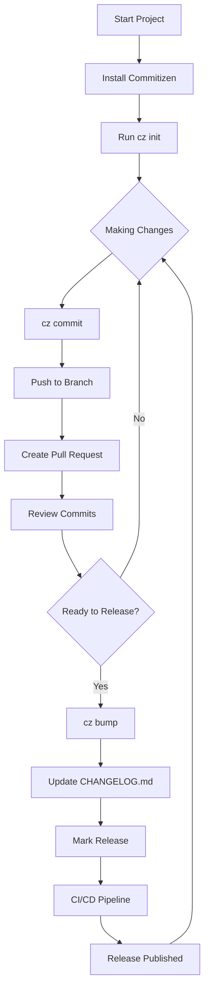

import CodeBlock from '@theme/CodeBlock';

# Versioning

<pre align="center">Use semantic versioning and conventional commits to standardize your project's versioning process.</pre>

## Introduction

Versioning provides your development team and consumers of your codebase the ability to keep track of differences between release states of your code. This guide covers semantic versioning principles, conventional commit standards, and practical tools like [Commitizen](https://commitizen-tools.github.io/commitizen/) to help you maintain consistent and meaningful version management throughout your project's lifecycle.

## Use Cases

- **Versioning Communication**: Help the team and users understand upgrade impacts
- **Breaking Change Communication**: Signal incompatible software changes clearly
- **Release Planning**: Coordinate feature releases and bug fixes
- **Dependency Management**: Specify compatible dependency version ranges

## Prerequisites

- Basic understanding of Git and version control
- Python (for [Commitizen installation](https://pypi.org/project/commitizen/))
- Understanding of your project's release workflow

## Quick Start

**Resources:** 
1. 📖 [Semantic Versioning Specification](https://semver.org/) - Read the official SemVer guide
2. 📖 [Conventional Commits](https://www.conventionalcommits.org/) - Read the standardized commit message format
3. ⬇ [Commitizen for Python](https://pypi.org/project/commitizen/) - Download and use this interactive commit and version helper

**Recommendation:** 
1. Install Commitizen:
   ```bash
   pip install commitizen
   ```

2. Initialize in your project:
   ```bash
   cz init
   ```

3. Start using conventional commits:
   ```bash
   cz commit
   ```

4. Bump versions:
   ```bash
   cz bump
   ```
   - Automatically analyzes conventional commits to determine version bump type
   - Updates version in configured files (setup.py, package.json, pyproject.toml, etc.)
   - Generates or updates CHANGELOG.md with new version entries
   - Creates git tag for the new version

## Step-by-Step Guide

### Understanding Semantic Versioning

Semantic versioning provides a simple set of guidelines that describe how to increment your version numbers based on the changes being introduced.

Given a version number **MAJOR.MINOR.PATCH**, increment the:

1. **MAJOR** version when you make incompatible API changes
2. **MINOR** version when you add functionality in a backward compatible manner  
3. **PATCH** version when you make backward compatible bug fixes

Additional labels for pre-release and build metadata are available as extensions to the MAJOR.MINOR.PATCH format.

#### Examples:
- `1.0.0` → `1.0.1` (bug fix)
- `1.0.1` → `1.1.0` (new feature)
- `1.1.0` → `2.0.0` (breaking change)
- `1.0.0-alpha.1` (pre-release)
- `1.0.0-beta.1` (beta release for testing with users before final release)
- `1.0.0+build.123` (build metadata)

### Setting Up Conventional Commits

Conventional commits provide a standardized format for commit messages that can be used to automatically determine semantic version bumps and generate changelogs.

#### Format:
```
<type>(<scope>): <description>

[optional body]

[optional footer(s)]
```

#### Example:
```
feat!(auth): add OAuth2 authentication support

Implemented OAuth2 flow for user authentication with Google and GitHub providers.
This change improves security and provides better user experience.

Breaks compatibility with the old API key authentication method.

BREAKING CHANGE: API key authentication is no longer supported
```

#### Common Types:
- `feat:` → Minor version bump (1.2.0 → 1.3.0)
- `fix:` → Patch version bump (1.2.0 → 1.2.1)
- `feat!:` or `BREAKING CHANGE:` → Major version bump (1.2.0 → 2.0.0)
- `docs:` → Documentation changes (no version bump)
- `style:` → Code style changes (no version bump)
- `refactor:` → Code refactoring (no version bump)
- `test:` → Adding or updating tests (no version bump)
- `chore:` → Build process or auxiliary tool changes (no version bump)

For a comprehensive list, see:
- [Conventional Commits Specification](https://www.conventionalcommits.org/)
- [Angular Commit Guidelines](https://github.com/angular/angular/blob/main/CONTRIBUTING.md#commit)

### Installing and Using Commitizen

[Commitizen](https://commitizen-tools.github.io/commitizen) helps create properly formatted commit messages and automate version bumping. This tool is particularly useful for maintaining a consistent commit history and facilitating automated release workflows.

#### Installation:
```bash
pip install commitizen
```

Or with pipx for isolated installation:
```bash
pipx install commitizen
```

#### Initial Setup:
```bash
# Initialize Commitizen in your project
cz init

# This creates a .cz.toml or pyproject.toml configuration
```

#### Daily Usage:
```bash
# Interactive commit creation
cz commit

# Check current version
cz version

# Bump version based on commits
cz bump

# Generate changelog
cz changelog
```

### Version Management Workflow

Establish a consistent versioning workflow for your team:

#### Team Setup:
1. **Discuss and Document**: Have a discussion with your team about adopting a code versioning convention your project will follow and document it for reference as new developers are onboarded.

2. **Choose Your Approach**: Your project's versioning scheme may require additional qualifiers (e.g., build identifiers, release designations like unstable/stable/prerelease).

3. **CHANGELOG Maintenance**: For each pull request, ensure that a summary of changes are captured in the repository's CHANGELOG and associated with a version number that follows your team's versioning scheme.

#### Commitizen Bump Command

The `cz bump` command is your primary tool for version management:

```bash
# Dry run to see what version would be bumped to
cz bump --dry-run

# Bump version and create changelog entry
cz bump

# Bump to a specific version type
cz bump --increment MAJOR    # Force major version bump
cz bump --increment MINOR    # Force minor version bump  
cz bump --increment PATCH    # Force patch version bump

# Bump with custom message
cz bump -m "Release version {new_version}"

# Bump and create git tag
cz bump --tag-format "v{version}"

# Bump version and update CHANGELOG.md
cz bump --changelog

# Bump version, update CHANGELOG.md, and specify the changelog file location
cz bump --changelog --changelog-to-stdout > CHANGELOG.md
```

#### Configuration:

For configuration options and examples, see the [Commitizen documentation](https://commitizen-tools.github.io/commitizen/config/).

## Best Practices

### Pre-release Versions

Use pre-release identifiers for unstable releases:
- Alpha: `1.0.0-alpha.1` (very early, potentially unstable)
- Beta: `1.0.0-beta.1` (feature complete, but may have bugs)
- Release candidates: `1.0.0-rc.1` (potentially final, awaiting testing)

### Breaking Changes Communication

Clearly communicate breaking changes to your users:
- Use `!` in commit type: `feat!: change API response format`
- Or add `BREAKING CHANGE:` in commit body
- Document migration path in release notes
- Consider deprecation warnings before breaking changes

### Changelog Management

Maintain a human-readable changelog:
- Use conventional commits to auto-generate entries
- Organize by version with clear section headers
- Include upgrade instructions for breaking changes
- For detailed guidance, see our [Change Log Guide](/docs/guides/documentation/change-log/)

## Wrapping it All Together



1. **Start Project** - Set up your repository and read the [Semantic Versioning Specification](https://semver.org/) and [Conventional Commits](https://www.conventionalcommits.org/) documentation
2. **Install Commitizen** - Run `pip install commitizen` to install the version management tool
3. **Run `cz init`** - Initialize Commitizen configuration in your project
4. **Making Changes** - Begin your development workflow
5. **`cz commit`** - Use Commitizen to create properly formatted conventional commits
6. **Push to Branch** - Push your changes to your feature branch
7. **Create Pull Request** - Open a PR following the [Pull Request Guide](/docs/guides/governance/contributions/pull-requests)
8. **Review Commits** - Ensure all commits follow conventional format
9. **Ready to Release?** - Decide if changes are ready for a new version
10. **`cz bump`** - Run to automatically increment version based on commit history
11. **Update CHANGELOG.md** - Use `cz bump --changelog` to automatically generate changelog entries
12. **Mark Release** - Tag the release using `cz bump --tag-format "v{version}"`
13. **CI/CD Pipeline** - Deploy using the [Continuous Delivery Guide](/docs/guides/software-lifecycle/continuous-delivery/)
14. **Release Published** - Your new version is now available
15. **Return to Making Changes** - Continue development for the next release

## Frequently Asked Questions (FAQ)

**Q: When should I bump the major version?**

A: Bump the major version when you make incompatible API changes, remove features, or change behavior in ways that could break existing users' code.

**Q: How do I handle hotfixes?**

A: Create a hotfix branch from the release tag, make fixes with conventional commits (`fix:`), then use `cz bump` to create a patch release.

**Q: Can I skip version numbers?**

A: While technically possible, it's not recommended. Semantic versioning works best with consecutive version numbers that reflect the actual progression of changes.

**Q: How do I migrate an existing project to semantic versioning?**

A: 
1. Determine your current version (or start with `1.0.0`)
2. Install and configure Commitizen: `cz init`
3. Start using conventional commits for all new changes
4. Use `cz bump` for version increments going forward

**Q: What about build metadata and pre-releases?**

A: 
- **Pre-releases**: `1.0.0-alpha.1`, `1.0.0-beta.1`, `1.0.0-rc.1`
- **Build metadata**: `1.0.0+build.123` (doesn't affect version precedence)
- Both can be managed with Commitizen configuration

**Q: How do I version APIs vs applications differently?**

A: 
- **APIs/Libraries**: Be more conservative with major version bumps; consider deprecation periods
- **Applications**: More frequent major versions are acceptable; focus on user-facing changes
- **Internal tools**: Can be more flexible with versioning based on team needs

## Credits

**Authorship**:
- [@riverma](https://github.com/riverma)
- [@anilnatha](https://github.com/anilnatha)

**Acknowledgements**:
- [Semantic Versioning](https://semver.org/) specification authors
- [Conventional Commits](https://www.conventionalcommits.org/) community
- [Commitizen](https://commitizen-tools.github.io/commitizen/) maintainers

## Feedback and Contributions

We welcome feedback and contributions to improve this guide. Please see our [contribution guidelines](https://nasa-ammos.github.io/slim/docs/contribute/contributing/).
