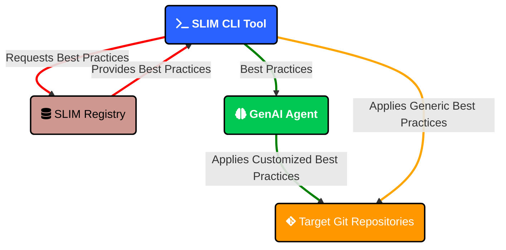

# SLIM Tools

This section provides an overview of tools created by the SLIM community to help implement best practices in your projects.

## SLIM Leaderboard

The SLIM Leaderboard is a tool that generates scan reports of SLIM best practices compliance across GitHub repositories. It helps you measure, rank, and showcase how well a set of repositories follows SLIM best practices.

### Features

- Generates compliance reports for GitHub repositories based on the [SLIM Getting Started Checklist](https://nasa-ammos.github.io/slim/docs/guides/checklist#checklist)
- Ranks repositories from most to least compliant with SLIM best practices
- Supports configuration via JSON to specify individual repositories or scan entire organizations
- Works with both GitHub.com and GitHub Enterprise repositories
- Utilizes GraphQL and parallelized queries for optimized performance
- Provides multiple output formats including tree, table, and markdown
- Offers a verbose mode for additional statistical details and explanations

### Getting Started

#### Requirements

* Python 3.7+
* GitHub personal access token (classic) with all permissions under the "repo" group, including `security_events`

#### Installation

```bash
# Install via pip
pip install slim-leaderboard

# Verify installation
slim-leaderboard --version
slim-leaderboard --help

# Upgrade to latest version
pip install --upgrade slim-leaderboard
```

#### Configuration

Create a configuration file (e.g., `slim-config.json`) to specify the repositories or organizations to scan:

```json
{
  "targets": [
      {
        "type": "repository",
        "name": "https://github.com/nasa-ammos/slim"
      }
  ]
}
```

#### Basic Usage

```bash
# Generate a report using default settings (tree format)
slim-leaderboard slim-config.json

# Generate a report using default settings (tree format) for an adhoc repository
slim-leaderboard --repositories https://github.com/riverma/terraformly

# Generate a report in table format
slim-leaderboard --output_format TABLE slim-config.json

# Generate a verbose report in tree format
slim-leaderboard --output_format TREE --verbose slim-config.json

# Generate a markdown report with emojis instead of text for statuses
slim-leaderboard --output_format MARKDOWN --emoji slim-config.json
```

### Demo
Watch SLIM Leaderboard in action:

This demo demonstrates the key features of SLIM Leaderboard:
- **Version check**: Shows the current version of slim-leaderboard
- **Help display**: Shows available command-line options and usage
- **Individual repository scanning**: Scans a single repository (Terraformly) using the `--repositories` argument with tree output format and emoji status indicators
- **Config file creation**: Creates a JSON configuration file for scanning multiple NASA-AMMOS repositories
- **Batch scanning**: Scans multiple repositories (SLIM, SLIM Leaderboard, and SLIM Starterkit Python) using the configuration file approach

<p style={{textAlign: 'center', marginBottom: '5px'}}>
  <a href="#" onClick={(e) => {e.preventDefault(); document.getElementById('slim-leaderboard-gif').src = document.getElementById('slim-leaderboard-gif').src;}} style={{fontSize: '20px', color: '#666'}}>🔄 Restart Demo</a>
</p>


### Learn More

For more detailed information about SLIM Leaderboard, visit the [GitHub repository](https://github.com/nasa-ammos/slim-leaderboard).

## SLIM CLI

SLIM CLI is a command-line tool designed to infuse SLIM best practices seamlessly into your development workflow. It fetches and applies structured SLIM best practices directly into your Git repositories and leverages artificial intelligence capabilities to customize and tailor the application of best practices based on your repository's specifics.



### Demo

Watch SLIM CLI in action:

This demo showcases the core functionality of SLIM CLI:
- **Version check**: Displays the current version of SLIM CLI
- **Best practices listing**: Shows all available SLIM best practices that can be applied
- **Local repository setup**: Creates a sample repository and initializes it with Git
- **Local best practice application**: Applies the README best practice to a local directory using `--repo-dir`
- **File inspection**: Shows the generated README.md file contents
- **Remote repository application**: Applies the README best practice to a GitHub repository (Terraformly) using `--repo-urls`

<p style={{textAlign: 'center', marginBottom: '5px'}}>
  <a href="#" onClick={(e) => {e.preventDefault(); document.getElementById('slim-cli-gif').src = document.getElementById('slim-cli-gif').src;}} style={{fontSize: '20px', color: '#666'}}>🔄 Restart Demo</a>
</p>


### Features

- **Modern CLI Interface**: List, patch, and infuse SLIM best practices into your Git repository workflow using a seamless terminal interface
- **Fetches the latest SLIM best practices** dynamically from SLIM's registry the moment they change
- **Patches and pushes**, SLIM best practices to your repository and pushes up to your Git remote (i.e. GitHub) - all automatically
- **AI Enabled**: 100+ AI models to automatically infuse best practices using AI customization for your repository
- **Extensible Architecture**: Easy-to-extend best practice system with centralized mapping and YAML configuration

### Getting Started

#### Requirements

* Python 3.7+
* Git
* **Optional**: LiteLLM for enhanced AI model support (`pip install litellm`)
* **Optional**: `.env` file to properly configure the environment for AI model APIs

#### Installation

```bash
# Install via pip (recommended for most users)
pip install slim-cli

# Verify installation
slim --version
slim --help
```

#### Basic Usage

```bash
# List all available best practices
slim list

# Apply best practices to repositories (using aliases)
slim apply --best-practice-ids readme --best-practice-ids governance-small --repo-urls https://github.com/your-username/your-repo

# Apply a best practice using AI customization
slim apply --best-practice-ids readme --repo-urls https://github.com/your-username/your-repo --use-ai azure/gpt-4o

# Apply best practices and then push those changes to a new repository branch on GitHub.com - all automatically
slim apply-deploy --best-practice-ids readme --best-practice-ids governance-small --repo-urls https://github.com/your-username/your-repo --remote origin --commit-message "Apply SLIM best practices"

# Explore available AI models
slim models list
slim models setup anthropic
```

### Documentation Generation

The SLIM CLI includes a website generator that can automatically create [Docusaurus](https://docusaurus.io/) documentation from your repository content:

#### Demo

Watch SLIM CLI documentation generation in action:

<p style={{textAlign: 'center', marginBottom: '5px'}}>
  <a href="#" onClick={(e) => {e.preventDefault(); document.getElementById('slim-cli-docs-video').currentTime = 0; document.getElementById('slim-cli-docs-video').play();}} style={{fontSize: '20px', color: '#666'}}>🔄 Restart Demo</a>
</p>
<video id="slim-cli-docs-video" src="/slim/img/tools/slim-cli-demo-docs.webm" width="100%" controls>
  Your browser does not support the video tag.
</video>

#### Example Usage

```bash
# Generate documentation with AI enhancement using local Ollama Llama 3.1
slim apply --best-practice-ids docs-website --repo-dir /path/to/your/repo --output-dir /path/to/output --use-ai ollama/llama3.1

# Generate documentation with AI enhancement using Anthropic Claude
slim apply --best-practice-ids docs-website --repo-dir /path/to/your/repo --output-dir /path/to/output --use-ai anthropic/claude-3-5-sonnet-20241022
```

**AI Model Recommendations:**
- **Recommended**: Use cloud-based models like `openai/gpt-4o-mini`, `azure/gpt-4o`, or `anthropic/claude-3-5-sonnet-20241022` for best documentation quality
- **Local models**: While supported (e.g., `ollama/llama3.1`), local models typically produce lower quality documentation

### Unit Test Generation

🚧 **Coming Soon** - The unit test generation feature is currently being refactored and will be available in a future release.

### AI Models Discovery

SLIM CLI supports 100+ AI models through LiteLLM integration with automatic model discovery:

```bash
# List all available models (100+ models from various providers)
slim models list

# Filter by provider
slim models list --provider anthropic
slim models list --provider openai

# Get AI model recommendations by task and quality tier
slim models recommend                              # Default: documentation, balanced
slim models recommend --task documentation --tier premium
slim models recommend --task code_generation --tier fast

# Get setup instructions for specific providers
slim models setup anthropic
slim models setup ollama

# Validate model configuration and test connectivity
slim models validate anthropic/claude-3-5-sonnet-20241022
slim models validate openai/gpt-4o
slim models validate ollama/llama3.1
```

**Supported AI Providers:**
- **Cloud Premium**: OpenAI, Anthropic Claude, Google Gemini
- **Cloud Fast**: Groq, Together AI, Cohere, Perplexity
- **Local/Private**: Ollama, VLLM, LM Studio, GPT4All
- **Enterprise**: Azure OpenAI, AWS Bedrock, Google Vertex AI

### Learn More

For more detailed information about SLIM CLI, visit the [GitHub repository](https://github.com/nasa-ammos/slim-cli).
