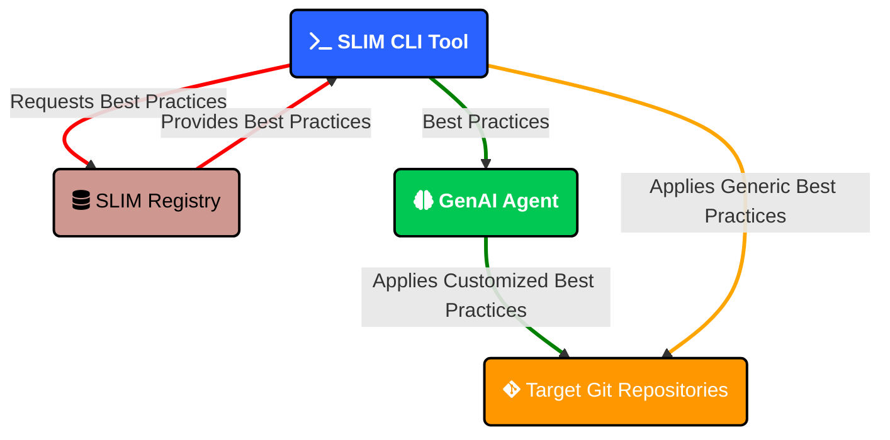

# SLIM Tools

This section provides an overview of tools created by the SLIM community to help implement best practices in your projects.

## SLIM Leaderboard

The SLIM Leaderboard is a tool that generates scan reports of SLIM best practices compliance across GitHub repositories. It helps you measure, rank, and showcase how well a set of repositories follows SLIM best practices.

### Demo

Watch SLIM Leaderboard in action:

<video controls width="100%">
  <source src="/slim/img/slim-leaderboard-example.mov" type="video/quicktime" />
  Your browser does not support the video tag.
</video>

### Features

- Generates compliance reports for GitHub repositories based on the [SLIM Getting Started Checklist](https://nasa-ammos.github.io/slim/docs/guides/checklist#checklist)
- Ranks repositories from most to least compliant with SLIM best practices
- Supports configuration via JSON to specify individual repositories or scan entire organizations
- Works with both GitHub.com and GitHub Enterprise repositories
- Utilizes GraphQL and parallelized queries for optimized performance
- Provides multiple output formats including tree, table, and markdown
- Offers a verbose mode for additional statistical details and explanations

### Getting Started

#### Requirements

* Python 3.7+
* GitHub personal access token (classic) with all permissions under the "repo" group, including `security_events`

#### Installation

```bash
# Install via pip
pip install slim-leaderboard

# Verify installation
slim-leaderboard --version
slim-leaderboard --help

# Upgrade to latest version
pip install --upgrade slim-leaderboard
```

#### Configuration

Create a configuration file (e.g., `slim-config.json`) to specify the repositories or organizations to scan:

```json
{
  "targets": [
      {
        "type": "repository",
        "name": "https://github.com/nasa-ammos/slim"
      }
  ]
}
```

#### Basic Usage

```bash
# Generate a report using default settings (tree format)
slim-leaderboard slim-config.json

# Generate a report using default settings (tree format) for an adhoc repository
slim-leaderboard --repositories https://github.com/riverma/terraformly

# Generate a report in table format
slim-leaderboard --output_format TABLE slim-config.json

# Generate a verbose report in tree format
slim-leaderboard --output_format TREE --verbose slim-config.json

# Generate a markdown report with emojis instead of text for statuses
slim-leaderboard --output_format MARKDOWN --emoji slim-config.json
```

### Learn More

For more detailed information about SLIM Leaderboard, visit the [GitHub repository](https://github.com/nasa-ammos/slim-leaderboard).

## SLIM CLI



The SLIM CLI is a command-line tool designed to infuse SLIM best practices seamlessly into your development workflow. It fetches and applies structured SLIM best practices directly into your Git repositories and leverages artificial intelligence capabilities to customize and tailor the application of best practices based on your repository's specifics.

### Demo

Watch SLIM CLI in action:

<video controls width="100%">
  <source src="/slim/img/slim-cli-example.mp4" type="video/mp4" />
  Your browser does not support the video tag.
</video>

### Features

- Command-line interface for applying SLIM best practices into Git development workflows
- Fetches the latest SLIM best practices dynamically from SLIM's registry
- Allows customization of best practices using advanced AI models before applying them to repositories
- Deploys, or git adds, commits, and pushes changes to your repository's remote

### Getting Started

#### Requirements

* Python 3.7+
* Git
* An environment configuration file for AI capabilities (Azure or OpenAI)

#### Installation

```bash
# Install via pip (recommended for most users)
pip install slim-cli

# Verify installation
slim --version
slim --help
```

#### Basic Usage

```bash
# List all available best practices
slim list

# Apply best practices to repositories
slim apply --best-practice-ids SLIM-1.1 --repo-urls https://github.com/your-username/your-repo

# Apply a best practice using AI customization
slim apply --best-practice-ids SLIM-1.1 --repo-urls https://github.com/your-username/your-repo --use-ai azure/gpt-4o

# Apply best practices and then push those changes to a new repository branch on GitHub.com - all automatically
slim apply-deploy --best-practice-ids SLIM-1.1 SLIM 1.2 --repo-urls https://github.com/your-username/your-repo
```

### Documentation Generation

The SLIM CLI includes a website generator that can automatically create [Docusaurus](https://docusaurus.io/) documentation from your repository content:

```bash
TBD
```

### Unit Test Generation

The SLIM CLI offers AI-powered test generation to automatically create unit tests for your codebase:

```bash
TBD
```

### Learn More

For more detailed information about SLIM CLI, visit the [GitHub repository](https://github.com/nasa-ammos/slim-cli).
