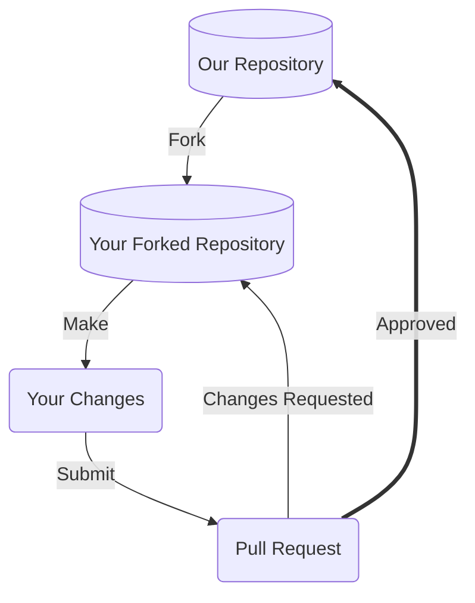

# Contributing to [INSERT YOUR PROJECT NAME]

Thanks for taking the time to consider contributing! We very much appreciate your time and effort. This document outlines the many ways you can contribute to our project, and provides detailed guidance on best practices. We look forward to your help!

## Prerequisites

Before you begin contributing to our project, it'll be a good idea to ensure you've satisfied the below pre-requisites. 

### Developer Certificate of Origin (DCO)

To accept your contributions for any kind of patch, you'll want to:
1. Understand what a Developer Certificate of Origin is. See [this](https://wiki.linuxfoundation.org/dco) guide.
2. Read and agree to the [terms](https://developercertificate.org) of the Developer Certificate of Origin.
3. Remember to add your Sign-Off for each patch contribution you submit to our project via either:
   1. By using the `-s` flag if using Git. See [these](https://git-scm.com/docs/git-commit#Documentation/git-commit.txt--s) instructions.
   2. By including the following text in your patch contributions (i.e. pull requests)
   ```
   Signed-off-by: Full Name <email>
   ``` 

Reviewers reviewing your patch will look for the sign-off before deciding to accept your contribution.

### License

Our project has our licensing terms, including rules governing redistribution, documented in our `LICENSE` file. Please take a look at that file and ensure you understand the terms. This will impact how we, or others, use your contributions.

### Code of Conduct

Our Code of Conduct helps facilitate a positive interaction environment for everyone involved with the team, and provides guidance on what to do if you experience problematic behavior. Read more in our `CODE_OF_CONDUCT.md`, and make sure you agree to its terms. 

### Developer Environment

For patch contributions, see our [Developer Documentation](INSERT YOUR DEVELOPMENT GUIDE LINK HERE) for more details on how to set up your local environment, to best contribute to our project. 

At a minimum however to submit patches (if using Git), you'll want to ensure you have:
1. An account on the Version Control System our project uses (i.e. GitHub).
2. The Version Control System client (i.e. Git) installed on your local machine.
3. The ability to edit, build, and test our project on your local machine. Again, see our `README` or detailed developer guide for more details 

## Our Development Process

Our project integrates contributions from many people, and so we'd like to outline a process you can use to visualize how your contributions may be integrated if you provide something. 



### Fork our Repository

Forking our repository, as opposed to directly committing to a branch is the preferred way to propose changes. 

See [this GitHub guide](https://docs.github.com/en/get-started/quickstart/fork-a-repo) on forking for information specific to GitHub.com

#### Find or File an Issue

Make sure people are aware you're working on a patch! Check out our issue tracking system and find an open issue you'd like to work against, or alternatively file a new issue and mention you're working on a patch.

### Make your Modifications

Within your local development environment, this is the stage at which you'll propose your changes, and commit those changes back to version control. See the `README` or development guide for more specifics on what you'll need as prerequisites to setup your local development environment.

#### Commit Messages

Commit messages to version control should reference a ticket in their title / summary line:

```
Issue #248 - Show an example commit message title
```

This makes sure that tickets are updated on GitHub with references to commits that are related to them.

Commit should always be atomic. Keep solutions isolated whenever possible. Filler commits such as "clean up white space" or "fix typo" should be merged together before making a pull request, and significant sub-feature branches should be [rebased](https://www.youtube.com/results?search_query=git+rebase) to preserve commit history. Please ensure your commit history is clean and meaningful!

### Submit a Pull Request

Pull requests are the core way our project will receive your patch contributions. Navigate to your branch on your own fork within the version control system, and submit a pull request or submit the patch text to our project. 

Please make sure to provide a meaningful text description to your pull requests, whenever submitted. Use the following template:
```
## Purpose
- Clear, easy-to-understand sentences outlining the purpose of the PR
## Issues
- Links to relevant issues
- Example: issue-XYZ
## Proposed Changes
- [ADD] ...
- [CHANGE] ...
- [FIX] ...
## Testing
- Provide some proof you've tested your changes 
- Example: test results available at ...
- Example: tested on operating system ...
```

**Working on your first Pull Request?** See guide: [How to Contribute to an Open Source Project on GitHub](https://kcd.im/pull-request)

### Reviewing your Pull Request

Reviewing pull-requests, or any kinds of proposed patch changes, is an art. That being said, we follow the following best practices:
- **Intent** - is the purpose of your pull-request clearly stated?
- **Solution** - is your pull-request doing what you want it to?
- **Correctness** - is your pull-request doing what you want it to *correctly*?
- **Small Patches** - is your patch of a level of complexity and brevity that it can actually be reviewed by a human being? Or is does it involve too much content for one pull request?
- **Coding best practices** - are you following best practices in the coding / contribution language being used?
- **Readability** - is your patch readable, and ultimately maintainable, by others?
- **Reproducibility** - is your patch reproducible by others?
- **Tests** - do you have or have conducted meaningful tests?

## Ways to Contribute

### ⚠️ Issue Tickets

> *Do you like to talk about new features, changes, requests?*

Issue tickets are a very simple way to get involved in our project. It also helps new contributors get an understanding of the project more comprehensively. This is a great place to get started with the project if you're not sure where to start. 

See our list of issues at: [INSERT YOUR ISSUE TRACKING PAGE]

#### Cleaning up Duplicate Issues

Often we receive duplicate issues that can confuse project members on *which* issue ticket to hold conversations upon.

Here's how you can help:
1. Scan the list of *open* issue tickets for duplicate titles, or internal wording 
2. If you find duplicates, copy / paste the below message on the conversation thread of the issue ticket *that has less participants* involved

```
This is a duplicate issue. Please migrate conversations over to [issue-XYZ](hyperlink to issue)
```

#### Good First Issues

Issue tickets can vary in complexity, and issues labeled with `good first issue` labels are often a great way to get started with the project as a newcomer. 

Take a look at our issue tracking manager, and filter by `good first issue` for issues that are low-complexity, and that will help you get familiar with our issue tracking and patch submission process.

#### Suggesting New Issue Labels

Labels within an issue tracking manager are a great way to quickly sort through tickets. The project may not yet have labels to cover the full variety of issue tickets. Take a look through our list of issues, and if you notice a set of issue tickets that seem similar but are not categorized with an existing label, go ahead submit a request within one of the issues you've looked at with the following text:

```
I've noticed several other issues that are of the same category as this issue. Shall we make a new label for these types of issues?
```

#### Submitting Bug Issues

Resolving bugs is a priority for our project. We welcome bug reports. However, please make sure to do the following prior to submitting a bug report:
- **Check for duplicates** - there may be a bug report already describing your issue, so check the issue tracking system first

Here's some guidance on submitting a bug issue:
1. Navigate to our issue tracking system and file a new issue
2. Select a bug template (if available) for your issue
   1. Fill out the template fields to the best of your ability, including output snippets or screenshots where applicable
3. Follow the general guidelines below for extra information about your bug
   1. Include a code snippet if you have it showcasing the bug
   2. Provide reproducible steps of how to recreate the bug
   3. If the bug triggers an exception or error message, include the *full message* or *stacktrace*
   4. Provide information about your operating system and the version of our project you're using

#### Submitting New Feature Issues

We welcome new feature requests to help grow our project. However, please make sure to do the following prior to submitting a bug report:
- **Check for duplicates** - there may be a new feature issue already describing your issue, so check the issue tracking system first
- **Consider alternatives** - is your feature really needed? Or is there a feature within our project or with a third-party that may help you achieve what you want?

Here's some guidance on submitting a new feature issue:
1. Navigate to our issue tracking system and file a new issue
2. Select a new feature template (if available) for your issue
   1. Fill out the template fields to the best of your ability
3. Follow the general guidelines below for extra information about your bug
   1. Include a code snippet if you have it showcasing the bug
   2. Provide reproducible steps of how to recreate the bug
   3. If the bug triggers an exception or error message, include the *full message* or *stacktrace*
   4. Provide information about your operating system and the version of our project you're using


#### Submitting Security Vulnerability Issues

Security vulnerabilities should **not** be filed to the regular issue tracking system.

Report your security vulnerabilities to: [INSERT SECURITY VULNERABILITY E-MAIL / SUBMISSION FORM HERE]

Please be sure to:
* Indicate the severity of the vulnerability
* Provide any workarounds, if you know them
* Provide return-contact information to follow-up with you if needed

#### Reviewing Pull Requests

Reviewing others' contributions is a great way to learn about best practices in both contributions as well as software. 

Take a look at our pull requests tracking system [INSERT LINK FOR PULL REQUESTS TRACKING SYSTEM], and try the following options for providing a review:
1. Read the code / patch associated with the pull-request, and take note of any coding, bug, or documentation issues if found
2. Try to recreate the pull-request patch on your local machine, and report if it has issues with your system in particular
3. Scan over suggested feedback from other contributors, and provide feedback if necessary

### 💻  Code

TBD

### 📖 Documentation 

TBD

### 📷 Media

TBD

### ❓ Questions

TBD

### 🎨 Design

TBD

### 🎟️ Meetups

TBD